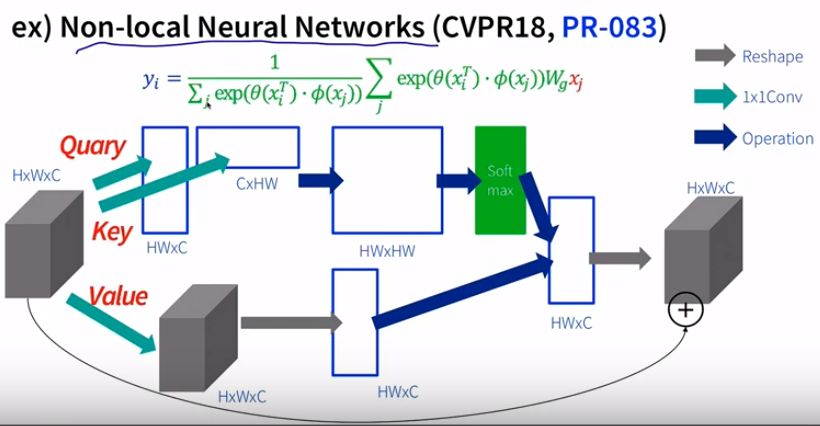
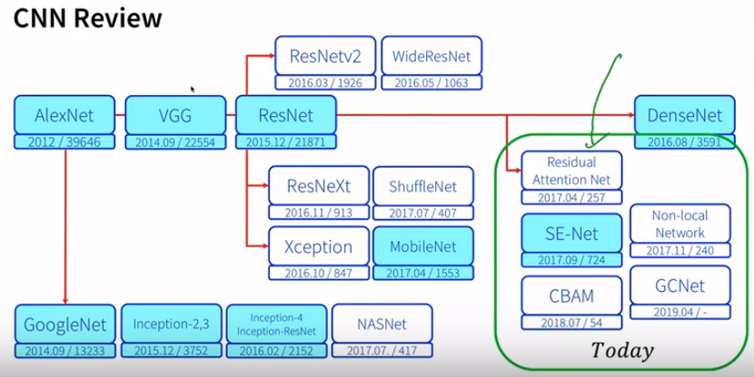
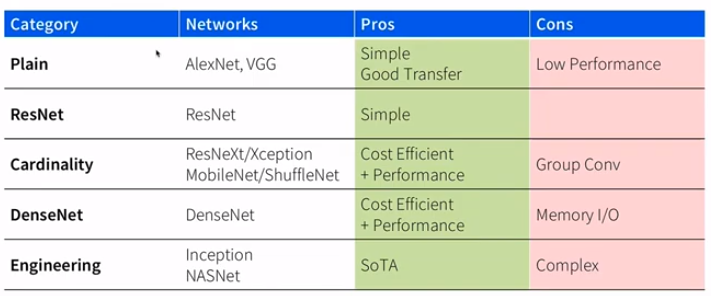

## CNN attention-based networks
* NLP 뿐 아니라 이미지에서도 attention 을 적용해봤을때의 효과가 어땠는지 설명
* Attention
  * 쿼리, 키, 밸류 
		* 쿼리 - 각 밸류 중에서 어느정도를 가져오고 싶은데, 얼만큼가져오면 될까? 라는 질문같이 것- 각 밸류들을 얼마나 가져가면 좋을지를 output 으로 내게 될 것
		* Q\*W\*K 이  를 학습시켜서 쓸 수 있는 것
		* 어떤 칸에 대한 값이 진화해나가는데, 나만 보는데 아니라 주변의 값을 참고해서 가져가게 되는 것, 이때에 얼마나 가져갈 것인지는 나타내는 vector 를 가져가게 되는 것
	* Fully connected Neural network
		* W를 얼만큼 가져가지는 생각하지 않고 전체를 동일한 비율로 가져가게 되는 것
	* CNN
		* 한정된 양 만큼을다음의 output 을 나는데요 활용하게 되는 것
		* 현재의 위치가 제약사항으로 들어가게 되는 것
	* Attention
		* Input의 중요도 만큼(weight)으로 주변의 정보를 활용하겠다(input 에 따라 변화하는 weight를 갖고 가겠다 라는 것)
		* W_n=softmax(f(BS, K_n)) - BS : 현재의 상태, k_n : 모든 키의 값, w_n: n에서의 weight
	* self attention
		* 자기 자신의 정보로부터, 다른 정보를 얼마나 가져와야한지를 파악하게 되는 것
		* (쿼리가 자기자신인 것)
		* transformer
			* encoder 의 layer 를 self attention 으로 쌓은 것
			* decoder 에서는 일반 attention 으로 쌓은 것
		* self attention for image
			* 현재의 위치값을 가지고, 현재 위치의 다음 abstraction map 에 적합한 representation 을 만들어내겠다
		* e.g. Non-local Neural network(CVPR18)
			
			* self attention 컨셉을 cnn 에 적용한 것
			* 단, 주변만 보는게 아니라 모든 좌표와 비교한다는 점에서 일반적 cnn 은 아니징(반대개념이라 볼 수도)
			* hight \* width \* channel
				* query : HW\*C / key : C\*HW 
				* HW\*HW 각 좌표간의 상관관계를 담은 matrix
				* softmax 로 weight 값을 만듦
				* value - matrix 하나 만들면서, 형태를 그대로 보존
				* value 를 HW\*C로 reshape
				* softmax * (HW\*C) 로 나온 결과물을 쓰게 되는 것
	* Recalibration
		* Non-local 에서처럼 HW\*HW 는 너무 크지 않나라는 idea 에서
		* 주변을 얼마나 가져올지가 아니라, 본인의 값을 얼마나 가져가야할지를 주변을 보고 판단하게 되는 것
			* recalibration: w2\*v2
			* attention : w1\*v1+w2\*v2+...
		* attention 의 다른 방향으로의 응용
		* w2=sigmoid(f(k2, kn))
		* 곱셈이 없어져서 계산이 확 줄어들 것
		* e.g. squeeze-and-Excitation network
			* 채널별로 압축한 후, 어떤 채널이 더 중요한지를 recalibration 하여 활용
			* 마지막 이미지넷 챌린지에서 우승한 모델

### cnn network

* Plain network
	* vgg net
* ResNet
	* skip connection 컨셉 활용
	* 너무 깊게 쌓으면 gradient flow 가 좋지 않으니, f(f(f...(x))대신 f(x)+x 중첩을 활용함
	* ResBlock
		* 기본 블록 정의 후 반복
		
	* ResNet Varients
		* Pre-activation ResNet이때 activation 을 먼저 하는게 더 효과가 좋더라 라는 논문
		(convolution -> batch norm -> relu 보다 relu -> batch norm -> convolution 이 낫더라) 
		* wider channel resnet
			* 실험적으로 채널을 크게 해보니 성능이 좋더라
	* resnet with cardinality
		* convolution 대신 grouped convolution 사용
		* grouped convolution - channel 에서 연산을 다 하지 않고, 그룹지어서 넣음
		* e.g. xception, shuffle net 등
	* DenseNet
		* ResNet 의 block 을 다 연결해버린 것
* Engineered network
	* Inception / NASNet
		* 모델 연결까지 학습해서 막 하는 것

### cnn network with attention
* Spatial Transformer Network
	* Recalibration(with Transform)
	* 어텐션 모델은 아님!
	* mnist classification 같은 task 에서 image input 를 잘 transform 해서 학습하기 좋은 형태로 바꾸는 과정을 학습함(recalibration 컨셉 이용) --> T(theta)에서 theta 를 학습해서 넣는 것
* Residual attention network
	* resnet 에 attention 넣음
	* F(x)+x 대신 F(x)+A(x) 활용
	* 성능은 그닥 뛰어나지 않았음
* Sqeeze and excitation network
	* 현재 default
	* recalibration 컨셉 활용
	

