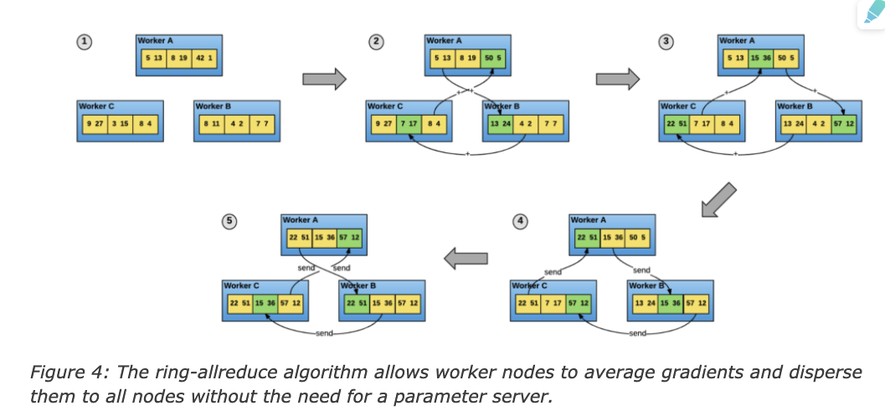

## Horovod: fast and easy distributed deep learning in TensorFlow
### Why (large-scale training?)
- batter accuracy
	- single machine 에서 할 때에 batch size 를 크게 하는게 어려워짐 --> machine 을 여러개 써서, larget scale data 에 대해서도 batch norm 이 의미있게 만들겠다
- fast training
	- 당연한 얘기지만 속도

### How?
- 어느정도 성숙한 라이브러리엔 distributed 로 쓸 수 있게 하는 옵션이 있음(e.g. distributed tensorflow 등)
	- 근데 utilization 이 fully 되지는 못한다
- **distributed 하는 방식**
	- 일반적으로 model parallelism vs data parallelism
	- model parallelism : 모델을 쪼개서, 같은 데이터로 쪼개진 여러 모델에 학습 시킨 후 합침
		e.g. vgg16 에서 예시 확인 가능
	- data parallelism : 
		- gradient update 는 다 합쳐서 update 하는 것(이걸 따로 하면 분산이라기보단 앙상블이 돼버리는 것)
		- gradient update 전에 network 통신(gradient 를 평균으로 update)
		- 이 통신을 할때에 문제가 생기는 경우가 많아서 이 부분이 특히 개선돼야 함
		- distributed tensorflow 에서는 gradient를 worker 에서 server 에 전송해서 합치게 됨
			- 설정이 어렵고 속도가 느려짐
- Horovod 의 distributed training
	1. Master 가 parameter 초기화 후 worker 로 전달
	2. Worker는 모델을 가지고 있고 학습 데이터를 읽어서 Forward, Backward를 통해 최종적으로 모델 Update를 위한 Gradients를 계산
	3. 이 후 Gradients를 Ring-allreduce 방식으로 서로 주고 받고 각자의 Worker는 모아진 Gradients들의 평균을 이용하여 모델을 Update
	- (이렇게 worker들이 다 같은 Parameter 갖는 방식이 synchronous 방식)

	- ring-allreduce
	
		* ring 형태로 주고받고 나니 gradient가 전체에 전송되는데에 2(n-1)iteration 이면 된다.
- Horovod Concept
	- core principle 은 MPI 에서의 size, rank, local rank, allreduce, allgather, broadcast 를 기반으로 함
	- e.g. server 4대, 각 gpu 4대라면
		- size (number of process) = 16
		- rank (unique process id) = 0 to 15
		- local rank (server 내 unique process id) = 0 to 3
		- allreduce / allgather / broadcast 로 데이터 aggregate and distributes.
	- https://github.com/horovod/horovod/blob/master/docs/concepts.rst
- 기타 horovod 특징
	- Tensor fusion 사용
	- performance 시각화 가능 (https://github.com/horovod/horovod/blob/master/docs/timeline.rst)
	- Performance autotuning 가능 (https://github.com/horovod/horovod/blob/master/docs/autotune.rst)


### 설치 방법
1. open mpi 설치 (download from https://www.open-mpi.org/software/ompi/v4.0/)
```sh
gunzip -c openmpi-4.0.3.tar.gz | tar xf -
cd openmpi-4.0.3
./configure --prefix=/usr/local
make all install
```
	- make 하는 중에 접근 권한 에러 발생하기도 함(명령어 앞에 sudo 붙이면 됨)
2. mpi 설치 확인
```sh
mpirun
```
	- mpirun 하는 중에 아래와 같이 library 에러가 뜰 경우
```
mpirun: error while loading shared libraries: libopen-rte.so.40: cannot open shared object file: No such file or directory
```
	- 아래의 명령어로 공유 라이브러리 캐시를 다시 설정해주면 된다
```sh
sudo ldconfig
```
3. horovod 설치
```sh
HOROVOD_GPU_OPERATIONS=NCCL pip install horovod
```

- NCCL과 MPI 가 모두 필요한 이유
	- horovod 가 처음 만들어질때에는 모든 연산이 mpi 를 통해 이뤄졌음 (NCCL 개발 전 혹은 성능이 잘 나오지 않을때였음)
	- gpu간 communication 면에서는 NCCL 이 더 빨라서 이부분은 NCCL 로 대체됐고, 나머지는 환경 관리 등(rank, size, which process is the "master" 등등)은 MPI 로 남아있음
	- Nvidia docs 에서는 cpu-cpu communication 에서는 MPI, gpu-gpu communication 에서는 NCCL 이라고 설명되고 있음
	- https://stackoverflow.com/questions/53498952/tensorflow-horovod-nccl-and-mpi


## 참고 자료
- https://eng.uber.com/horovod/
- https://arxiv.org/abs/1802.05799
- https://y-rok.github.io/deep%20learning/2019/12/19/horovod-tensorflow.html
- https://github.com/horovod/horovod
