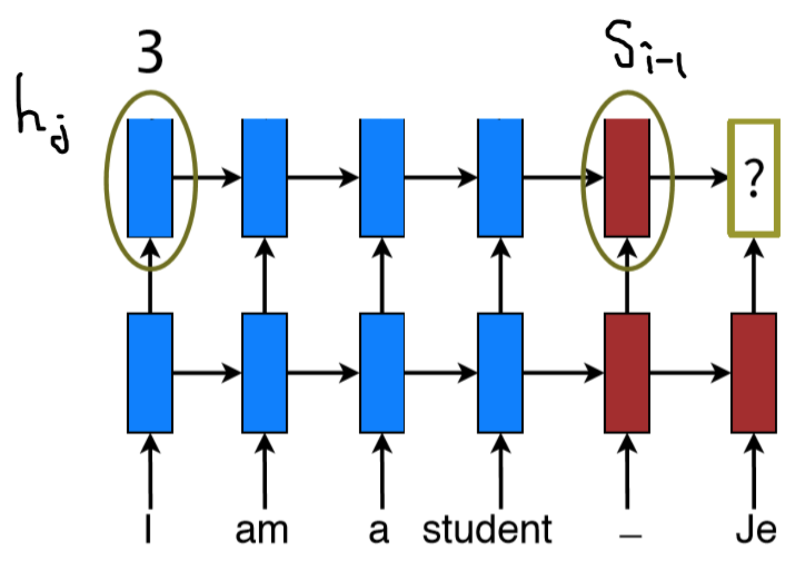
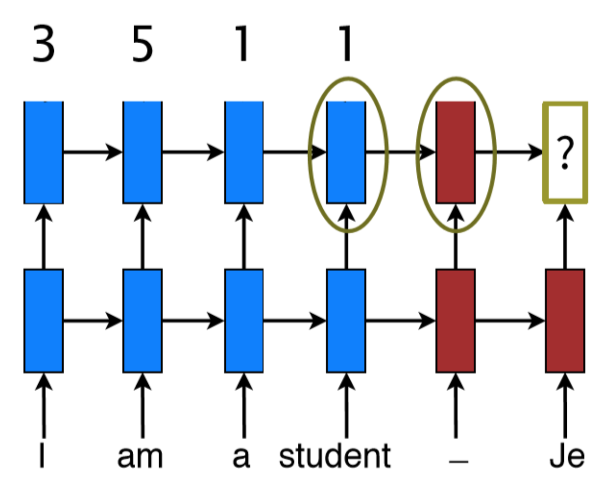
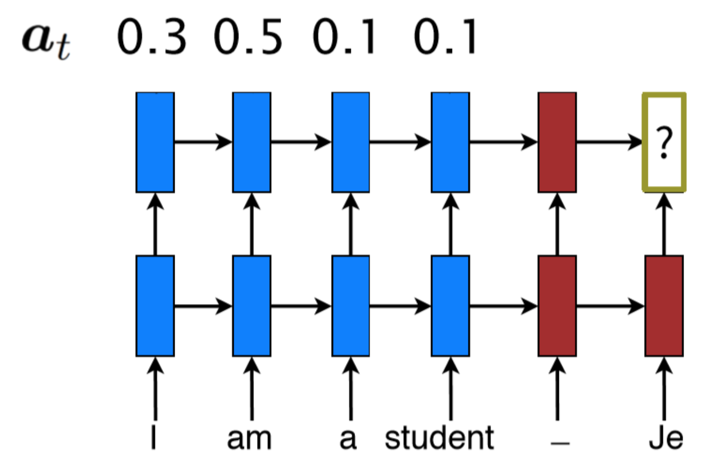
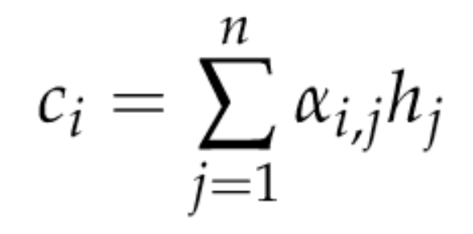

## Attention  mechanism
* Idea :
  * S2S model에서 처음 등장
  * Src—> (encode) —> v —> (decode) —> target
	* Src 와 target 이 길어질 수록 모델 성능이 떨어질 것 —> 모델이 중요한 부분에만 집중하게 하자!
		* (E.g. 해당 단어를 번역 할 때에는 문장의 다른 부분 보다 그 부분에 집중해서 보게 하겠다)
* (가정) 인코더가 해당 단어를 vector화 한 결과는 디코더가 그 단어를 예측할 때에 쓴 vector는 같을 것
  * —> 각 출력이 대응되는 입력상태를 더 많이 참조하도록 가중치를 둔다
* 가중치의 설정
  * Alpha_ij=exp(e_ij)/sigma(exp(e_ij)
    * e_ij=a(s_i-1, h_j)
	* 이전 스텝의 hidden state vector s_i-1과 인코더는 j번째 벡터 h_j가 얼마나 유사한지를 나타내는 스코어를 쓴다
	
	
	
	
