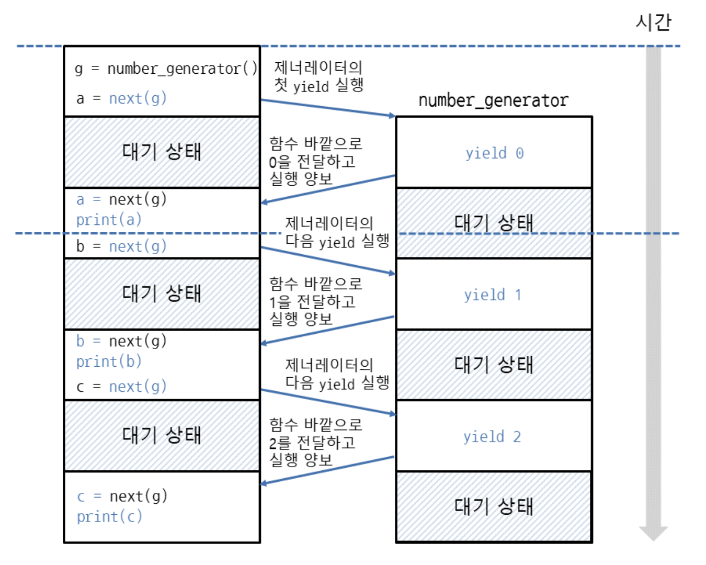

1. generator
- iterator 를 생성해주는 함수
	- \_iter\_, \_next\_, \_getitem\_ 메서드를 따로 구현할 필요 없게 해줌
	- 대신 yield 라는 키워드 사용
```python
def number_generator():
    yield 0
    yield 1
    yield 2
 
for i in number_generator():
    print(i)
#0
#1
#2
```
- iterator 인지 확인
```python
>>> g = number_generator()
>>> g
<generator object number_generator at 0x03A190F0>
>>> dir(g)
['__class__', '__del__', '__delattr__', '__dir__', '__doc__', '__eq__', '__format__', '__ge__', '__getattribute__', '__gt__', '__hash__', '__init__', '__init_subclass__', '__iter__', '__le__', '__lt__', '__name__', '__ne__', '__new__', '__next__', '__qualname__', '__reduce__', '__reduce_ex__', '__repr__', '__setattr__', '__sizeof__', '__str__', '__subclasshook__', 'close', 'gi_code', 'gi_frame', 'gi_running', 'gi_yieldfrom', 'send', 'throw']
```
2. 동작과정 확인
- next 호출될때에야 다음 yield 를 return
```python
def number_generator():
    yield 0    # 0을 함수 바깥으로 전달하면서 코드 실행을 함수 바깥에 양보
    yield 1    # 1을 함수 바깥으로 전달하면서 코드 실행을 함수 바깥에 양보
    yield 2    # 2를 함수 바깥으로 전달하면서 코드 실행을 함수 바깥에 양보
 
g = number_generator()
 
a = next(g)    # yield를 사용하여 함수 바깥으로 전달한 값은 next의 반환값으로 나옴
print(a)       # 0
 
b = next(g)
print(b)       # 1
 
c = next(g)
print(c)       # 2
```


3. range 처럼 동작하는 generator 만들기
```python
def number_generator(stop):
    n = 0              # 숫자는 0부터 시작
    while n < stop:    # 현재 숫자가 반복을 끝낼 숫자보다 작을 때 반복
        yield n        # 현재 숫자를 바깥으로 전달
        n += 1         # 현재 숫자를 증가시킴
 
for i in number_generator(3):
    print(i)
#0
#1
#2
```

4. for 문 없이 yield from으로 값 여러번 전달
- yield from [iterable, iterator, generator]
```python

def number_generator():
    x = [1, 2, 3]
    yield from x    # 리스트에 들어있는 요소를 한 개씩 바깥으로 전달
 
for i in number_generator():
    print(i)
#1
#2
#3
```
- 참고 : https://dojang.io/mod/page/view.php?id=2412
