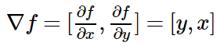
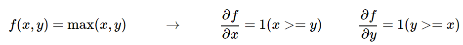
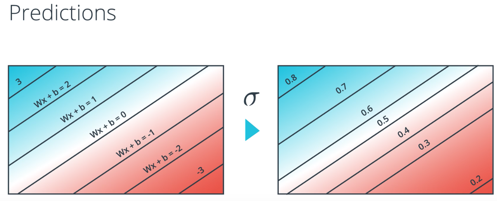
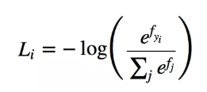
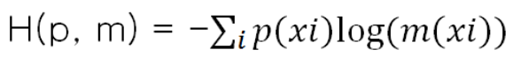
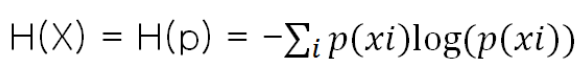

## Gradient / Backpropagation / Activation function
### gradient (기울기)
* 모든 변수의 편미분을 벡터로 정리한 것

- 기울기가 가리키는 방향은 각 장소에서 함수의 출력 값을 가장 크게 줄이는 방향

### gradient descent
- 현 위치에서 기울어진 방향으로 **일정 거리(learning rate)**만큼 이동, 그런다음 이동한 곳에서도 마찬가지로 기울기를 구하고, 또 그 기울어진 방향으로 나아가기를 반복
- 이때 매개변수 갱신은 미니배치로 무작위로 선정 --> stochastic gradient descent!

### backpropagation
* forward step - gate 통과하면서 실제 값을 계산
* backward step - gate 를 반대로 통과하면서 chain rule 로 각 gate 에서의 gradient 값을 계산
	* 전후 step 의 output 값과 gradient 값을 이용해서 현재 노드에서의 gradient 값을 계산해나감
* 보다 큰(혹은 작은) 최종 출력 값을 얻도록 게이트들이 자신들의 출력이 (얼마나 강하게) 증가하길 원하는지 또는 감소하길 원하는지 서로 소통하는 것으로 간주할 수 있다.

### Activation function
* 입력 신호의 총 합을 출력신호로 변환하는 함수
* perceptron 과 neural net 의 차이점
* 이거 없이 그냥 쌓으면 hidden layer 가 있다는 의미가 사라질 수가 있음 (non-linearity를 추가)
(h(x)=cx 를 활성화함수로 사용한 3층 네트워크 <==> y(x)=h(h(h(x)))
실은 y(x)=ax와 똑같은 식 인거라 a=c3이라고만 하면 끝)
- e.g. relu, sigmoid...

## classification 에서
* sigmoid function
	* 하나의 직선을 기준으로 class 를 두가지로 나눈다고 했을때에 어느쪽 class 에 속하게 되는지는 discrete 하게 나타나게 됨
	* 이를 연속적인 function 으로 표현 한다면 sigmoid 가 될 것 (시그마(x)=1/(1+exp(-x))
	
* softmax classifier
	* svm 과 더불어 많이 쓰이는 classifier
	* logistic regression classifier 의 multiple class 에 대한 일반화 개념
	* Class 를 나눌 feature 의 score가 값이더라도 이거에 의해서 multi class 에서 각각의 class 에 해당될 확률이 합이 1이 될 수 있도록
	

## Cross-entropy function
* cross entropy
	* loss function 으로 사용 가능
	* 2개의 확률 분포 차이를 나타내는 용도로 정의됨(cross correlation)
	* 두 확률 분포 p 와 m 에 대한 cross entropy 값
	* 두개의 확률 분포가 얼마나 가까운지 혹은 먼지를 나타냄
	
		* 차이가 클수록 큰 값이 나오고 두개가 같아질때 최소 값이 나온다.
		==> 기대값과 실제 연산값의 차가 클수록 큰 결과가 나오고 결과가 항상 양
		==> cost function 으로 활용이 가능한 것
		* 정보 이론에서의 entropy
		
	

http://aikorea.org/cs231n/optimization-2/
https://ratsgo.github.io/deep%20learning/2017/04/22/NNtricks/
https://ratsgo.github.io/deep%20learning/2017/09/24/loss/
http://blog.naver.com/PostView.nhn?blogId=gyrbsdl18&logNo=221013188633