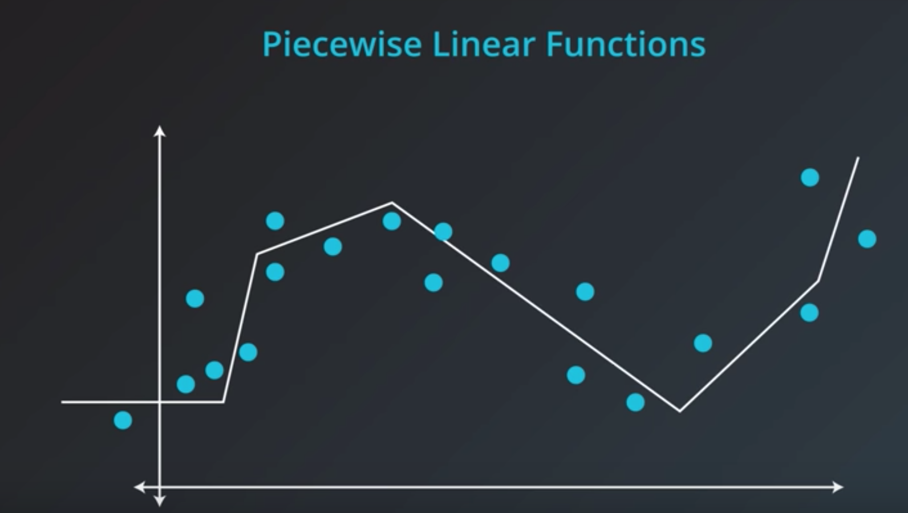

## Batch vs stochastic gradient descent
* Batch : 한번에 다 network 태워서 learning 시키는 것(epoch 한번 마다 w update)
* Stochastic : 데이터중 일부씩을 뽑아서 계산후 back prop로 w update 과정을 반복, w 를 완성시킴

## Learning rate 의 결정
* Learning rate decay
	* 너무 커도, 작아도 문제
	* Rule of thumb : model 이 working 하지 않을 때에 learning rate 를 낮추는 식으로 정한다!
		* 좋은   learning rate 의 rule
			* If steep : long steps
			* If plain : small steps
* Random restart
	* learning rate 에 대해 random 의 값을 반복해서 최적의 상태를 정함
* Momentum
	* 진행 하고 있던 힘(방향?)을 합쳐서 local min 에서도 더 진행함
	
## Deal with non linear data - regression 에 활용
* Piecewise linear function 방식으로…
	* 각 구간들을 linear function 으로 가정하여 regression 해가는 방식
	* relu로 activate 하고,
	* Classification 문제면 마지막에 sigmoid 로...
	
	* Regression 으로 하고싶다면
		* Error function 을 (y-y^)^2

## 가중치의 초깃값
- 초깃값은 균일해서는 안됨 --> 모든 가중치가 똑같이 갱신되게 되므로...(가중치를 여러개 갖는다는 의미가 사라져버림)
- sigmoid 쓰는 경우
	- gradient vanishing : sigmoid 쓰는 경우 출력이 0 or 1에 가까워지면 미분이 점점 0에 가까워짐 -> 데이터가 0, 1 에 치우쳐 분포하면 역전파 기울기 값이 점점 작아지다가 사라져버림 
	- 기울기 값이 고르게 퍼지지 못하고 몇가지 값에 집중됨(표현력 관점에서 큰 문제가 있는 것)
	- **xavier 초깃값 사용**
		- 각 층의 활성화 값을 광범위하게 분포시킬 목적으로 가중치의 적절한 분포를 찾아줌
		- 활성함수가 선형이라는 전제(sigmoid, tanh 는 0 근처에서 선형)
- Relu 쓰는 경우
	- he 초깃값 사용

## batch normalization
- 각 층에서의 활성화 값이 적당히 분포하도록 조정하는 것
- 미니배치 입력데이터를 평균 0, 분산 1인 데이터로 변환하는 것 / 이 처리를 활성화 한수 앞(혹은 뒤)에 삽입해서 데이터 분포가 덜 치우치게 할 수 있음
- 장점
	1. 학습속도 개선
	2. 초깃값에 의존하지 않게 됨
	3. 오버피팅 억제(dropout 등의 필요성 감소)
