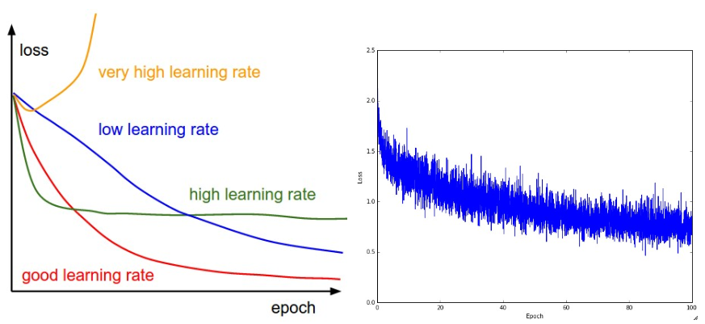

## 학습 전에 제대로 돌아가는지 확인하는 팁
1. 맞는 손실함수를 찾아야
	a. 기대한 만큼의 loss function 값이 실제로 나오는지 확인해야함
	b. (ex cifar-10 데이터에서 softmax 쓰면 손실함수를 2.302로 기대할 수 있음(-ln(0.1)=2.302 / 각 클래스에 확률이 0.1로 분산)
2. 정규화 강도를 올릴수록 손실 함수 값이 올라가야 함
3. 자료의 작은 부분 집합으로 과적합 해봐야
	a. 20개 자료정도로 0cost 가 나오는지 확인해봐야해(정규화 강도를 0으로 해 놓고)
	b. 작은 자료에서 확인이 제대로 안되면 전체 과정이 무가치함

## 학습 과정 확인(babysitting the learning process)
### loss function

* 좌측은 써 있는 그대로...
* 우측은 배치사이즈가 너무 작음(노이즈가 너무 많다.)

### train/val accuracy


### weights: updates ratio
```python
# assume parameter vector W and its gradient vector dW
param_scale = np.linalg.norm(W.ravel())
update = -learning_rate*dW # simple SGD update
update_scale = np.linalg.norm(update.ravel())
W += update # the actual update
print update_scale / param_scale # want ~1e-3
```
* 1e-3 근처여야 한다. 이보다 낮으면 학습 속도(learning rate)가 너무 낮은 것이다. 이보다 크면 학습 속도가 너무 크다. 

### activation/gradient distribution per layer
* 초기값 설정으로 인해 학습과정이 느려지거나, 학습이 제대로 안되는 사항들 모니터링
* 활성값/그라디언트값의 히스토그램을 망(network)의 모든 층(layer)마다 그려보는 것
* 이 분포가 이상하면 문제가 있는 것일 것
	* e.g. tanh 뉴런(neuron)에서는 활성값이 [-1,1]의 전 범위에 걸쳐 분산되어 있는 모습을 보이는게 맞을텐데, 모든 활성값이 0을 내놓거나 -1 혹은 1에 집중되어 있으면 문제가 있는 것


참고 : http://aikorea.org/cs231n/neural-networks-3/