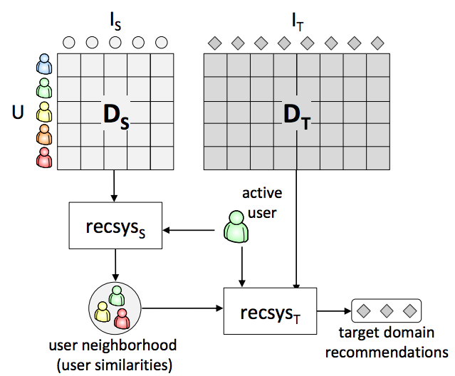
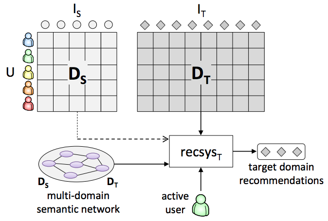
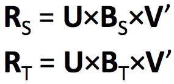
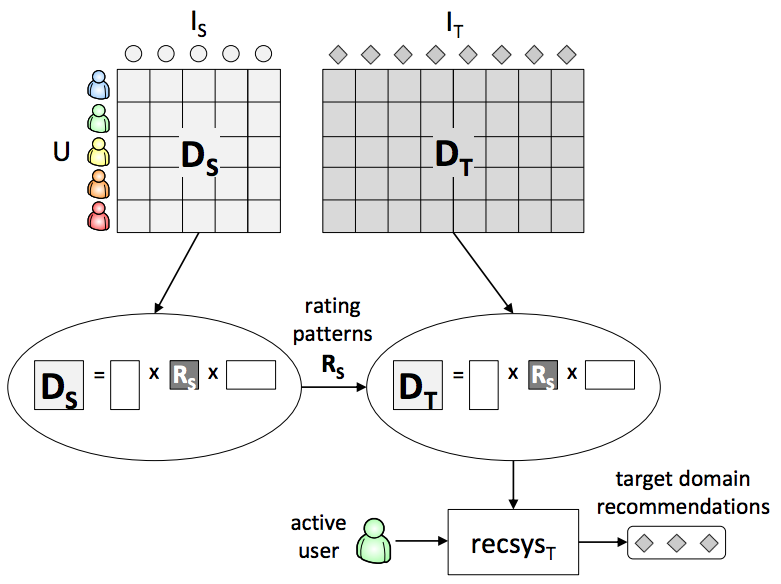
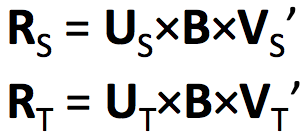

## user profiles in multiple systems - 목적
* cross-sell products and services
* provide recommendations to new users
* 해결을 위한 시도는 2009년부터

## problems related to cross-domain RSs
* Machine learning
	* multi-task learning / transfer learning
* user modeling
	* aggregation user preferences for cross system personalization, targeted adv. security
* Context aware recommender
	* 서로다른 도메인을 서로다른 context로
* Hybrid recommender (Ensemble learing)
	* adaboost --> hybrid
	* bootstrap / blending --> cross domain

## cross domain recommendations
* single-domain : 각 도메인들을 독립적으로 다뤄
* collective-domain : 여러 도메인을 합쳐서 하나의 도메인인것처럼 활용
* cross-domain : source 에서 target 으로 knowledge를 transfer
	* 가정 : 유저와 아이템 사이에 overlap 이 있다

### cross-domain recommendation goals
* cold start 문제의 해결
* 정확도 향상
	- sparsity 줄이기 등
* 추천에 added value 제공하기
	- diversity, novelty, serendipity
* user model 향상
	- 신규 유저의 선호 찾기 등

## cold start recommandation
* content / profile based methods
    * content: for new items
        * 음원 신호처리
        * (deep) collaborative topic regression
    * profile : for new users
        * DSSM
        * multi view DSSM
        * user linkage
* interview based methods
    * issue query(items) to a user
    * issue queries about a new item to users
    
* Definition of domain (domain levels)
	* attribute level(comedy <-> thriller)
		* same type of items, different values of certain attribute
	* type level (movies <-> books)
		* similar types, sharing some attributes
	* item level (movies <-> restaurants)
		* distinct types, differing in most, if not all attributes
	* system level (Netflix <-> movielens)
		* almost the same itmes, collected in different ways and/or from different operators
* cross-domain : opportunity or problem
	* source domain 이 bias가 되거나 noise 가 되거나
	 --> 근데 이건 weight 를 어떻게 주느냐에 대한 문제로 귀결됨
 	* two approaches
 		
 		* linking/aggregating knowledge
 			* user preferences merge 하기
 			* user modeling data 를 중재함
 			* recommendations 를 combine 함
 			* domain 을 link 함
 		* sharing/transferring knwledge
 			* latent feature 를 share 함
 			* rating pattern 을 변환함

## proposed categorization
### Knowledge Aggregation for Cross-Domain Recommendations(linking/aggregating knowledge)
1. merging single domain user preference
	* 제일 많이 쓰는 방법이고 제일 직접적임
	* 여러 domain 에서의 rating 정보로 user preference matrix 를 완성해감(user rating 을 single multi domain rating matrix--> 쉽게 말해 두 매트릭스 합쳐버리는 것)
	* aggregate user preference
		* ratings, tags, transaction logs, click-through data
		* rating, tag, transaction log, click-through data 정보를 그대로 쓰는 것 / 다른 도메인 정보들을 그냥 붙여버려
		
		* pros
			* new-user problem 에는 좋아
			* robust
			* 설명이 용이함
		* cons
			* source 와 target domain 에 user-overlap 이 있어야돼 (social tag 나 semantic concept 로 구성된 user profile 을 이용하기도 --> 이 경우엔 user item 의 overlab 이 필요 없지(tag 나 semantic concept 이 common representation to merge user preferences from merge domain 으로 활용 될 수 있기 때문))
		* aggregate matrix 에는 single domain techniques 에 weight 를 주는 방식으로 해결할 수도 있어
			* ex
				* User-based kNN
					Berkovsky et al. 2007; Shapiraet al. 2013; --> rating correlation으로
					Winoto& Tang 2008; --> rating correlations and relations between domain categories
				* Graph-based
					Nakatsujiet al. 2010; Cremonesi et al. 2011; Tiroshiet al. 2013
				* Matrix Factorization / Factorization Machine
					Loni et al. 2014
2. mediating single domain user modeling data
	* 하나의 도메인에서 유저들이 유사했다면 다른 도메인에서도 유사하게 행동할거란 가정
	* single domain 에서 유저간의 유사성을 갖고와서 target domain 에 붙임
	* 서로 다른 domain 에서의 모델(CF, CBF, Hybrid)을 aggregate 함
	* 유저간 유사성을 바탕으로 함
	
	* pros
		* new-user problem 에는 좋지
		* robust
	* cons
		* source 와 target 도메인에서 user 나 item 간의 overlap 이 필요함
	* ex
		* Aggregating collaborative or content similarities
			Berkovsky et al. 2007; Shapira et al. 2013; Shlomo
			Berkovsky, Tsvi Kuflik, and Francesco Ricci. 2008.
		* Aggregating user neighborhoods
			Berkovsky et al. 2007; Tiroshi & Kuflik 2012; Shapira et al. 2013
		* Aggregating latent features
			Low et al. 2011
3. Combining single domain recommendations
	* 각각의 domain 에서 recommendation model 적용 후 결과를 aggregate 하는 방식
	* 이미 정보들이 sparse 하면 이를 기반으로 user 간의 similarity 구하는게 부정확해질 것 -> 각각에 대한 recommendation data 를 추가해서 user modeling 에 활용 - 최종 추천을 하는 것
	 (rating, ranking, probability distribution)
	
	* pros
		* 구현이 쉬움
		* 각 recommender 를 독립적으로 사용할 수 있음
		* 다양성이 증가함
		* context 에 independent 함
	* cons
		* user 간의 overlap 이 필요함
		* 각 domain 에서 나온 recommendation 에 대해서 weight tuning 이 어려울 수 있음
	* ex
		* Aggregating estimated values of ratings(blanding)
			Berkovsky et al. 2007; Givon & Lavrenko 2009
		* Combining estimations of rating distribution
			Zhuang et al. 2010

### Knowledge Linkage and Transfer for Cross-Domain Recommendation
1. Linking domains
	* 각 domain 들을 common 한 knowledge 로 연결시킴 (ex 영화, 책이 같은 장르인 경우 link 가능)
		* item attributes, user attributes, association rules, semantic networks
		
		* ex
			* Overlap of user/item attributes
				Chung et al. 2007
			* Overlap of social tags
				Szomszor et al. 2008; Abel et al. 2011; Abel et al. 2013;
				Fernández-Tobias et al. 2013
			* Overlap of text (BoW)
				Berkovsky et al. 2006
				Semantic networks
				Loizou 2009; Fernández-Tobias et al. 2011; Kaminskas et al. 2013
			* Knowledge-based rules
				Azak et al. 2010; Cantador et al. 2013
2. Sharing/transferring knowledge techniques - sharing latent features
	* shared latent features 로 source 나 target domain 연결
	
	* pros
		* source 와 target 모두에 대해서 sparsity 를 줄이고 accuracy 를 높일수있엉
	* cons
		* 계산이 복잡해
		* user 나 item 에 대해서 overlap 이 필요함
	* ex
		* tri-matrix co-factorization
			- user, item factor 가 shared 라고 보면, rating factor 만이 차이점이라고 볼 수있음 그래서 이걸로 factorization
			
			Pan et al. 2010 and 2011
		* tensor-based factorization --> domain as a context
			Hu et al. 2013
			
3. Transferring rating patterns
	* rating pattern 을 domain간 transfer 할 수 있게 만들어
		
	* pros
		* user or item overlap 이 필요 없음
	* cons
		* 계산이 복잡함
	* ex
		* Code-Book_Transfer(CBT) : cluster level rating pattern 을 변환하는 것
			Li et al. 2009; Moreno et al. 2012; Gao et al. 2013
			
			
			1. auxiliary domain 에서 knowledge 추출
			2. sparsity 줄이기 위해 target domain 에 knowledge 주입
			3. user-based kNN 으로 target domain 에 대해 추천
		* Paolo Cremonesi and Massimo Quadrana. 2014. (Cross-domain recommendations without overlapping data: myth or reality?)

			
