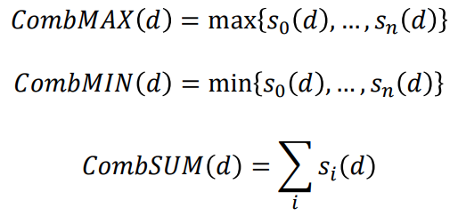

## Rank fusion
* 두개 이상의 rank 를 합쳐서 하나의 혹은 더 나은 rank 를 만드는 것
* Effects of rank fusion
	* Skimming effect : 단일 쿼리에 대해서 다른 유사한 문서를 찾아줄 수 있게 됨
	(different retrieval models may retrieve different relevant documents for a single query)
	* Chorus effect : 잠재력이 있는 문서는 제안된 문서가 얼마나 많은 retrieval model에 의해서 제안되는지에 상관관계가 있다
	(potential for relevance is correlated with the number of retrieval models that suggest a document)
	* Dark horse effect : 몇개의 retrieval model 이 몇몇 문서에 대해서는 더 정확한 혹은 더 안좋은 성능을 보일 수 있다
	(some retrieval models may produce more(or less) accurate estimates of relevance, relative to other models, for some documents)
* 검색 결과에 대한 rank fusion method
	* Unsupervised
		* Score-based methods
			* Comb*
		* Rank-based fusion
			* Bordafuse
			* Condorcet
			* Reciprocal Rank Fusion (RRF)
	* Supervised
		* Learning to rank
		* Learning to fuse

1. Comb*
	* Use score of the document on the different lists as the main ranking factor
	
	* Lucene 에서 쓰임
	
	* wComb*
		* Rank 에 weight 줘서 계산
		* 이 weight 는 learning 시켜도 되고 임의로 지정해도 되고
2. Borda fuse
	* Voting algorithm
	* For each rank, the document gets a score corresponding to its (inverse) position on the rank.
3. Condorcet
	* Voting algorithm that started as a way to select the best candidate
	* Pairwise comparison
		* D1, d2 의 rank 를 비교해서 d1 이 d2를 몇번이나 이겼는지 이런것들 수를 세서 도출
	* Computational complexity 가 엄청 높아
4. RRF(Reciprocal Rank Fusion) - (반비례의 rank)
	* It weights each document with the inverse of its position on the rank
	* Top rank 를 갖는 어떤 것들에 대해서 더 중요하게 취급하고자
	* 아래 논문에서 condorcet 나 individual rank learning method 보다 좋은 성능을 보여준다는걸 보임
		* Gordon Cormack, Charles LA Clarke, and Stefan Büttcher. Reciprocal rank fusion outperforms Condorcet and individual rank learning methods. ACM SIGIR 2009.
		
