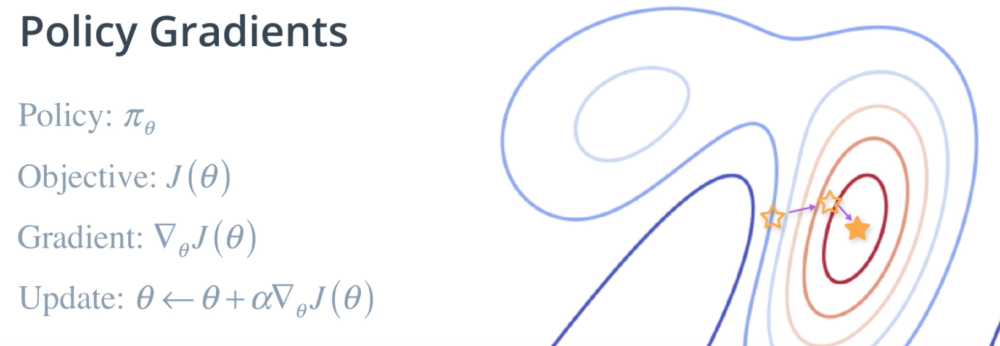
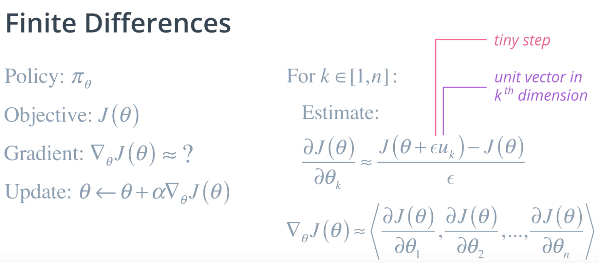
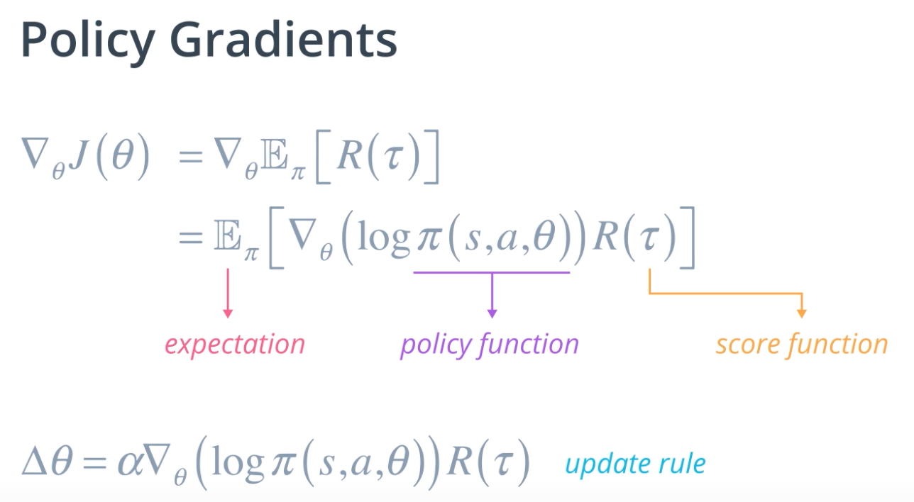

Stochastic policy 는 잘 동작할수도 하지 않을수도 있을것(local optima 에 걸리거나 converge 하기까지 오래걸리거나

이상한 방향으로 가지는 않을 것
Gradient 가 증가하는 방향으로 가게 될 거야

Gradient 를 바로 찾는게 불가능 할 떄
Tiny value 를 더해가면서 partial derivative 구해

시간이 많이 걸릴수가 있어

Computing gradients analytically
	Value function 의 expectation 값의 미분을 구하는건 쉽지 않아
	Score function 을 이용하면 좀 더 쉽게 할 수 있어
	
	

monte carlo policy gradient
	