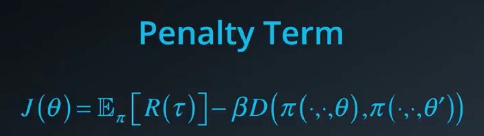
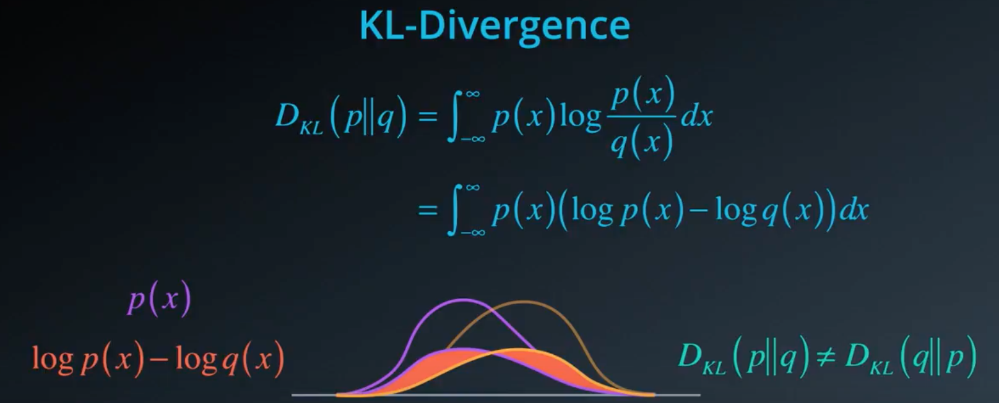
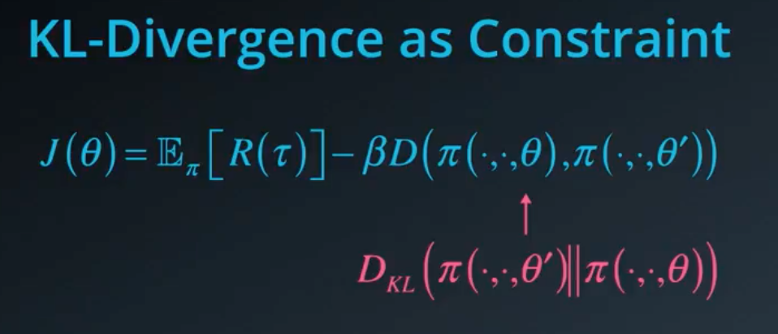

# Constrained policy gradients
* Better policy 로 가기 위해서
	* 더 좋은 방향으로 가기를 바라지만 learning process 자체는 되게 불안정하고 비효율적임
	* 로보틱스처럼 까다로운 거슬은 급작스러운 policy parameter 의 변화가 다 망쳐버릴 수가 있옹
	* Objective function 뿐 아니라 policy parameter 도 고려할 필요가 있음
	* Parameter 를 정해진 크기만큼, 혹은 정해진 방식대로 수정해야할 수도 있음
	* --> 이런건 gradient based algorithm 에서 constraint 를 부여하는 방식으로 구현될 수 있음

* 방식 1 : 최대 delta 까지만 policy 변화를 줌

* 방식 2 : Penalty term 이용

	* Objective function 에 penalty term 추가하는 것
	(sum multiple of this difference)
	* 잘 안변하게 될 것(regularization 넣는거랑 비슷함)

* 두 policy 의 차이를 양적으로 비교할 방법이 필요함
	* Parameter 의 차이에 norm 을 취함(Euclidean norm) --> 적절한 비교가 아닐거야
	* Policy 를 probability distribution over actions 로 봐야
	* 이 distribution 들을 어떻게 비교할 것인가! --> KL divergence
	
	
	* 여기에 kl divergence 로 punishment 를 줘서 너무 빨리 변하는걸 방지함
