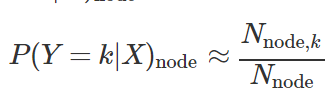
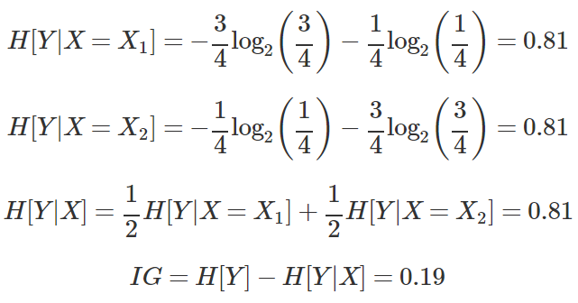

## Decision Tree 
### Entropy
* I(x)=−logP(x)
* 수식의 의미 - 정보량의 기댓값
	* Bit 로 표현 했을 때에 bit 수의 기댓값
		* 해당 정보 등장의 확률(p(x)) * 해당 정보에 필요한 bit 수(log_2(x))
			--> 정보량이 많고 다양하다면 많은 bit 가 필요하고, 혼란스러운(entropy)가 높은 상태인 것

### Decision tree
* 여러가지 규칙을 순차적으로 적용 분할하는 분류모형
	* Decision tree 구성은 이 entropy 를 작아지게 하는 방향으로 진행하는 것
	* 한번에 하나씩의 설명변수를 사용하여 예측가능한 규칙들의 집합을 생성
	* 한번 분기할때마다 변수 영역을 두개로 구분해, entropy 가 감소하는 방향으로 학습을 진행
	* 입력 변수 영역을 두개로 구분하여 **recursive partitioning**, 너무 자세하게 구분된 영역을 통합하는 **pruning** 과정으로 나뉨
* classification, regression 모두에 사용 가능
* decision tree 이용한 분류
	1. 독립변수 중 하나의 독립변수 선택, 그 독립변수에 대한 threshold 정함(**분류 규칙**)
	2. 전체 학습 데이터 집합(부모 노드)을 해당 독립 변수의 값이 기준 값보다 작은 데이터 그룹(자식 노드1)과 큰 데이터 그룹(자식노드2)로 나눔
	3. 각각의 자식노드에 대해 1,2 의 과정 반복하며 하위노드 만들어 감(자식노드에 하나의 클래스 데이터만 존재하면 더이상 증식 않고 중지)
* 예측 방법
	* 노드에 속한 데이터의 클래스의 비율을 구해서 이를 그 노드의 조건부 확률 분포로 정의
	
	* 테스트 데이터 예측시엔 root node 부터 규칙 차례로 적용해서 마지막에 도달하는 노드의 조건부 확률 분포로 클래스 예측
	
* 분류 규칙 정하기
	* 부모노드와 자식노드 간 엔트로피를 가장 낮게 만드는 최상의 독립 변수와 기준값을 찾는 것
	* 모든 가능한 기준값에 대해 정보 획득량을 구해, 가장 정보 획득량이 큰 변수와 기준값 선택
* 정보 획득량
	IG[Y,X]=H[Y]−H[Y|X]
	* e.g.
	
	1. 부모의 정보 획득량
		
	2. 자식의 정보 획득량
		A 방법
		
		B 방법
		

* Random forest
	* Decisive 한 column 들을 **random 하게 선택**해서 여러개의 decision tree 생성(어떤 요소들을 이용해서 decision tree 구성할지 결정하는 것) --> 이래서 이름이 **random** forest
	* 그 다음에 이것들에 대해서 vote 를 진행(임의의 샘플로 제대로 나눠지는 tree 를 골라내게 함) --> ensemble

* 참고
https://datascienceschool.net/view-notebook/16c28c8c192147bfb3d4059474209e0a/
https://medium.com/@deepvalidation/title-3b0e263605de

https://operatingsystems.tistory.com/entry/Data-Mining-Decision-Tree?category=624326