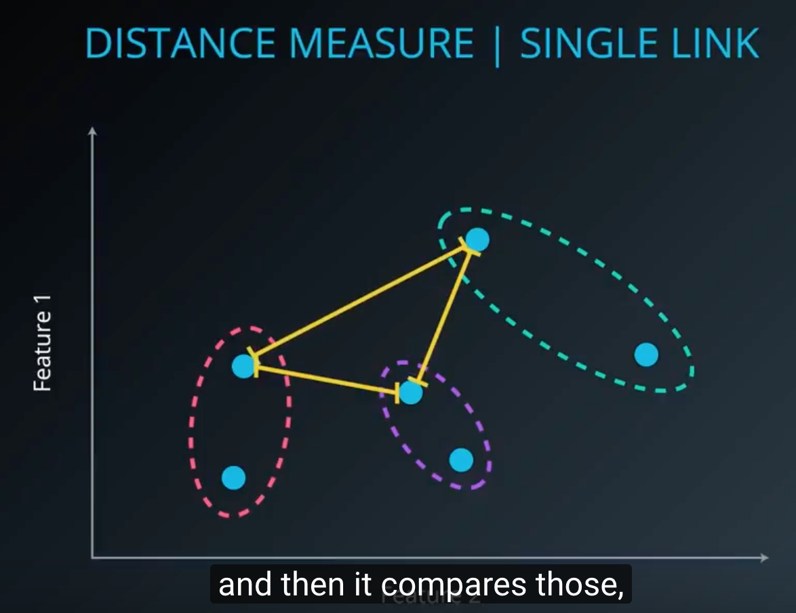
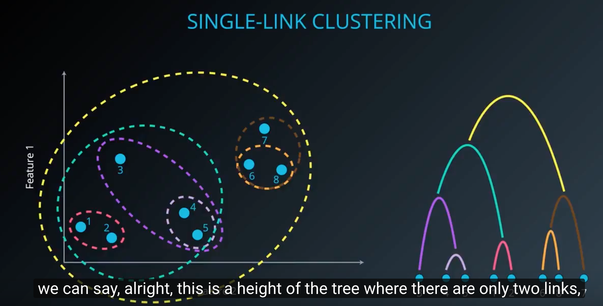

### Hierarchical clustering
* Single link clustering(사실은 비효율 --> sklearn 엔 이게 있지도 않아)
	1. cluster 간 거리비교 - cluster 간 최단거리를 갖는 노드들을 구함
	2. 각 클러스터간 의 최단거리 중에서 가장 가까운 두개 클러스터를 통합
	
	
	
	* 단점 : 
		* 이렇게 distance measure 를 최단거리로 하면 하나의 cluster 가 대부분의 node 를 먹어버릴 수 있음
		* 다른 곳에 속하는게 더 나았을 cluster 의 일부가 포함돼버릴수가 있음
	* 장점
		* 원하는 cluster 의 갯수에 맞춰서 clustering 결과를 낼 수 있음(merge 과정을 중간에 멈추면 됨)
		* 점 하나씩만 비교하니깐 cluster 모양이 다양해질 수 있음(k-means 와 비교됨)
		

* Complete link clustering
	* Iteration 돌때에 cluster 간 거리 구하는 measure 를 가장 먼 두개의 점 사이의 거리로 함
	(single link 와 반대)
	* 가장 먼 두개의 점 사이에서만 비교하니까 클러스터 내 다른 점들을 고려하지 못함
	--> 잘못된 clustering 유발(Single link 에서와 동일)
	* 길게 늘어져 있는 데이터 형태는 single link 에 더 잘 어울리고 뭉텅이로 되어있는 경우는 complete link 가 더 잘 맞음
	
* Average link
	* Cluster 내의 모든 점끼리의 거리를 구해서 average 로 measure 를 써
* Ward's method
	* Cluster 끼리의 병합을 가정하고, centeroid 를 그려 / 그러고 나서 그 center 로부터의 거리를 구함
	* 위의 linkage 기법들 중에서 가장 cluster 변동성이 적음
	
* tip
	* Dendrogram 그리려면 --> scipy 쓰면 됨
	* Clustering 평가하려면 adjusted_rand_score 쓰면 돼
	* 더 좋은 clustering 결과를 위해서 데이터를 normalize 하자(prepricessong.normalize())
* Dendrograms
	: hierarchy 와 cluster 간의 거리를 표현한 graph
	* 이걸 확인하면 더 나은 clustering 방식 선택할 수 있음
	
*  Hierarchical clustering
	* 장점
		* clustering 결과를 표현했을 때에 informative 할 것임
		* Provides an additional ability to visualize
		* 데이터 셋 자체가 hierarchical 한 특성을 갖고 있으면 더욱 파워풀해짐
	* 단점
		* noise 나 outlier 에 취약함
		* Computationally intensive O(n^2)-->clustering measure 구할때마다... 
	* measure 요약
		* single-link : 최단거리
		* complete-link : 최장거리
		* average-link : 모든 거리 구한후 average
		* Ward's method : clusteroid 간 거리

