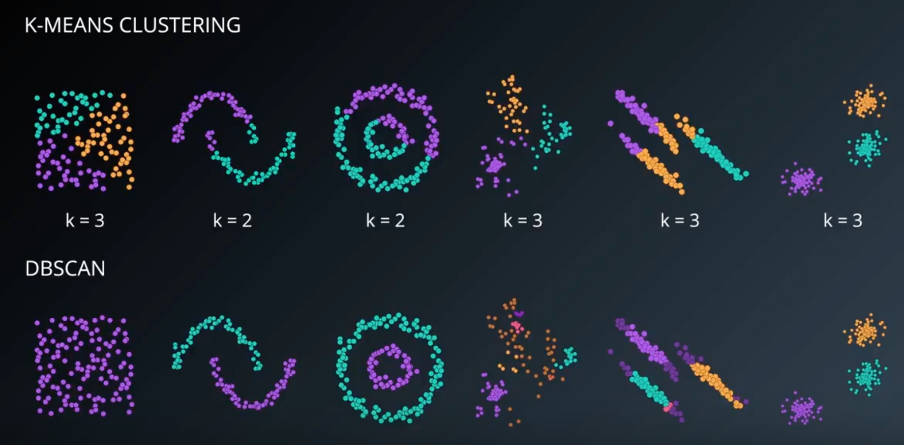

## Density clustering
### DBScan

○ 장점
	○ Don't need to specify the number of clusters
	○ Flexibility in the shape and size of clusters
	○ Able to deal with noise
	○ Able to deal with outliers
○ 단점
	○ Border points that are 	reachable from two clusters
	○ Faces difficulty finding clusters of varying densities

--> 이거 보완하려고 나온 알고리즘이 hdbscan
Dbscan 에서 noise로 분류된 지점들을 outlier 나 abnormaly 로 가져옴
