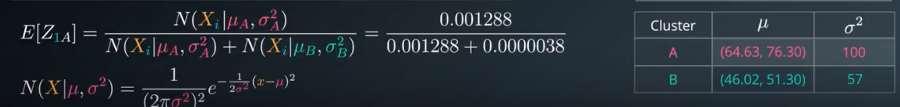
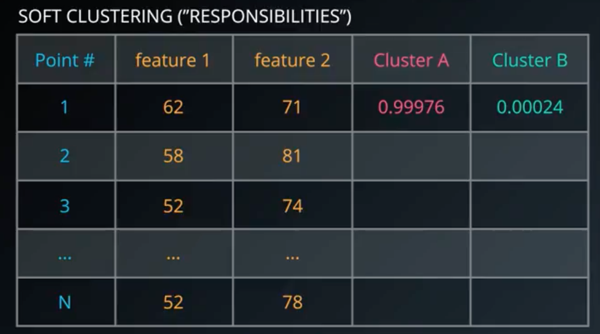
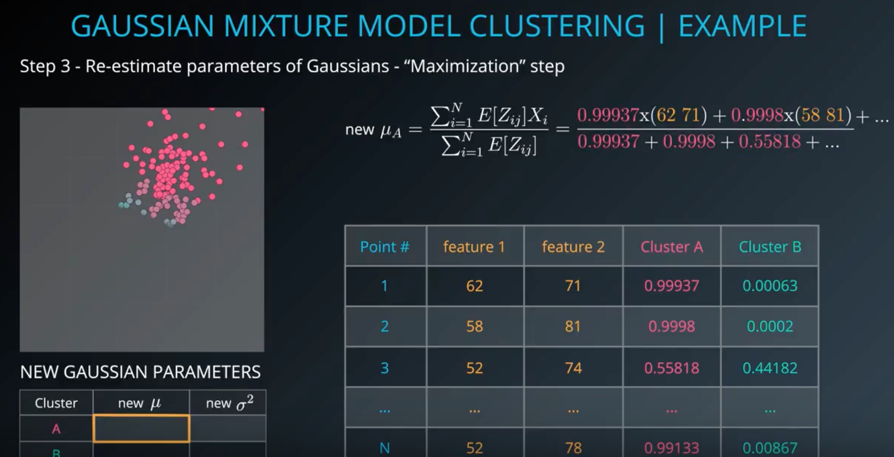
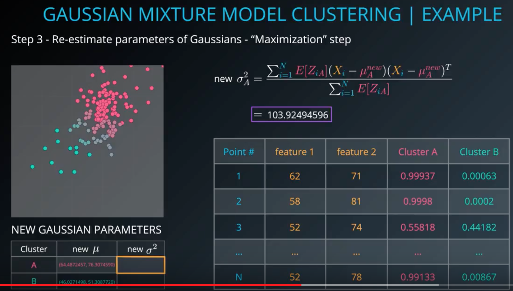
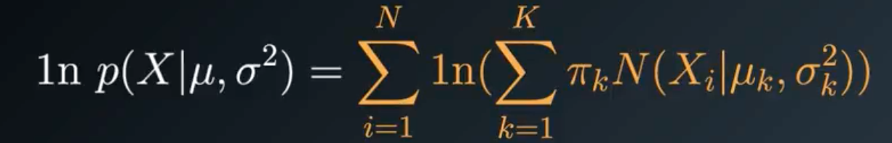

## GMM(Gaussian Mixture Model)
* 데이터들이 가우시안 분포를 따를거라는 가정으로 클러스터링
* EM 알고리즘(Expectation-Maximization algorithm)이용
	1. Initialize K Gaussian distributions
	2. Soft-cluster data --> expectation
	3. Re estimate the gaussians --> maximization
	4. Evaluate log-likelihood to check for convergence
	* Repeat from step 2 until converged
* Expectation maximization
	* Step1. Gaussian 분포 시작(두개의 Gaussian 이 섞인거라면)
		* 임의로 두개의 cluster로 나눔
		(random point 혹은 k-means clustering 을 돌려서 넣어 놓는 것)
		* 이 두개의 cluster 에서 각각 평균, 분산 구함
	* Step2. soft clustering the data points --> expectation
		* 어떤 cluster 에 속하는게 더 맞을지 확률 밀도 함수 기준으로 구한다
		
			* 어디에 등장하는게 더 가능성이 높을지를 계산해보는 것(각각의 Gaussian 함수에서 확률 밀도함수 구해서…)
			
			이 표를 채운다
	* Step3. re-estimate parameters of Gaussians --> maximization
		* Step 2 에서 만든 표 기반으로 클러스터 다시 구성(평균, 분산)
			
			* 각각의 확률 함수에 값을 곱하는 방식으로 평균구함(위그림)
			
			* 분산 구함(위 그림)
	* Step4. Evaluate log-likelihood
		
		* 이걸 maximize 해야함
		* 이런 gm 구하면 되는 것
* Mean, variance 외, covariance를 type 을 줄 수도 있음(e.g. spherical 로 하면 타원형 데이터는 clustering 이 잘 안될것)
* Initialization 을 뭘로 하느냐가 clustering 결과에 많은 영향을 줌(위에서는 manually or randomly 꼽았기 땜에 결과가 별로 였던 것)
* 장점
	* Soft-clustering
	(sample membership of multiple clusters)
	* Cluster shape flexibility
* 단점
	* 초기 값에 민감함
	* local optimum 에 수렴할 수도 있음
	* 수렴 속도가 느림
