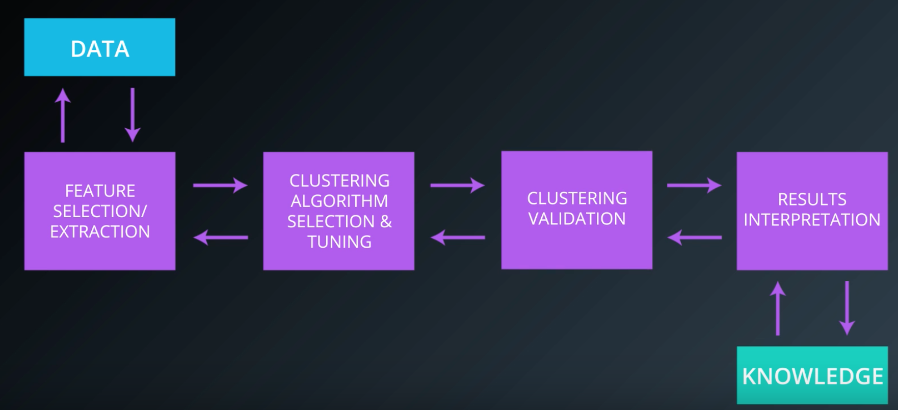
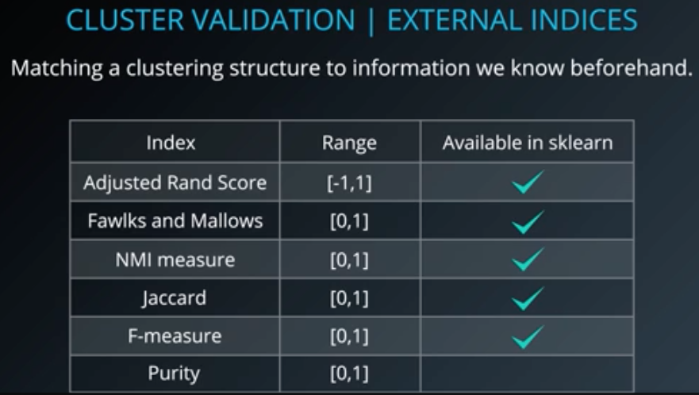
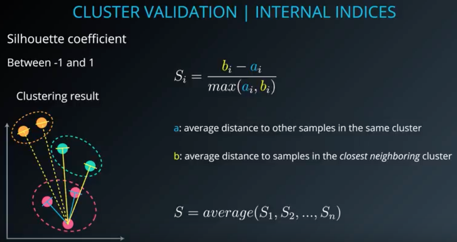
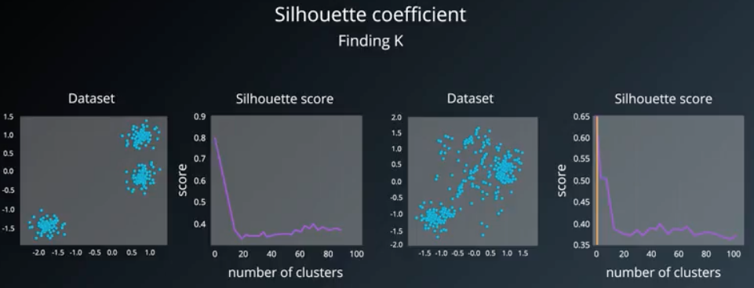
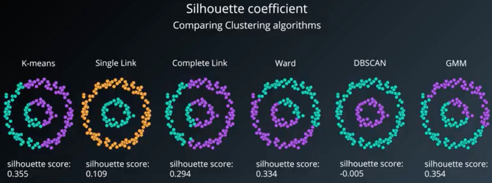

## clustering analysis process
* 전체 과정은 아래 그림으로 요약 가능

* Clustering validation(compactness / separability)
	* 데이터 형태에 따라 validation 방식이 다를 것
		* External indices
			* Labeled data
		* Internal indices
			* 답이 없을 때(unsupervised learning)
		* Relative indices
			* 어떤 clustering structure 가 더 나은가
	* clustering 평가의 주요 지표
		* Compactness
			* Cluster 의 element 들이 얼마나 가까운가
		* Separability
			* 서로 다른 cluster 들이 얼마나 멀리 있는가
* External validation indices
	* adjusted rand score 등...
	
	* labeled dataset 의 경우의 scoring methods
	* Adjusted rand index
	
		* rand index = (a+b)/(nC2)
		(cluster 가 두개인 경우)
			* A - 같은데 있는 두개가 같은데 있는 경우
			* B - 다른데 있는 두개가 다른데 있는 경우
		* Adjusted Rand Index
			(Rand index - expedted index)/(max(rand index)-expected index)
* Internal validation indices
	* Label 된 정답 data 가 없는 경우
		
		* silhouette coefficient
			
			* S_i=(b_i-a_i)/max(a_i, b_i)
				* A - 동일한 cluster 내에서 다른 sample 까지의 거리 평균
				* B - 가장 가까운 cluster 의 sample 까지의 거리 평균
			
			* 몇개의 class 로 나누는것이 적당한지 찾을 수도 있지
			
			* --> 모든 모델에 적용될 수 있는 수치는 안디ㅏ
			(dbscan 같은 알고리즘을 비교하자고 이 수치를 쓸 수는 없어)
			* 이거 대신 dbscan 에서 쓸 수 있는게 DBCV(Density Based Clustering Validation)