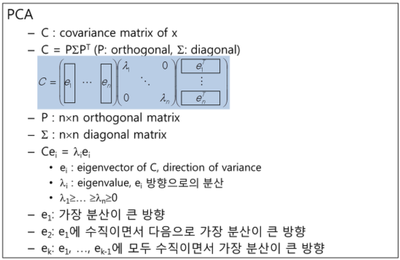
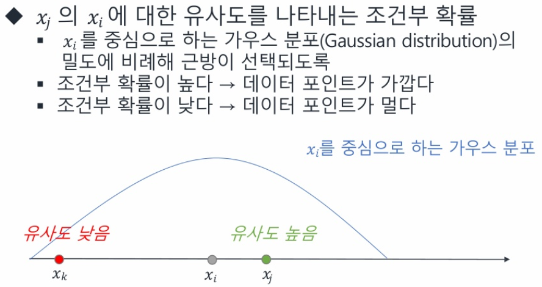
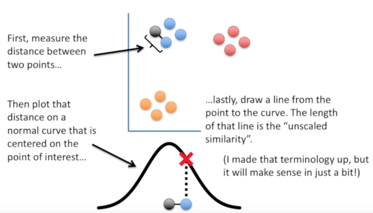
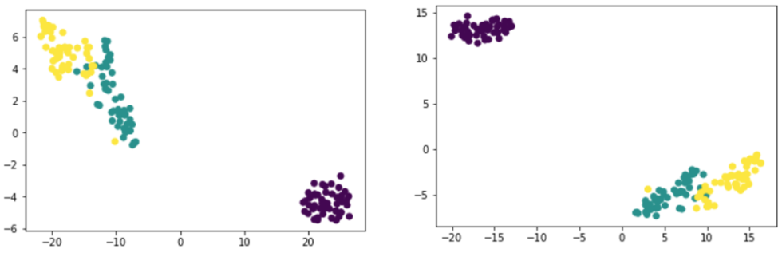

## Dimension reduction
* curse of dimensionality : 관측 데이터의 벡터 공간은 엄청 큰데 필요한 true data 는 작은 차원 공간으로 표현해도 충분한 경우
* 차원 줄이는 두가지 방법 : feature selection vs feature extraction
	* feature selection(변수 선택)
		* 변수 중에서 중요한 몇개만 고르고 나머지는 버리는 방법
		* 변수간 **중첩이 있는지**, 어떤 변수가 중요한 변수인지, 어떤 변수가 **타겟에 영향을 크게 주는 변수**인지를 분석할 필요가 있음
		* 대표성이 가장 큰 주요필드 몇개만 선택하여 대표 feature 로 활용
		* 중첩되는 변수 찾기 - 상관 분석
			- 상관 계수가 높거나 VIF(분산 팽창지수)가 높은 중첩 되는 변수들 중 하나만 선택
		* 타겟에 큰 영향을 주는 중요 변수 찾기 - 랜덤포레스트
	* feature extraction
		* 모든 변수들을 잘 조합해서 데이터를 잘 표현할 수 있게 하는 새로운 변수를 만들어냄
		* e.g. pca

### SVD
* A[m*n]=U[m*r]sigma[r*r]transpose(V[n*r])
	* A : Input data matrix (e.g. m documents, n terms)
	* U : Left singular vectors (m documents, r concepts)
	* sigma : singular values
		- r*r diagonal matrix(strength of each 'concept')
		- r: rank of the matrix A
	* V : Right singular vectors (n terms, r concepts)

### pca
* 여러 변수가 있는 데이터 차원에서 가장 주요한 성분을 순서대로 추출하는 기법
* 여러 변수의 값을 합쳐서 그보다 적은 수의 주요 성분을 새로운 변수로 하여 데이터를 표현
* 주성분 --> 그 방향으로 데이터들의 분산이 가장 큰 방향 벡터
* pca : 입력 데이터들의 공분산 행렬에 대한 고유값 분해
	* 이 때 나오는 고유벡터가 주성분 벡터
	* 고유벡터가 주성분 벡터 - 데이터의 분포에서 분산이 가장 큰 방향
	* 데이터의 분산을 최대한 보존하면서 소로 직교하는 축을 찾아 고차원의 표본들을 연관성 없는 저차원 공간으로 변환하는 것
	* 고유값 - 그 분산의 크기

* 과정
	1. 데이터 X의 empirical mean을 계산한 후 모든 데이터에서 평균을 빼준다.(공분산 행렬 계산)
	2. 새로 만들어진 데이터 X^의 가장 큰 singular value부터 k번째 큰 singular value까지에 대응하는 singular vector들을 구한다.(고유값 분해)
	3. 뽑아낸 k개의 singular vector로 U를 구성하고 return
* Frobenius norm의 제곱값을 사용하므로 각 element들이 norm을 계산할 때 한 번 제곱되고, 다시 전체에 제곱을 취할 때 또 제곱이 취해지므로 조금이라도 원래 데이터와 다른 outlier가 존재하게 된다면 그 효과가 굉장히 극적으로 증폭되기 때문에 noise에 취약

### t-SNE
* T-Stochastic Neighbor Embedding
* pca 에서 차원을 줄인 후, 변별력이 없어지는 군집이 생겨버리는 문제의 해결하려 개발
* Stochastic Neighbor Embedding
	* 고차원 공간상 유클리드 거리를 데이터 포인트의 유사성을 표현하는 조건부 확률로 변환하는 방법
	* e.g. x_j의 x_i 에 대한 유사도를 나타내는 조건부 확률
	
* process
	
	1. 점하나 선택
	2. 이점에서 다른 점까지 거리 측정
	3. T 분포 그래프 이용해서 기준점을 T 분포 상 가운데 위치 시켰을 때에 기준점으로 부터 상대점 까지 거리에 있는 T 분포 값을 similarity 로 정의
	4. 이 similarity 를 기준으로 가까운 값끼리 묶는다
* 장점
	* 군집이 중복되지 않는다
* 단점
	* 매번 계산할때마다 축의 위치가 바껴서 다른 모양으로 나타난다
* 군집성 자체는 유지되기 때문에 시각화를 통한 데이터 분석에 유용하지만, 매번 값이 바뀌기때문에, 학습의 feature 로서 이용되기는 어렵다

### matrix factorization
* 

* 참고
https://wikidocs.net/7646
https://bcho.tistory.com/1209
http://mllab.sogang.ac.kr/index.php?mid=research_subj_fs
https://kkokkilkon.tistory.com/127
https://darkpgmr.tistory.com/110
https://www.slideshare.net/ssuser06e0c5/visualizing-data-using-tsne-73621033
