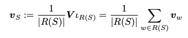
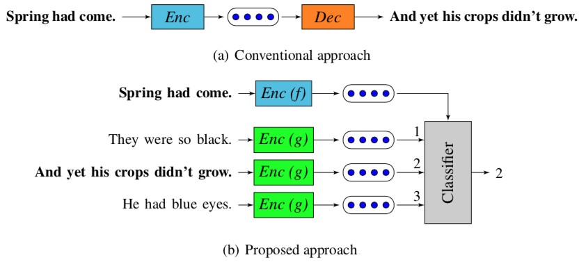

## Sentence Embedding Model Survey
* sent2vec
	* Sent2Vec 문장 임베딩을 통한 한국어 유사 문장 판별 구현
	* (http://docs.likejazz.com/paper/kaonpark-sent2vec-2018.pdf)
	* (2018, 한글 및 한국어 정보처리 학술대회)
	* Sent2Vec은 범용적인 문장 임베딩을 목표로 하는 비지도 학습 모델
	* Word2Vec의 CBOW 모델을 문장 단위로 확장
	
		* R(S) - 문장 S에 존재하는 유니그램을 포함한 모든 n-그램 목록
		* 수식의 계산 결과로 문장에 존재하는 모든 요소의 벡터 합에 평균을 취한 값을 문장 임베딩으로 갖는다 (word2vec 기반)
* Encoder-decoder model
	* Skip-thought 
		* Kiros et al. (2015)
		* encoder RNN - vector representation of the source sentence
		* decoder RNN - 인접한 문장의 단어들을 순차적으로 예측
		* target sentence → input sentence 의 인접한 문장
		* variation
			* (Hill et al., 2016) auto encoder 로 input sentence 만 예측
			* (Le & Mikolov, 2014) input sentence 의 window 의 properties를 예측
	* Quick-thought (2018)
		
		* decoder 를 classifier 로 대체해서 여러 후보 문장 중에서 대상 문장을 예측하도록 함
			* → semantic embedding 할 때에 쓸데없는걸 다 제거할 수 있을 것 / 시간은 단축되고 핵심에 집중할 수 있음
			* 이 논문에서는 encoder 의 rnn cell로 GRU(Gated recurrent unit) 사용
	* CNN-encoder
		* Gan et al. (2016)
		* CNN encoder 로 encoding 후 rnn 으로 input sentence 와 함께 neighboring sentences 를 reconstruct
	* Auto-encoder model
		* Socher et al. (2011)
			* recursive auto-encoder model
			* recursive encoder model 로 input sentence 를 encode / decoder 로 hidden state 를 reconstruct
		* Hill et al. (2016)
			* de-noising autoencoder model (SDAE)
			* 단어 지우고, bigram swapping 하고나서, 원래 문장을 reconstruct
	* Bag-of-words(BoW) representations
		* Hill et al. (2016)
		* FastSent model - context sentence 에 등장하는 단어 예측하는 bow 기반 모델
