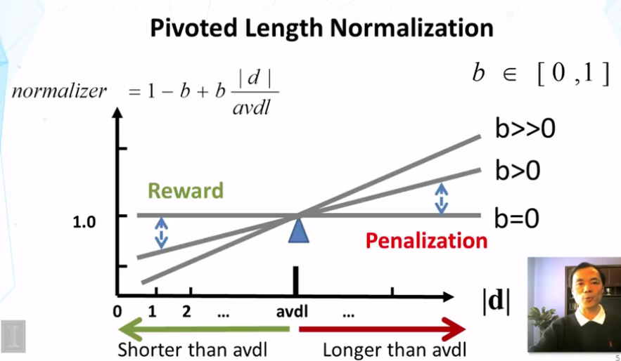

## VectorSpaceModel
* Similarity-based model의 일종
* 쿼리와 유사한 문서가 원하는 문서일거다 라는 가정 : f(q, d)=similarity(q, d)
* 각 차원이 term 을 상징
	* 모든 문서들을 이런 공간 안에 벡터으로 표현
	* 또한 query 도 vector 로 표현
	* 벡터간의 유사도로 원하는 문서를 잡아냄
* VSM is a framework
	* 가정
		* Representation of a doc/quer by a term vector
			* Term 은 단어, phrase, n-gram 어떤 것이든 다 될 수 있어
			* N terms define an N-dimensional space
			* Doc vector : d=(y1, y2,...yN) query vector : q=(x1, x2,…, xN)
		* Relevance(q, d) = similarity(q,d)=f(q,d)
	* 실제 코딩을 하려면 정의해야할게 엄청 많지 - 그래서 framework 라고 부른 것

### VSM 에서 정의해야하는 것
* What VSM doesn't say
	* How to define/select the 'basic concept'
	* How to place docs and query in the space
		* Term weight --> importance of term/ element value compute 하는 방법 --> how well the term characterizes the doc
	* How to define the similarity measure

## Simplest instantiation
### Dimension 정의
* 각 단어들을 차원으로(n 개 단어 --> n 차원)
* 등장, 비등장을 0,1로 표현

* Similarity instantiation --> simplest VSM
	* Dot product = sim(q, d)=q.d=x1y1+…+xnyn
	* 이렇게 하면 얼마나 많은 단어들이 match 되는지를 계산할 수 있게되지
	* 이렇게 계산한 값이 동률일 수 있지만, 같은 단어가 여러번 등장했거나, 더 중요한 단어들이 등장했을 수도 있음

## 1st step improvement
* --> vector 를 tf\*idf 값으로 구성
* IDF =log[(M+1)/k] m=num of docs in collection k =doc frequency
* Line을 따른다면 idf 보다 좋은 function 은 아닐 것 --> turnning point 가 있어야(이보다 더 많이 등장하면 그냥 커먼한 텀이다…)
* 근데 tfidf 높은 한 단어가 계속 등장하게 되는 문서는 이 점수가 지나치게 높아질 수가 있어 --> 이보다 더 세련된 model 이 필요해짐

## 2nd step improvement
### bm25 transformation
* Tf 를 개량
	* Logarithm function 으로… linear 하게 증가하지 않게
		
	* 현재는 이 모델 쓰는게 꽤 괜찮게 여겨짐(k+1는 upper bound)
		* 이 모델 안에서는 k를 변화시키면 0,1model, 그리고  linear model 을 만들 수 있음(flexible)
		* Final ranking function
			

## 3rd step improvement
### Document length Normalization
* 긴 문서는 query 에 포함된 단어들이 등장할 확률이 높아짐
* Penalize a long doc with a doc length normalizer
	* 문서가 긴 이유 --> 많은 단어가 있어서 or 많은 contents 가 있어서
		* 많은 단어라면 더 많이 penalize 시켜서 안보이게 해야
		* Contents 가 많아서라면(여러 문서의 abstract 를 나열한 문서라면) --> 원하는 내용이 있기는 있으니 덜 penalize 시켜야
	* Pivoted length normalization
		* Average doc length as "pivot"
			
			이 normalizer 를 이전까지 계산한 bm25등의 것들을 나눠주면 되징

## similarity function
* Improved instantiation of similarity function?
* Cosign of angle between two vectors
* Euclidean
* Dot product 가 여전히 짱짱이닷!(general with appropriate term weighting)

## Further improvement of BM25
* BM25F
	* BM25 for documents with structures("F"=fields)
	* Combine the frequency counts of terms in all fields and then apply BM25(instead of the other way)
* BM25+
	* TF formula를 조금만 바꾸면  over penalization of long document 를 엄청나게 fix 해주더라
	* 특히 법률 문서에 대해서 경험적으로 증명됐음

* Summary of VSM
	* Relevance(q, d)=similarity(q, d)
	* Query and documents are represented as vectors
	* Heuristic design of ranking function
	* Major term weighting heuristics
		* TF weighting and transformation
		* IDF weighting
		* Document length normalization
	* BM25 and Pivoted normalization seem to be most effective

