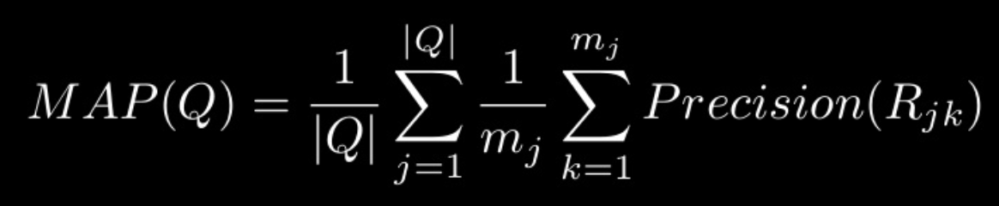
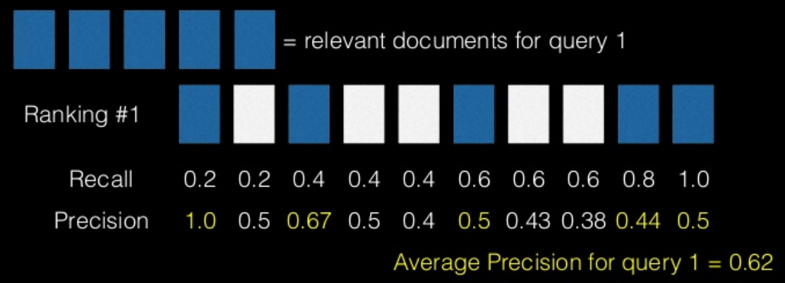
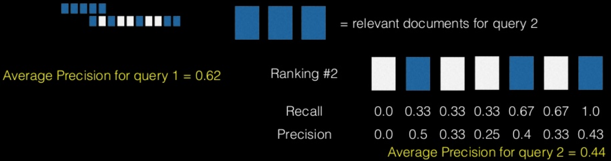
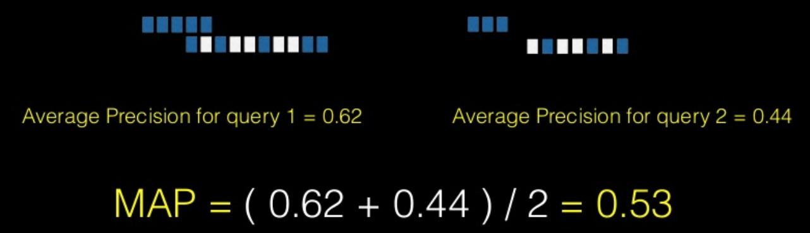

## Ranking System 의 Evaluation 방법
* MAP (Mean Average Precision)
	* recall 이 0.1 일때 precision 이 얼마인가 이런식의 비교를 간단하게 함
	
	* 각 information need 당 retrieval set 을 rank 순대로 하나씩 늘려가면서 precision 을 계산함
	* relevant document 가 모두 계산에 반영되는 순간 (R=1 이 될 때) 다음 query 로
	* 모든 쿼리에 대해서 위의 것들을 계산해서 다음 평균 값을 구하면 됨
	
	
	
	* map 은 모든 recall level 에서 precision 을 계산해야 됨

참고 : https://www.slideshare.net/MinsubYim/evaluation-in-ir-system