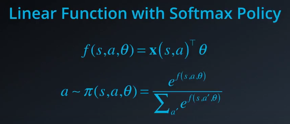
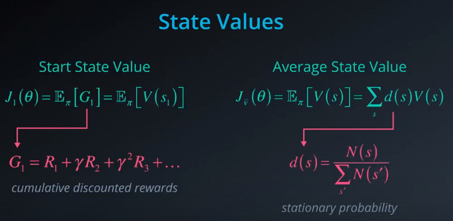
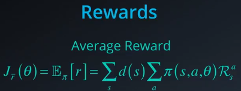

* simplicity
* stochastic policies
* continuous action space

# linear functions
* linear function with softmax policy
	* discrete action 에서만 적용 가능
	
* linear function with gaussian policy
	* Continuous 할 때에는 가우시안 분포 안에 있다고 가정하고 적용
	* 뮤, 시그마는 고정이라고 가정
	

# objective function
* 어떤 policy 가 좋은지 평가

	* R - 해당 policy 를 따랐을 때에 얻을 수 있는 reward
	* E - 그 기댓값
* state values
	
	* start state value : 모든 reward 의 합은 첫번째 state 의 value 와 같아
		* 근데 계속 진행하면서 starting state 에 의존할 수는 없어
	* average state value (--> start state value 대신)
		* & 이때에 state 별로 등장 횟수가 다를 거니까 probability of occurrence of the respective state 를 곱해줘
* action values
	
	* state value 와 유사하게 계산됨
* average rewards
	
	* 근데 policy 를 바로 encoding 한 이유는 state value 나 action value 를 track 하고 싶지 않기 때문임
	* --> average reward at each time step을 구해
