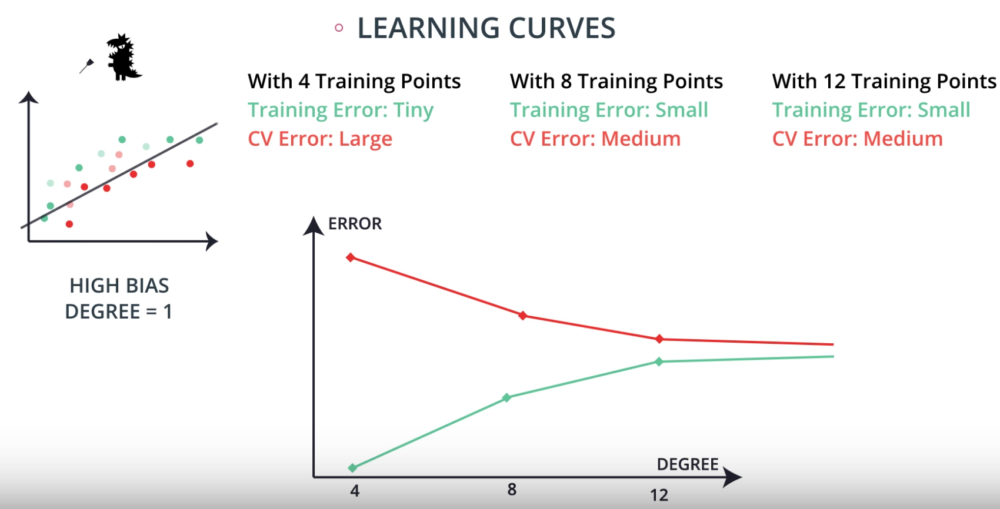
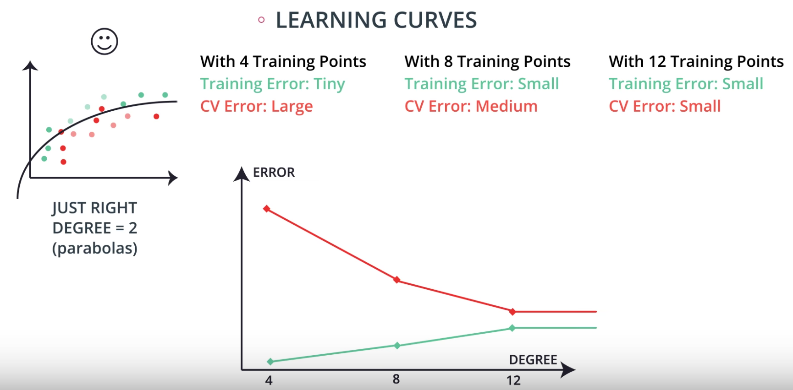
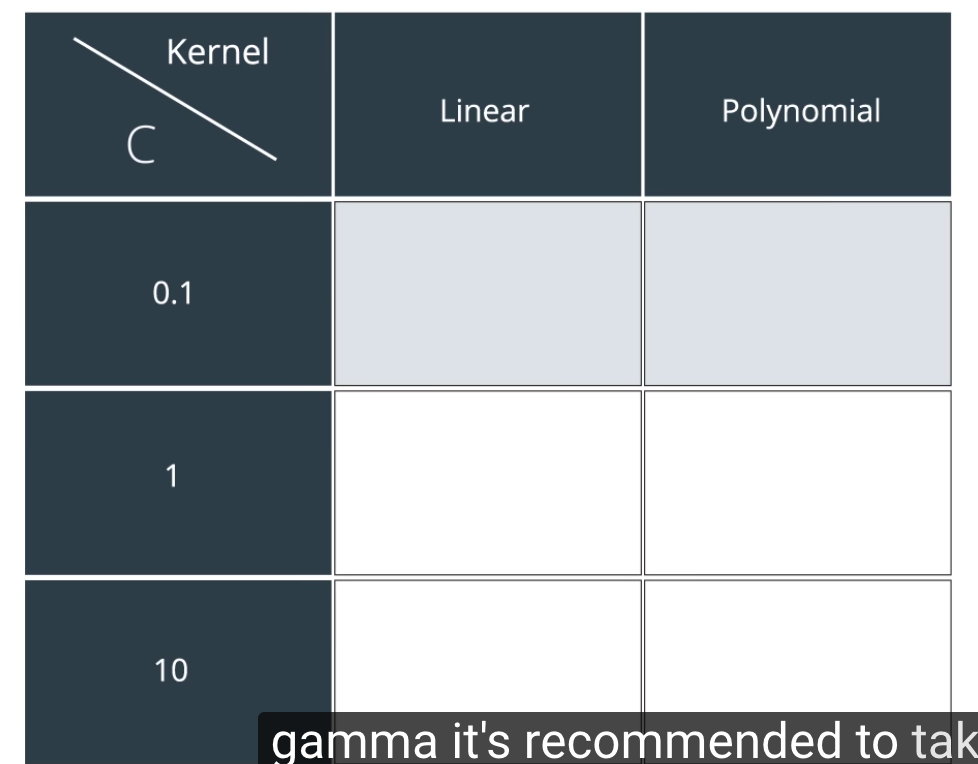

## model selection
* model complexity graph
	* 
	* Training error 와 testing error 를 각각 graph 로 표현
		* 둘 다 크면 under fit
		* testing error(cross validation error)가 크면 over fit
		* 두개가 비슷하고 작아야해
		* --> 근데 model 선택하는 과정에서 testing data 를 고르는것 자체가 웃기는 일
		* --> training set 안에서 cross validation set 을 두자!

* k-fold cross validation
	* data 재활용
	* 데이터를 k 개로 분할
	* 분할 데이터 k-1 개로 training / 나머지 1개로 validation
	* 이 과정을 k 번 반복한 후 결과값을 평균내서 사용
	* 
	* Kfold(12,3,shuffle=True)

* Learning curve
	* Under fitting - 높은 지점으로 수렴
	
	* Good - 낮은 지점으로 수렴
	
	* Overfit - 수렴하지 않아
	

* Logistic regression model 을 학습시키는 방법
	* Training set 에서 cross validation set 추려
		* --> degree 각각에 대해서 cross validation set 에서 f1 score 구해
		* --> 이게 가장 좋은 degree 골라
		* --> 이 모델로 testing

* Decision tree
	* --> hyper parameter 설정(depth)
	* --> 각각에 대해서 cross validation set 에서 f1구해
	* --> 가장 좋은 depth 골라
	* --> 이 모델로 testing

* Svm
	* --> hyper parameter(kernal - polynomial or rbf, gamma)
	* --> grid search해
	
	Df.groupby('gender')['age'].mean()
	Df['height'].plot(kind='box') --> show distribution

