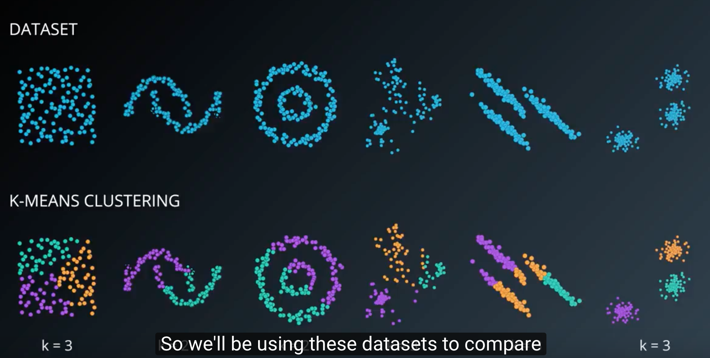

## K-means clustering
* k 개의 군집이 있다는걸 알고리즘의 input 으로 명시
* EM 알고리즘 기반 - 수렴할때까지 EM step 반복
* steps
	1. 주어진 seed 만큼의 clusteroid 를 설정
	2. expectation: 모든 개체들을 가장 가까운 clusteroid 의 cluster 로 할당
	3. maximization : clusteroid 를 각 cluster의 중심으로 이동시킴
	4. 2,3 의 과정을 반복

* 특징
	* Seed clusteroid 를 랜덤하게 잡게되는데 이때 뭘로 잡느냐에 따라서 결과가 너무 다름
	* Sklearn 에서는 n_init 을 설정해서 seed를 10번 정도 새롭게 생성해서, 그 중에 잘 나온 결과를 앙상블해서 보여줌
* 여전한 단점
	* Output 이 매번 계산할때마다 다름.
	* Counterintuitive clusters
		* Local mininum 에 끼어버릴 수 있음
	* 몇몇 독특한 형태의 데이터에서는 아예 이용할 수 없음(아래 처럼)
	

