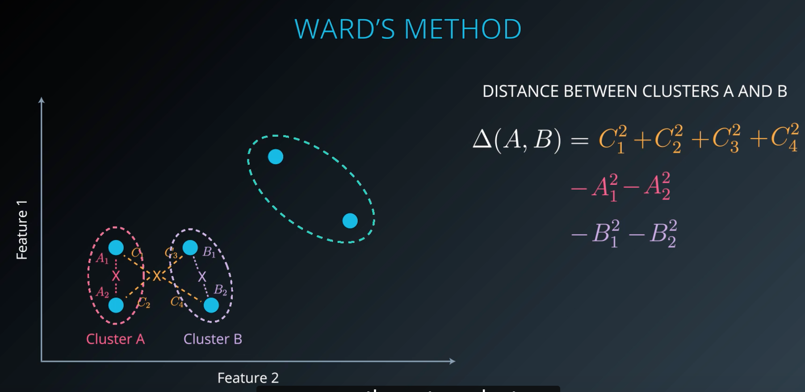

### Hierarchical clustering
* Single link clustering(sklearn 엔 이게 있지도 않아)
	* 처음에 제일 가까운것끼리 두개씩 묶고, 그 다음 iteration 에서 나머지 node 들과 가장 가까운 node 까지의 거리를 구해서 그 cluster 에 포함시켜
	
	
	

	* 원하는 cluster 의 갯수에 맞춰서 clustering 결과를 낼 수 있어
	* 단점 : 
		* 이렇게 distance measure 를 최단거리로 하면 하나의 cluster 가 대부분의 node 를 먹어버리거나
		* 다른 곳에 속하는게 더 나았을 cluster 의 일부가 포함돼버릴수가 있어
		* 점 하나씩만 비교하니깐 cluster 모양이 다양해질 수 있지
		
	* Dendrograms 의 효용(잘못 clustering 된 것처럼 보이는 것도 dendrogram(hierarchy 와 cluster 간의 거리를 표현한 graph)을 확인하면 더 나은 clustering 방식을 선택할 수 있다.
	
* Complete link clustering
* Agglomerative clustering
	* Iteration 돌때 거리 구하는 measure 를 cluster 내에서 가장 먼 두개의 점 사이의 거리로 해
	* 가장 먼 두개의 점 사이에서만 비교하니까 클러스터 내 다른 점들을 고려하지 못함- 잘못된 clustering 유발(Single link 에서와 동일)
* Average link
	* Cluster 내의 모든 점끼리의 거리를 구해서 average 로 measure 를 써
* Ward's method
	* Cluster 끼리의 병합을 가정하고, centeroid 를 그려 / 그러고 나서 그 center 로부터의 거리를 구함
	
	* Dendrogram 그리려면 --> scipy 쓰면 돼
	* Clustering 평가하려면 adjusted_rand_score 쓰면 돼
	* 더 좋은 clustering 결과를 위해서 데이터를 normalize 하자(prepricessong.normalize())
	* 위의 linkage 기법들 중에서 가장 cluster 변동성이 적어
*  Hierarchical clustering
	* 장점
		* Resulting hierarchical representation can be very informative
		* Provides an additional ability to visualize
		* Especially potent when the dataset contains real hierarchical relationthips
	* 단점
		* Sensitive to noise and outliers
		* Computationally intensive O(n^2)

