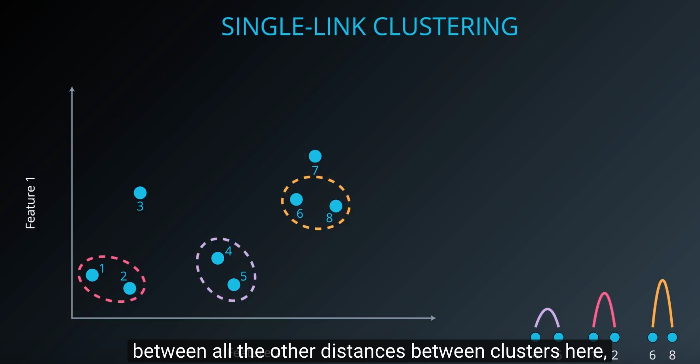
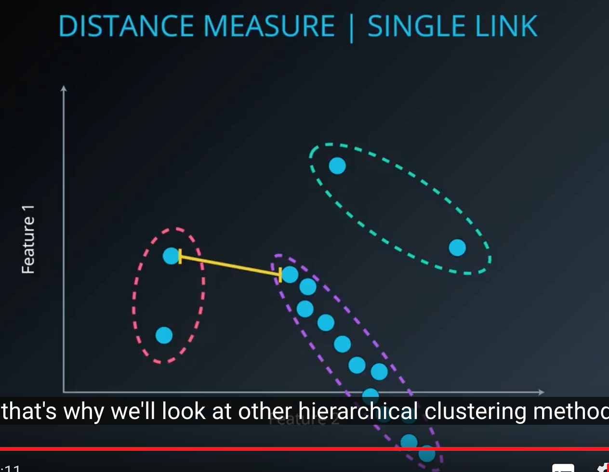
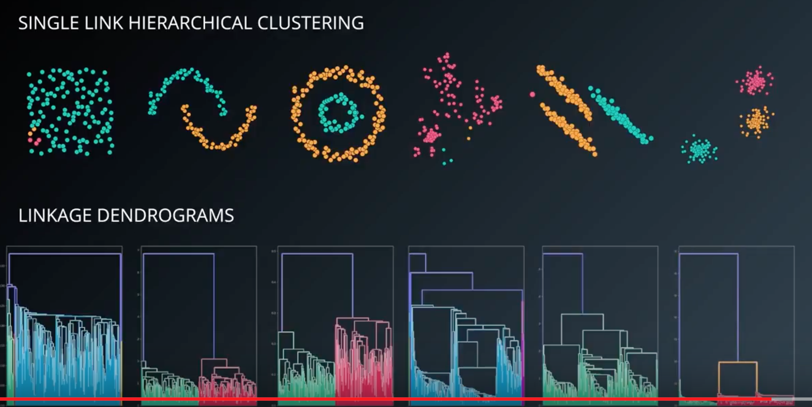

### Hierarchical clustering
* Single link clustering(sklearn 엔 이게 있지도 않아)
	* 처음에 제일 가까운것끼리 두개씩 묶고, 그 다음 iteration 에서 나머지 node 들과 가장 가까운 node 까지의 거리를 구해서 그 cluster 에 포함시켜
	
	
	

	* 원하는 cluster 의 갯수에 맞춰서 clustering 결과를 낼 수 있어
	* 단점 : 
		* 이렇게 distance measure 를 최단거리로 하면 하나의 cluster 가 대부분의 node 를 먹어버리거나
		* 다른 곳에 속하는게 더 나았을 cluster 의 일부가 포함돼버릴수가 있어
		* 점 하나씩만 비교하니깐 cluster 모양이 다양해질 수 있지
		
	* Dendrograms 의 효용(잘못 clustering 된 것처럼 보이는 것도 dendrogram(hierarchy 와 cluster 간의 거리를 표현한 graph)을 확인하면 더 나은 clustering 방식을 선택할 수 있다.
	

