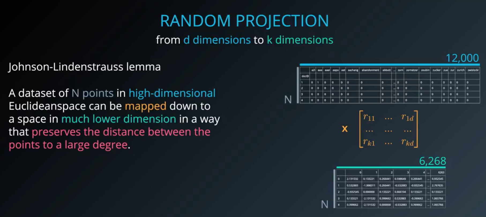
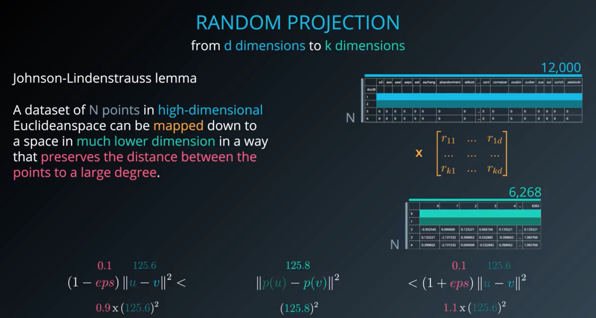

* One of the dimension reduction method
	* PCA 보다 computationally 더 효율적이다
	* 아무 축이나 만들어서 projection 시켜버려
	
	* Random matrix 에 multiply 해서 dimension 만 맞춰
	* Johnson-Lindenstrauss lemma 에 의해서 n개의 포인트가 있을 때에 차원 축소 이후에도 그 포인트 간의 거리는 유지될 수도 있다
	
	* 이 지점을 어떻게 찾는가!
		* Eps 는 차원 축소 후 발생하는 error 를 얼마나 허용할 것인가를 뜻함
		* 아래와 같은 조건으로
		