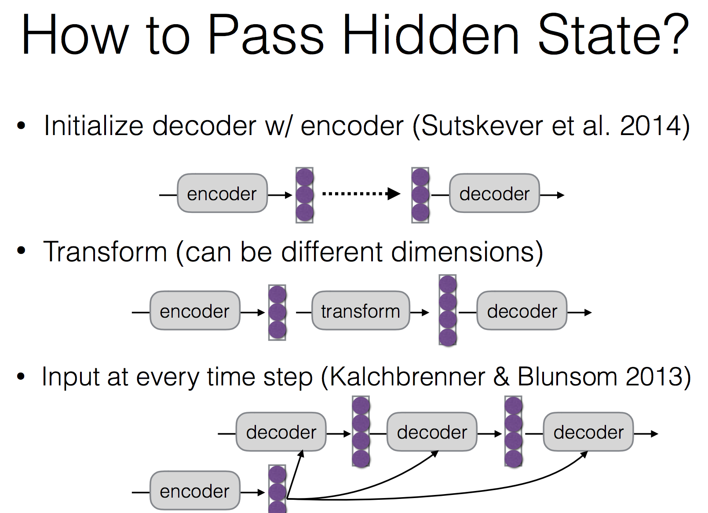

# conditioned language model
* Formulation and modeling
    * conditional 은 과거의 문장 자체 뿐 아니라 context를 삽입하는 것 것
    * 보통의 language model은 lstm을 써
    * 기본적인 language model 의 형태
    	
	* Conditional Language Model
		
		* Context 를 decoder 의 첫번째 값으로 넘긴다
	* How to pass hidden state
		
* methods
	* Ancestral sampling
		* 다 할 수 있다면 무조건 이게 나을 수 밖에 없지
		* Random 하게 뽑아서 그 중에 가장 높은걸로 취해나가
		* Random 하게 다 할 수 있다면 이게 무조건 좋겠지 근데 한 없이 많은 양을 sampling 할 수 없지
	* Greedy search
		* Common 한 언어보다는 일반적인 말만 나오겠지
		(easy word first)
		* Global optimum 을 구할 수가 없음
	* Beam search
		* Top k 를 보겠다!
		* 매 step 마다 상위 k 개를 남기고 parsing 해
* Model ensemble
	* 두 개의 model 을 합치는 방법들
		1. Linear interpolation
			
			Uniform 하게 하는 경우가 종종 있음
		2. Log-linear interpolation
			(어디에 집중할 것인가) * (실제 model 의 probability)
			
			얘도 무난하게는 uniform
		* 비교
			
		* Parameter averaging
			* Deep learning model 은 parameter 갯수가 앙상블 하면 너무 많앙
			* Weight vector 의 값들을 averaging 하는 것
			* Weight 를 쭉 끌고가서 moving average 를 취하는 방식으로
			* 보정하는 정도의 역할로(완전히 따로 돈 다음에 average 를 취하는건 아주 말이 안됨)
		* Ensemble distillation
			* 일단 앙상블을 만듦
			* 앙상블 모델이 학습한 결과를 똑같이 만들어내는 또다른 모델을 만들어 냄(teacher model 은 여러 모델이 다 들어가는데 얘를 흉내내니깐 하나만 있으면 되는 것)
			* 모델의 크기를 줄이게 될 수 있음
		* Stacking
	* Evaluation
		* 확실한 방법론이 나오지는 않았어
		* BLEU score
			* 정답셋과 n-gram 을 비교해서 계산해넣음
			* Brevity : bleu score 는 번역이 짧을 수록 점수가 높을 수 밖에 없으니까 이런것들을 보정하기 위한 값이야
		* Meteor
			* Bleu score 보정 (paraphrases, reordering, function word)
		* Perplexity
			* Loss 값이라고 보면 됨
			* 정답이 있을 때에 모델 안에서 그 정답을 냈을 확률 을 1에서 뺀 값을 더해서 e 에 몇승으로 나타낸 것
		* Evaluating unconditioned generation
			* Learning 하지 않고 그냥 뱉는 수가 있어
			