## Structured prediction basics
	• Structured prediction : 
		○ 클래스를 K^n개로 볼 수 있음
		○ 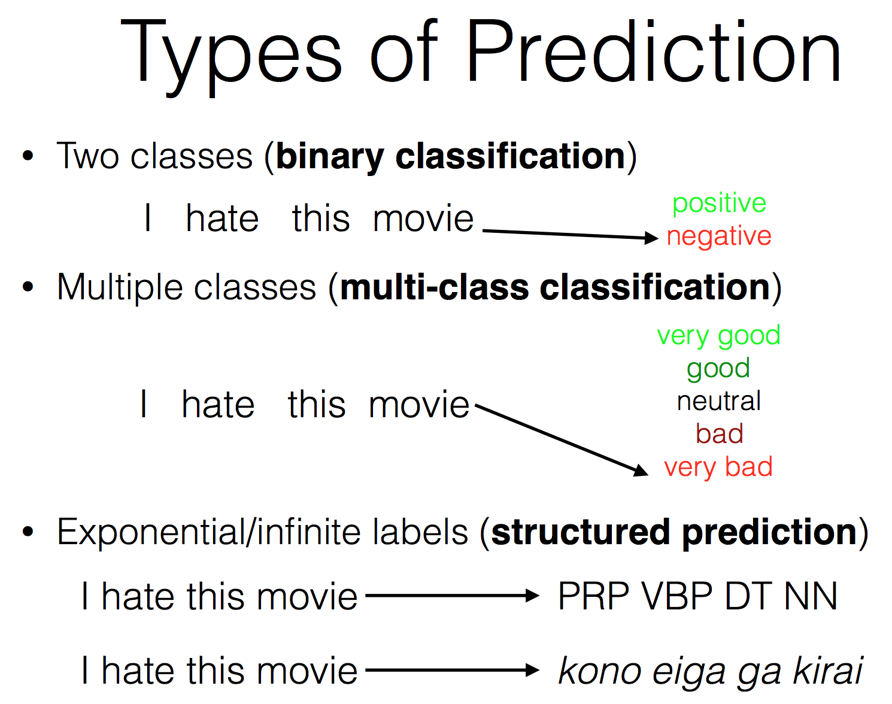
		○ Tag 가 어떻게 될 것인지 / 번역이 어떻게 될 것인지
		○ Binary / multiclass classification 의 방법으로 하기는 어렵지 않을까
	• Sequence labeling
		○ 순서와 연관
			§ Pos tagging or named entity 찾기 등
		○ Independent classification 처럼
			§ Structure 를 활용하지 않고
			§ 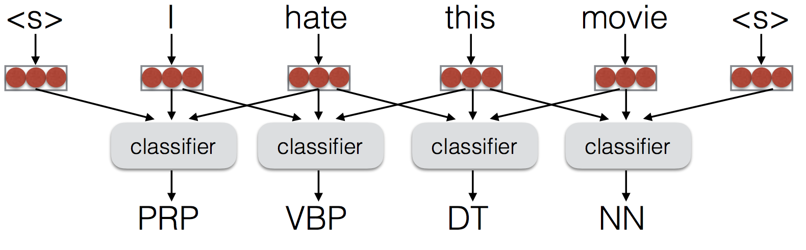
		○ With BiLSTM
			§ 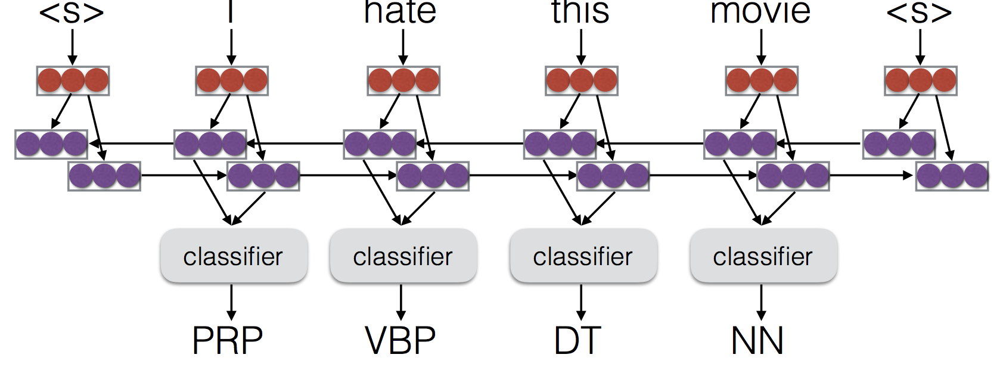
			§ 근데 여기서도 structure를 쓴건 아니지(label 간의 상관계가 있음을 explicit 하게 사용하지는 않았어)
		○ MLE 방식으로 했을때의 폐해
			§ 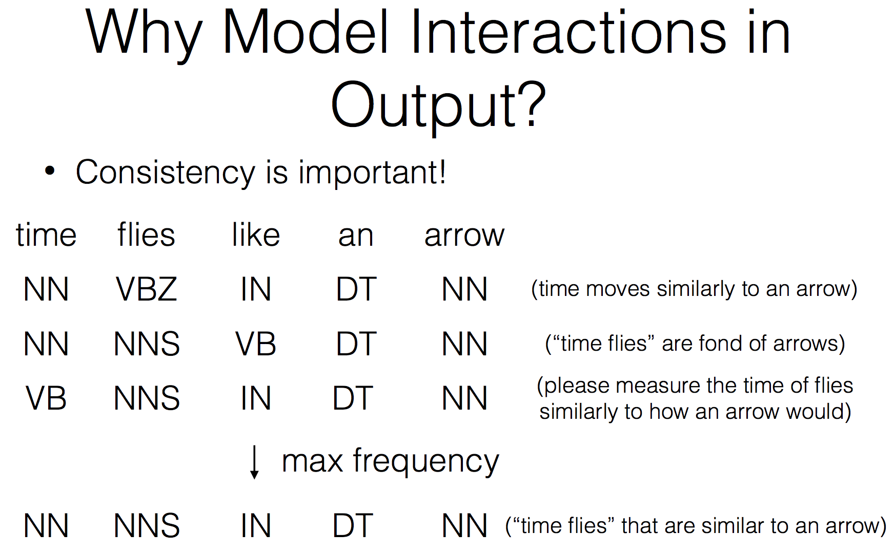
			§ 문법 파괴형식이 제일 좋다고 선택될 수가 있어
		○ 이전의 label 을 Concat 해서 넣는
			§ 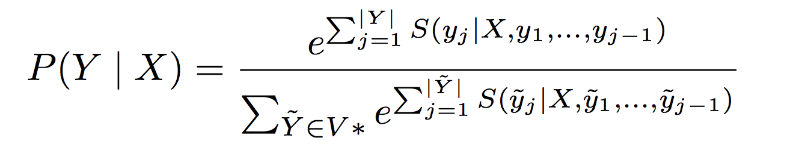
			§ Basically similar to encoder-decoder model (this is like an seq2seq model with hard attention on a single word)
			§ Teacher forcing으로 training 에 엄청난 시간이 걸리는걸 완화한다
			§ (just feed in the correct previous tag)
			§ Exposure bias
				□ Exposure bias: The model is not exposed to mistakes during training, and cannot deal with them at test
			§ Normalization 관점에서
				□ Local normalization
					® 단어 하나에 대해서
				□ Global normalization
					® 문장 전체에 대해서
					® 이게 structured 에는 conceptually 더 맞겠지
					® 
					® 분모 보면 vocab 의 n승으로 들어가서... 정확한 계산은 intractable
				□ --> trick 이 필요해(가정 통한 부분만 계산 or 지금과 직전만 등…)
				□ --> structured perceptron
	• Structured perceptron
		○ Ranking style 로 해결하겠다
		○ 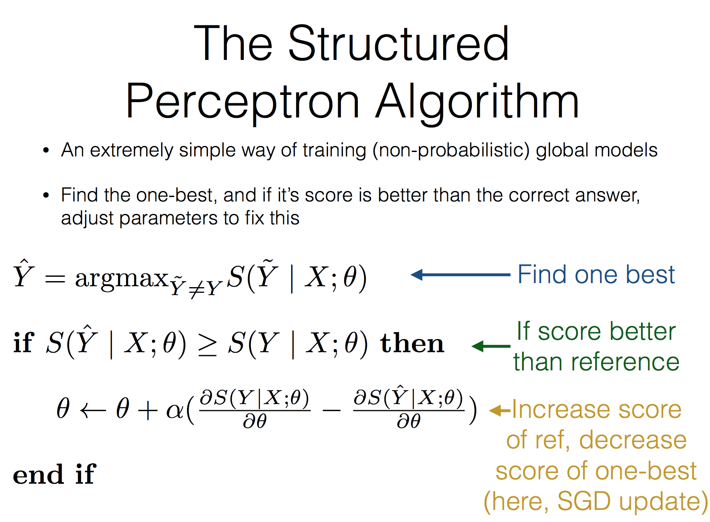
		○ 예측한게 정답보다 더 높은 스코어를 내면 이걸 버려
		○ Structured perceptron loss
			§ 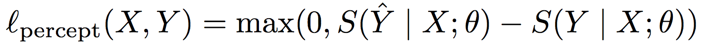
		○ Pretraining
			§ 수렴하기까지 너무 오래걸리니깐 pretraining
			§ Teacher forcing으로 pretrain
				□ One negative example 로 트레이닝 하는건 너무 오래걸리니깐
	• Hinge Loss
		○ Margin 개념을 넣는 것!
		○ 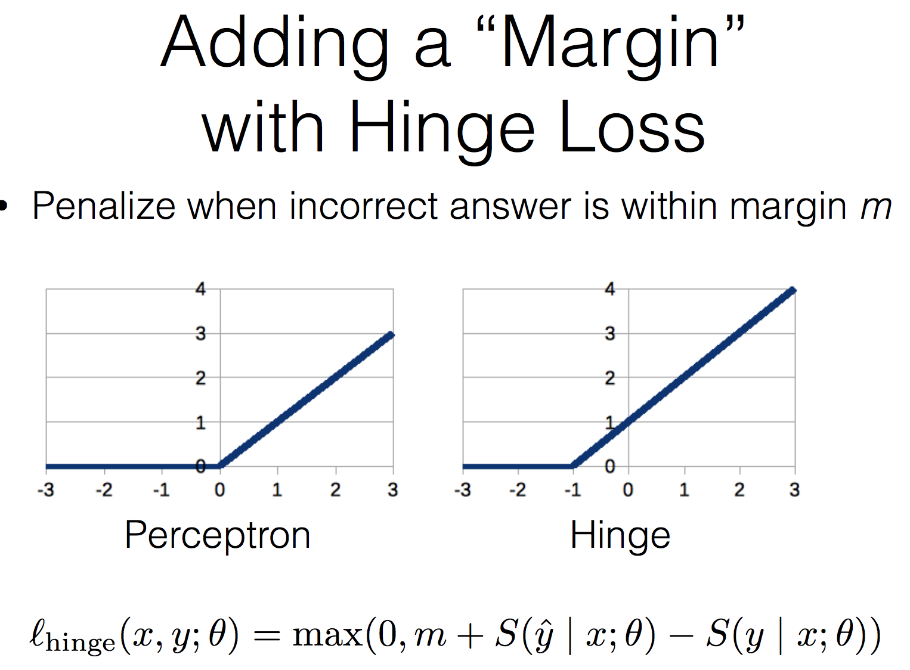
		○ 그 차이가 1이상은 앞서나가야해! 라는 컨셉
		○ Cross entropy 쓰던걸 다 hinge loss로 바꿔도 돼(학습이 잘 되기만 한다면 좋댕) --> 별로 연구가 안됐대
		○ 근데 이 값만 조정하는거는 아무 의미가 없지(S 값이 이미 normalized 된 값이 아닌 이상)
	• Cost-augmented hinge
		○ 위 그래프에서 -1같은 상수가 아니고 이 cost를 다양하게 주는 것
		○ 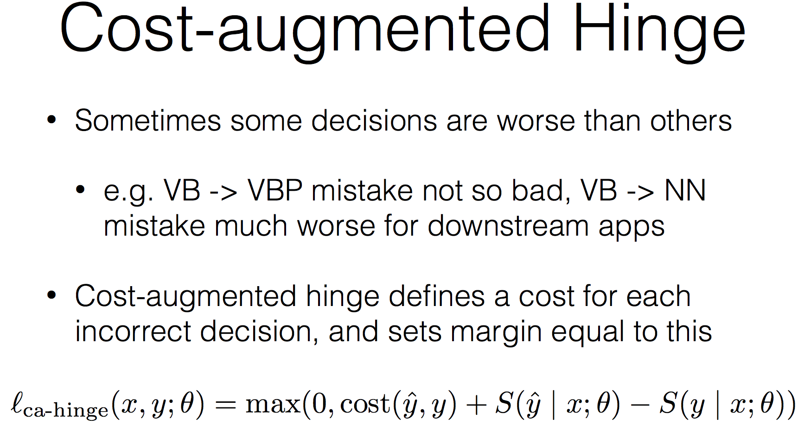
		
		○ 
	• Structured Hinge Loss
		○ cost 가 나오는 시점 차이때문에 argmax 는 어려울 수가 있다
		○ 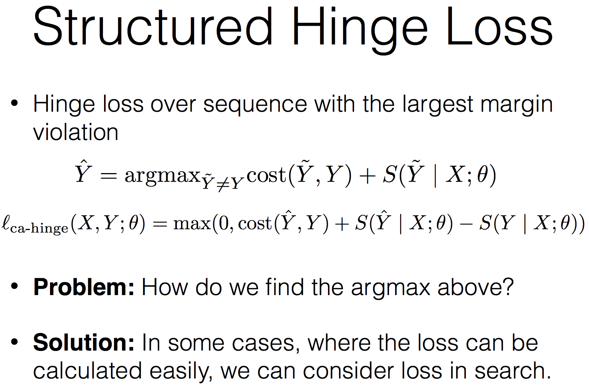
		
		○ 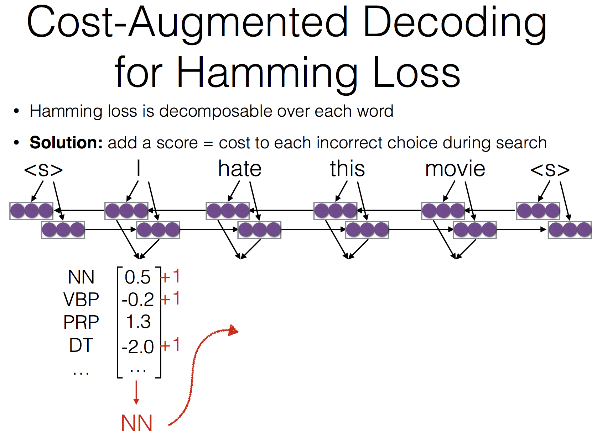
		○ Hamming distance 1을 더해주고 나면 다른게 선택되게 되겠지 / training 과정에서 prp 가 얻는 점수가 더 높아져야한다는걸 모델이 깨닫게 될거야!
	• Sample mistakes in training
		○ Teacher forcing 할 때에 exposure bias 생길 수 있으니
		○ 이때에 정확한 답을 사용하는게 아니고 어떤 golden standard distribution 에 의해서 teacher forcing 할 값을 sampling 해서 가져오겠다는 것
	• Drop out
	• Corrupt training data
		○ 정답에 노이즈를 넣는것
		○ 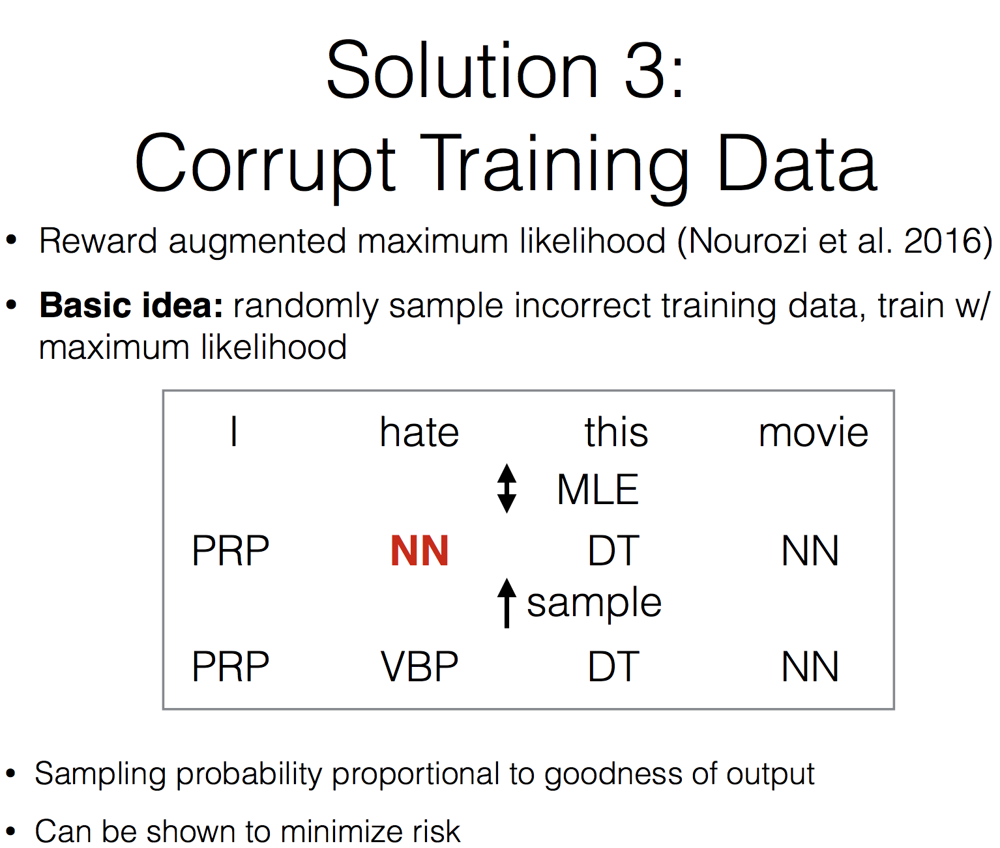
		○ 대신 output 의 정답에 관련된 어떤 분포로부터 sampling 해서 노이즈를 넣는다는 것
	
