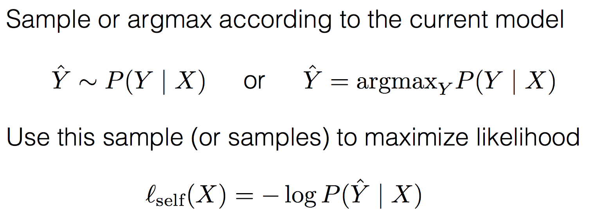
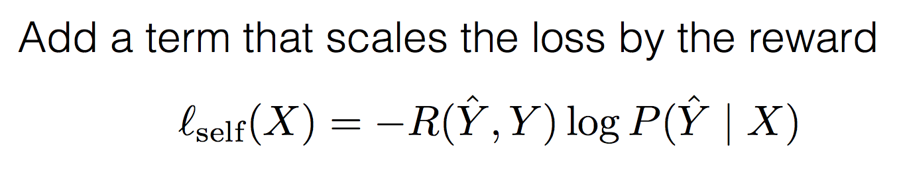

* RL in NLP
	* Latent variables, 이 있고 여기에 뭔가 연산을 해서 답을 내는 식
	* Sequence level error function - bleu score 같은걸로 reward 정의
* Supervised learning 이 
* Self training
	* greedy 한 방법론이라고 이해하면 될 듯 / 값이 어떤게 크게 나오면 그거 argmax 같은거 취해서 니가 낸 그 score 잘했어라고 계속해서 그 score 값을 강화해가는 방법 --> 모델의 성능이 이미 괜찮은 상태라면 쉬운 문제에서 풀었던 모델을 어려운 문제로 가져갔을 때에도 잘 워킹을 하게 만들 수도 있다능…
	* 근데 사실 독립적으로 사용되는 경우는 잘 없엉
* Policy gradient
	
	* 이런거라면 argmax 가 policy 고 l_self 값이 loss 야
	
	* 이거 자체가 loss function
* Reward 의 delay 를 어떻게 해결할 것이냐
	* Decayed reward 를 assign 함
* Stabilizing RL
	* Adding a baseline --> reward 의 평균 값을 baseline 으로 둬서 
		* 예상보다 잘하면은 좋다 / 예상보다 잘 못하면 punish
	* Increasing batch size
		* Sampling 을 하기때문에 이상한 값이 들어갈 가능성을 적게 하려면 batch size 를 크게 해서 이상한거 안들어가게 할 수도 있어
		 Experience replay
	* Warm-start
		*mle로 먼저 learning 시킨 후에 안정화되면 rl 을 쓴다