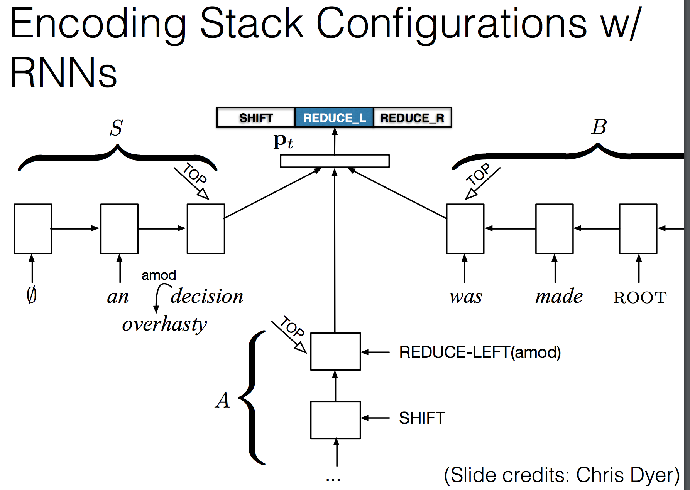

	• Two types of linguistic structure
		○ Dependency - 관계에 집중
		○ Phrase structure - 명사구, 동사구 이런거를 tree structure 를
	• Parsing
		○ Transition based models
			§ Tree 를 뭔가 sequential 하게 푸는 (위상수학 컨셉)
		○ Graph based models
	• Dependency parsing
		○ Shift-reduce dependency parsing
			§ Semantic 한 task 에 유리할 수 있음
			§ Arc standard shift-reduce parsing
			§ Buffer 를 queue 로 놓고, stack 에 하나씩 넣으면서 reduce left reduce right 를 하면서 tree 를 그려감
		○ Making classification decisions
			§ Extract features from the configuration
			§ Feature combinations
			§ Combination features used to be created manually, now we can use neural nets
		○ A feed forward neural model for shift-reduce parsing
			§ (Chen and Manning 2014)
	• Tree structure(sentiment analysis)
		○ 언어학 연구자 갈아 넣어서 각 단어, 구 별로 positive 인지 negative 인지 가려내서 학습셋으로 활용
		○ Rnn 을 tree strucrue 구조로 돌린다 - sequence 에서 tree 로 확장한 형태
		○ Tree structured LSTM
			§ Child sum tree-LSTM
				□ Child sum 을 미리 구해서 lstm 을 돌려
			§ N-ary Tree-LSTM
				□ 안에서 child 를 가져와서 sum 을 해
		○ Bi-lstm composition
			§ Simply read in the constituent with a bi lstm
			§ 하나의 lstm 안에 오, 왼이 다 들어있지 세개의 bilstm 은 다 같은 weight 를 공유할거얌
		○ Stack lstm : dependency parsing 을 neural net 으로
		

			
