## Generative model
* 생성할 수 있을 정도의 힘이 있는 모델
	* 분류 문제처럼 구분하는 서만 긋는게 아니고 데이터 자체에 대해서 러닝을 해(분포 정보를 가지고 선을 긋게 되겠지)
	* 분포 자체에 대해서 해석을 하기 떄문에 데이터를 새로 만들어낼 수가 있어
* P(y|x)계산이 아닌 p(x)를 구하는 것
* Typical approaches in deep generative model
	1. Auto-regressive model
		* 그 전에껄 보고 그 다음껄 예측
		* e.g. RNN language model (RNNLM) 
		* Sequential 로 디자인 하기만 하면 일단 계산은 가능하다
		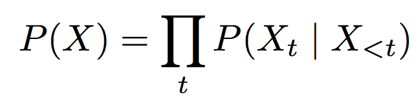
	2. Latent variable model
		* 모델의 신상을 나타내는 variable(Z) 을 둬
		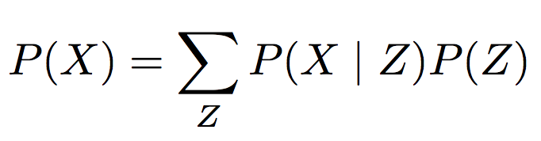
		* 주로 노말 분포를 쓰는건 쉬워서(더 잘 나타낼 수 있는 분포가 있으면 그걸 쓰면 돼)
		* e.g. Variational Auto-Encoder (VAE) - next lecture

### What do we want from generative models?
* Likelihood - 나올법 한 말이 그 다음에 나왔는지 평가
* Evaluate likelihood: P(x)
	* e.g. Perplexity in language modeling
* Generate samples: x ~ P(X)
	* e.g. Generate a sentence randomly from P(X) or conditioned on some other information using P(X|Y)
* Infer latent attributes: P(Z|X)
	* e.g. Infer the “topic” of a sentence in topic models
* 각 모델이 더 잘하는, 덜 잘하는 분야가 있어
	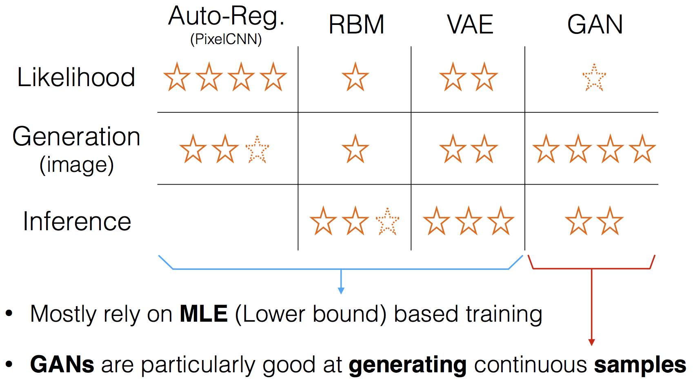
	* Gan : 샘플 생성에 특화돼있음 / sample 하나하나에 대해서 평가하는 방법(평균에 대해서는 생각하지 않아 --> 뾰족하게 나오징
	* Vae : 통계적으로 하다보니 평균을 취하는 경향이 있음
	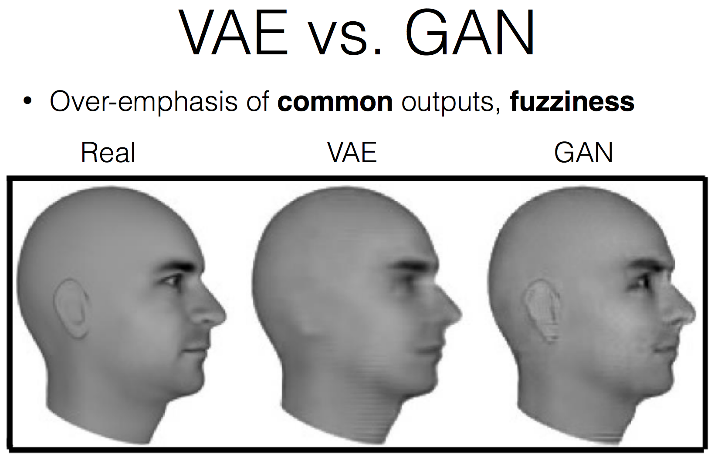
	* Conditional gan - 나이, 성별 등에 대해서 z 값을넣을 수도 있징 
	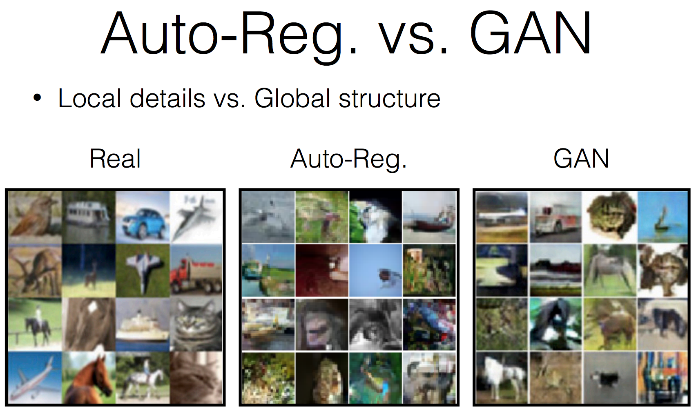

### Basic
* Discriminator :  이미지가 주어지면 이게 진짜인지 가짜인지 판별하는 역할
* Generator : discriminator 가 속을정도의 이미지를 생성해내는 것
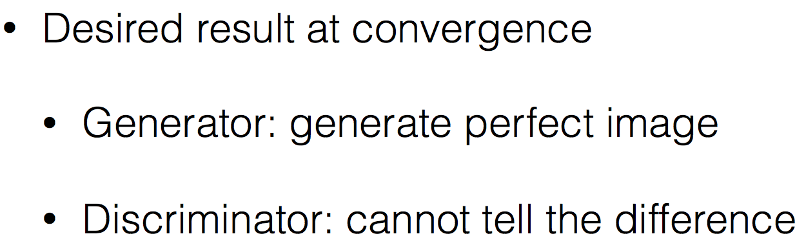
* 아직까지 이걸 다 이룬 모델은 나온적이 없지만 지향하는 바
* Training method
	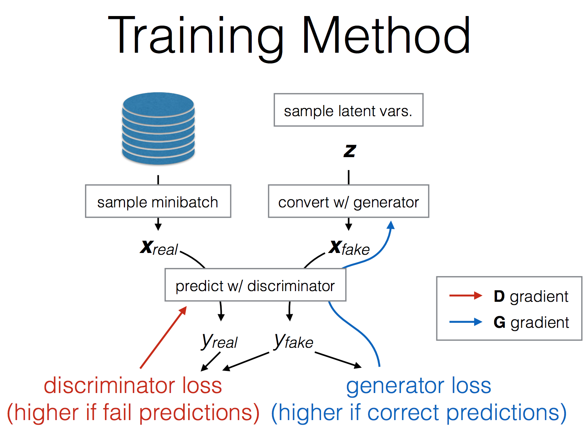
	* discriminator의 Loss function (결국 걍 binary cross entropy function)
		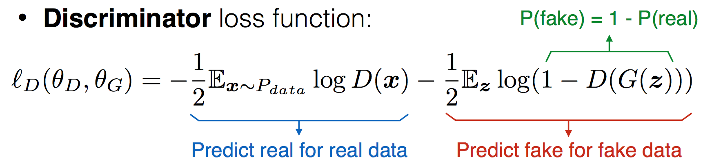
	* Generator loss function
		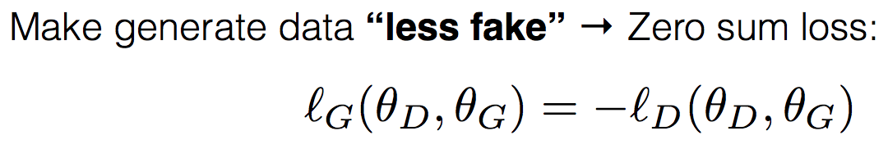
		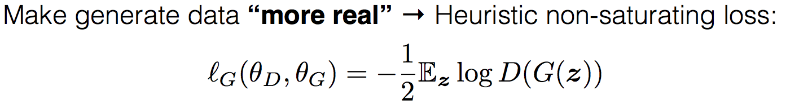
		* 이걸로 하면 학습이 잘 되더라 --> 여기에 binary cross entropy function

### 정리

* Train D - 각각이 얼마나 잘했는지를 하나씩 넣고
* Train G
* P(Z) --> 몇 차원의 분포면 원하는 이미지를 표현할 수 있겠다 라는 기준에서 이 분포의 차원을 정해
Large Z 는 random variable 인 것

### Why is GAN good?????
* Discriminator 가 흐릿한 것들은 다 쳐내버리니깐
* Can easily pick up any kind of discrepancy, e.g. blurriness, global inconsistency 
* Generator has fine-grained (gradient) signals to inform it what and how to improve --> 계속 평가해주니까 fine tune될수있어

### Problems in GAN training
* 사실은 어디서 끊어야할지가 되게 어려워
* Loss 값이 진동하기도 하고, 
* Known problems 
	* Convergence & Stability:loss 값이 진동하고 어디서 끊어야할지가 어려워
		* WGAN (Arjovsky et al., 2017) loss function 을 새로 디자인(러닝 시켜보면 loss function 이 직선에 가깝게 나오게)
			* 요새 아주 각광받는 아이
			* Limitation 이 있었어( 이 사이의 값만이 들어와야 한다 라는) --> 나머지는 잘라버림
		* WGAN-GP (Gulrajani et al., 2017)
			* 위에서의 limitation 을 해결
		* Gradient-Based Regularization (Roth et al., 2017)
	* Mode collapse/dropping: 
		* 하나의 값이 쉬우면 모든 z 값에 대해서 그 쉬운 하나의 값만 계속 generate 해
		* Mini-batch Discrimination (Salimans et al. 2016)
		* Unrolled GAN (Metz et al. 2016)
			* 계속 같은 값만 generate 하면 punish
	* Overconfident discriminator: 
		* Discriminator 의 수준이 너무 높으면 그걸 따라가기가 힘들다
		* One-side label smooth (Salimans et al. 2016) 
			* 다른 가능성을 좀 열어두게 (confidence 를 0.9 까지만 맞춘다던지…)

* Implicit distribution
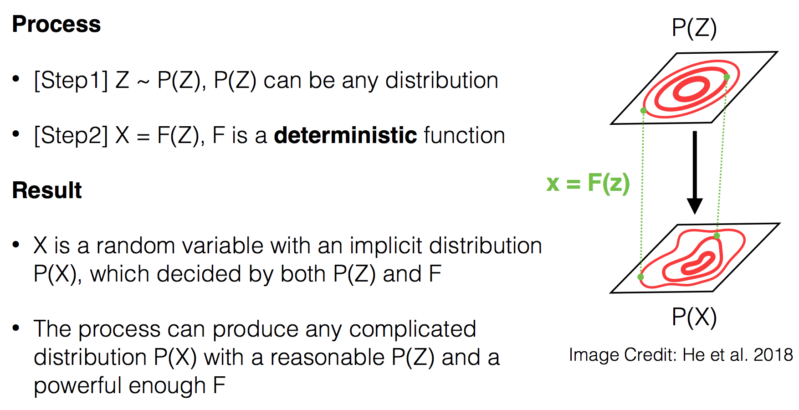
	* z는 별로 안중요할 수도 있어 F가 다 캐리를 하는거징
* Distributional Matching via Samples
	* Generator → Any model that produces “samples” 
	* Samples → Anything with an underlying distribution
		* hidden features, parameters, images/text(제약을 두지 말자)
		* the distribution is often implicit
	* Discriminator → Identify the distributional differences
		* as a learned metric
		* by checking real & fake samples only 샘플 체크만을 한다

### application
* Learning Domain-invariant Representations(Ganin et al. 2016) - 그림을 주던 사진을 주던 빌딩인지 구분해내는 모델
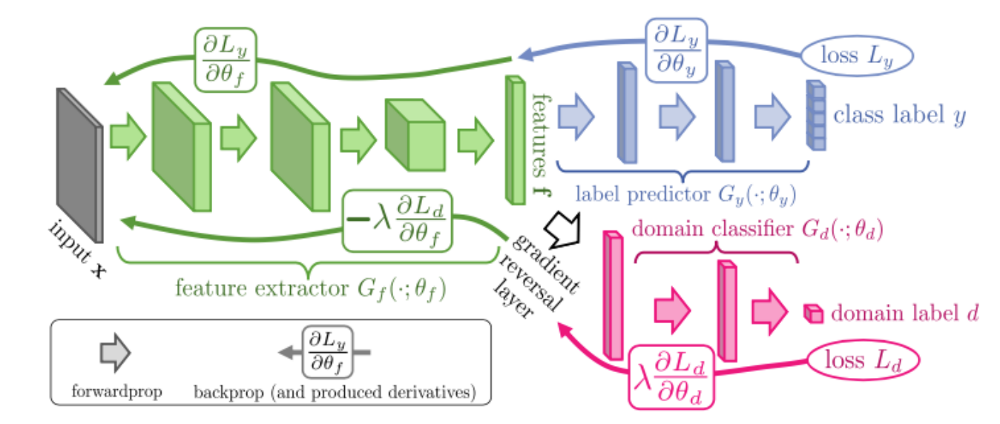
* Domain 을 구분해내면 안되니까 domain classifier 한테는 gradient 에 역수를 취해서 보내버려
* Applying GANs to Text
	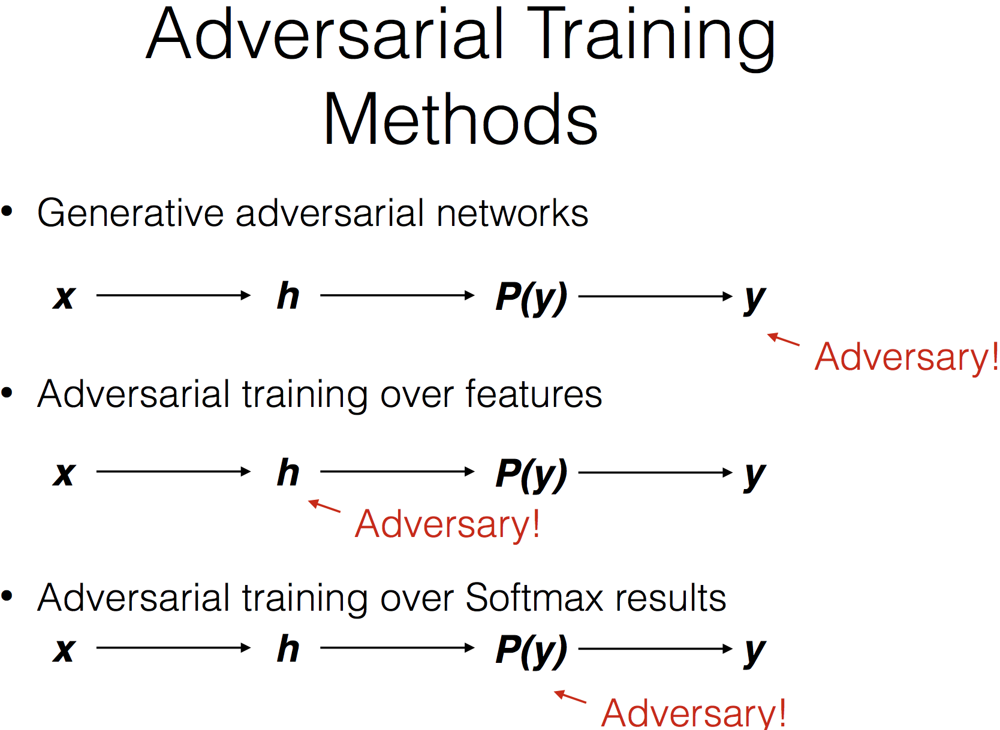
	* Discriminators for Sequences
		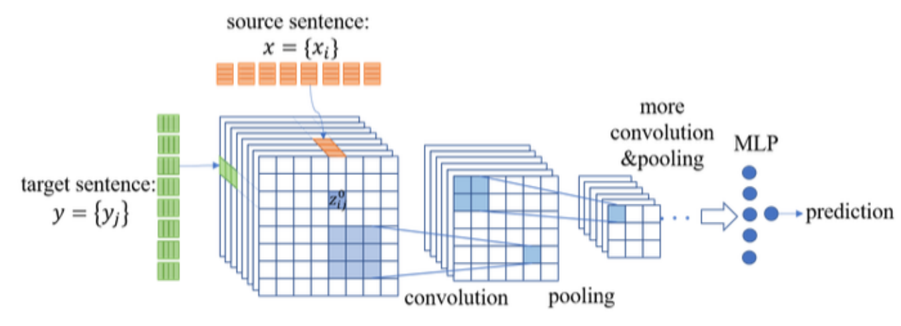
		* Discriminator 는 cnn 이 좋다 라고 report 가 돼 있댕
	* 텍스트에 적용되기 어려웠던 이유
		* 단어 하나를 one hot 으로 찾아내는 과정은 미분이 불가능해(discrete 하거든)
		* --> 이 문제를 강화학습으로 해결!
		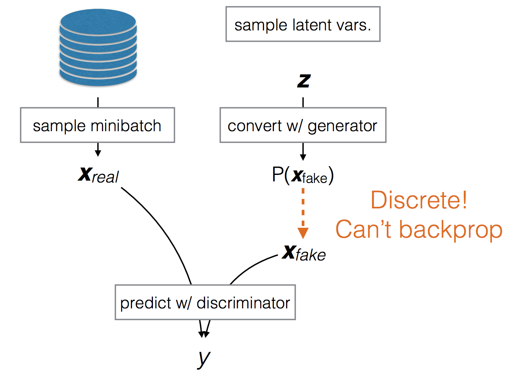
		* Policy gradient 로 하면 가능해진대용
			* Policy gradient reinforcement learning methods (e.g. Yu et al. 2016) 
		* Reparameterization trick for latent variables using Straight-through Gumbel softmax (Gu et al. 2017)
			* Random sampling 하는 부분을 computation 하는 graph 에서 빼놓자!
			* 뮤, 시그마를 학습 시키고, 거기서 random sampling 하는 부분은 따로 빼 놓는 것
			* 이러면 back propagation 이 가능해지지
			* Random generation
			* Gumbel softmax - gumbel distribution
		* Assigning Reward to Specific Actions
			* Bleu score 는 문장 하나에 대해서 계산해내는데, 여기에 대해서 더 책임있는 단어를 찾아 punish 하기 위해서
			* D(this) D(this looks) D(this looks do) 이런식으로 하나씩 나눠서 넣어서 어디가 잘못됐는지를 알 수 있게
		* 샘플을 조금만 하니깐 문제가 생기는거니깐 많이 하자
			* High variance can be helped somewhat by doing multiple rollouts 
			* Generator 에서 많이 생산
		* 강점과 약점
			* Matching the distribution of generated sentences 
				* Pros: Unbiased (optimizing our final goal of generating natural sentences) 
				* Cons: High variance (unstable), Sample inefficient (slow)
			* Alternatives: Matching the distributions of features / Softmax results
				* Pros: Low variance, sample efficient
				* Cons: Biased (optimizing a surrogate objective)
				* Currently more widely used

### application
* Learning Languageinvariant Representations
	* Chen et al. (2016) learn language-invariant representations for text classification
	* 똑같이 loss 를 뒤집어서 학습해서 다른 언어라도 감정을 인식할 수 있도록 함
	* multi-lingual machine translation (Xie et al. 2017) --> 다음해에 업그레이드시킨 것
* Professor Forcing
	* (Lamb et al. 2016)
	* Teacher forcing 
	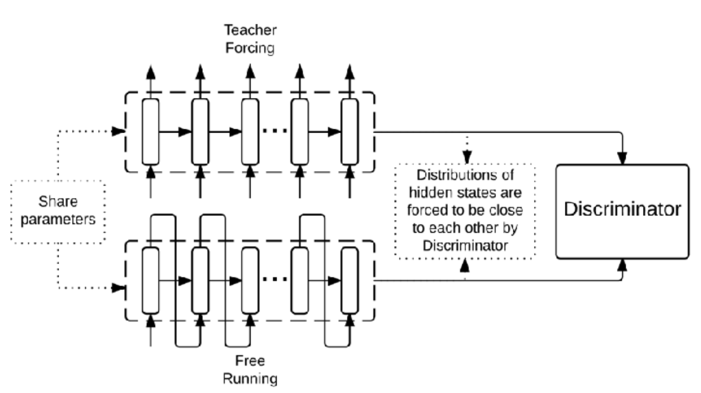
* Unsupervised style transfer for text
	* 언어체계 (인류 전체의)는 유사할 것이라는 가정 안에서 
	* Task: transfer sentences with one style to another style 
		* Decipherment: Translate ciphered sentences to natural sentences (A simpler case of unsupervised MT)
		* Transfer sentences with positive sentiment to negative sentiment.
		* Word reordering 
	* 약간 오토 인코더 느낌
	* Impressive performance on decipherment
		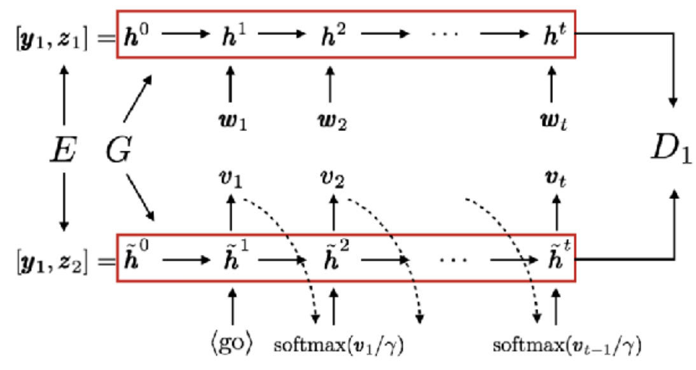
	* Unsupervised Machine Translation 
		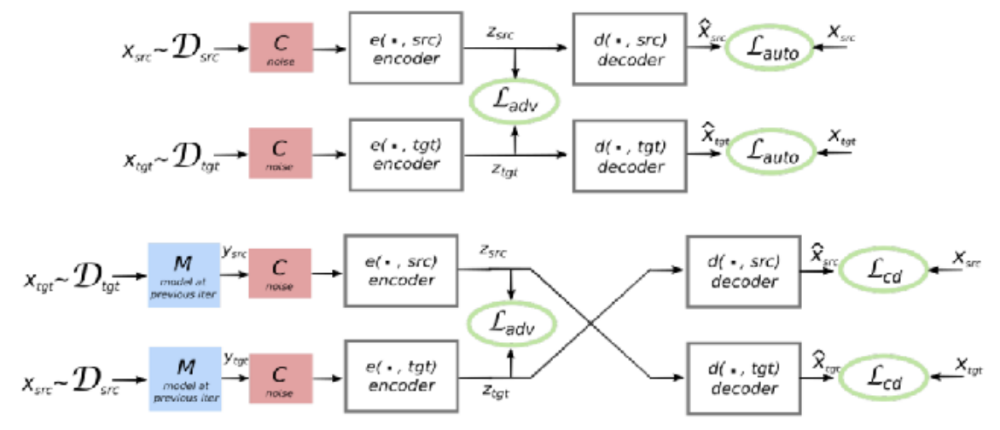
		* 가운데에 있는 z값이 학습하도록(방향이 어느쪽으로 가던 언어상의 느낌적 느낌을 학습할 수 있도록)
* Adversarial Multi-task Learning 
	* 공통으로 쓰이는 feature 와 특별하게 사용되는 feature 를 구분해내게 하는 디자인
	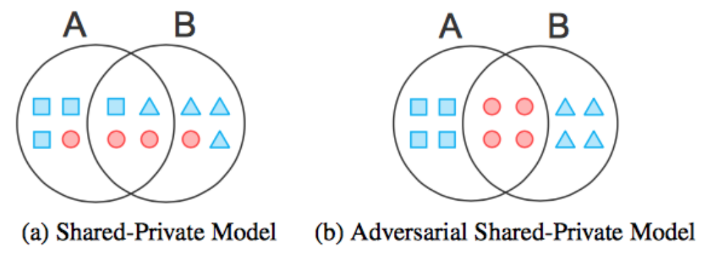

