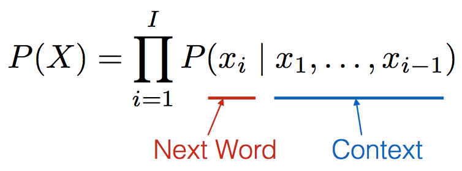
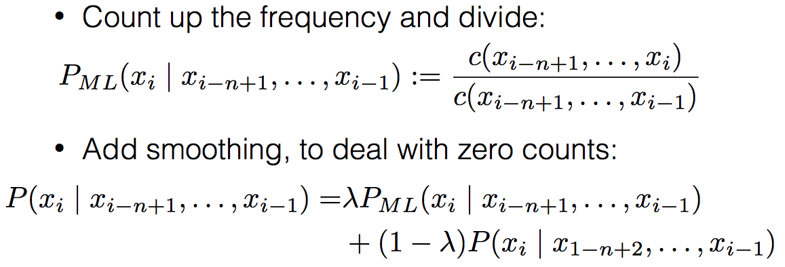
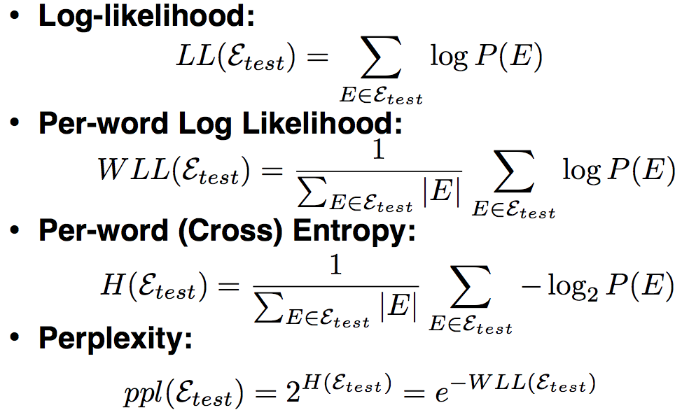
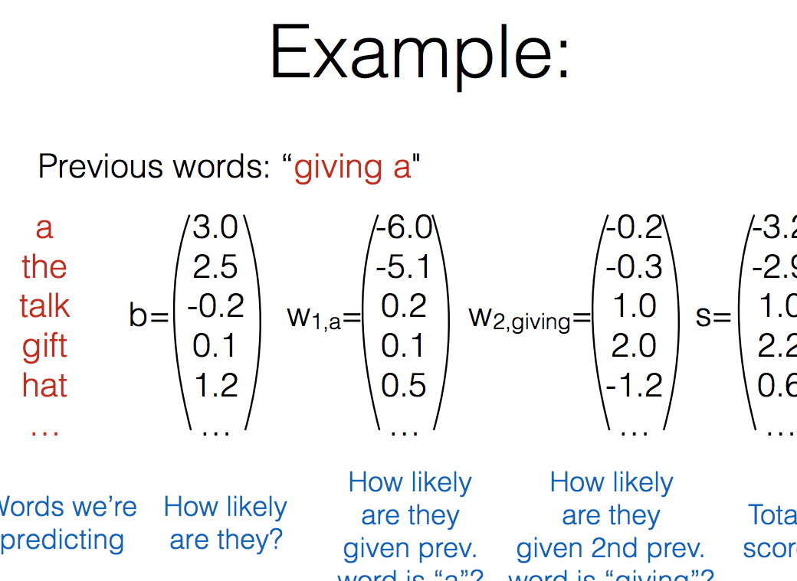
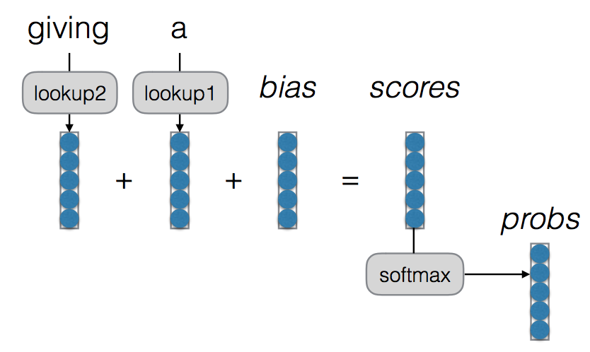
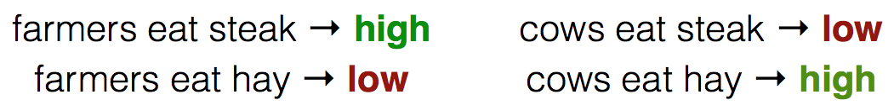
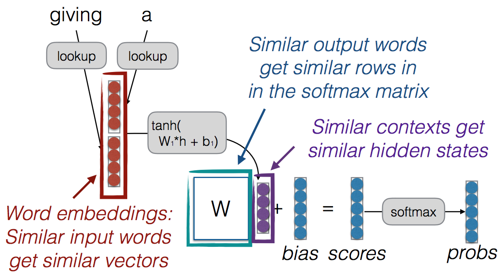
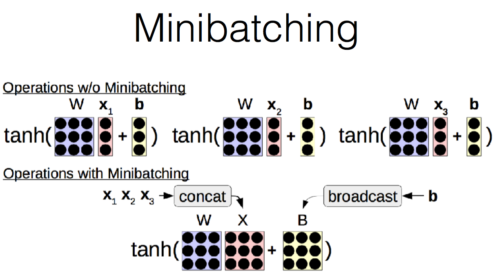

## A Simple (?) Exercise: Predicting the Next Word
* probability of a sentence(이게 말이 되는 문장인가)
* language model
	* m개 단어가 주어졌을 때 m개 단어 시퀀스가 나타날 확률, 즉 P(w1,w2,…,wm)을 할당(assign)
* context 로부터 next word 에 대한 probability 
	
	* how?
		1. count-based
			
			perplexity
			
		2. linear model로
			이 문장이 말이 된다/ 안된다
			* 문제와 그 해결
				* similar word 사이의 strength --> class based language model
				* intervening word 에서의 context catch --> skip-gram language model(중심 단어가 나타날때 주변단어가 나타날 확률 최대화)
				* long-distance dependencies -->  cache, trigger, topic, syntactic models, etc.
		3. alternative --> featurized models
			* context 의 feature 를 계산
			* feature 기반으로 probability 계산
			* optimized 된 feature weight (using gradient descent)
			
			graph view -->look up 은 big matrix of word embedding 에서 grabbing 할 word 들에 대해서 one hot 곱해서 선택할 수 있음
			
			* 근데 모든 단어들을 쓰지는 않아 --> 메모리 문제
				* frequency threshold 나 ranking threshold
		4. beyond log linear model!
			* linear model 은 feature combination 을 학습할 수 없다!
			
			-->	Neural Net!
			strength shared
			
			여기에 input output embedding
		* Training Tricks
			* Shuffling the Training Data
				* stochastic gradient method 는 parameter 를 한번에 조금씩만 바꾸니깐 동일한 문장을 데이터 끝부분에 왕창 넣으면 여기에서만 영향을 엄청 받게 돼 --> shuffle 해서 넣어야...
			* gradient method 변형
				* simple SGD
					* generalization 에 좋아
				* SGD with Momentum: Remember gradients from past time steps to prevent sudden changes
				* Adagrad: Adapt the learning rate to reduce learning rate for frequently updated parameters (as measured by the variance of the gradient)
				* Adam: Like Adagrad, but keeps a running average of momentum and gradient variance
					* 수렴이 빠르고 안정적임
				* Many others: RMSProp, Adadelta, etc.(See Ruder 2016 reference for more details)
			* Early stopping, learning rate decay
			* drop-out
		* Efficiency Tricks
			* operation batching
				