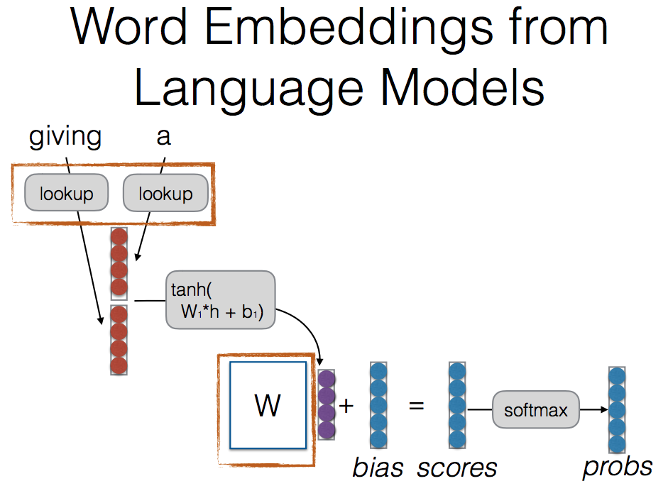
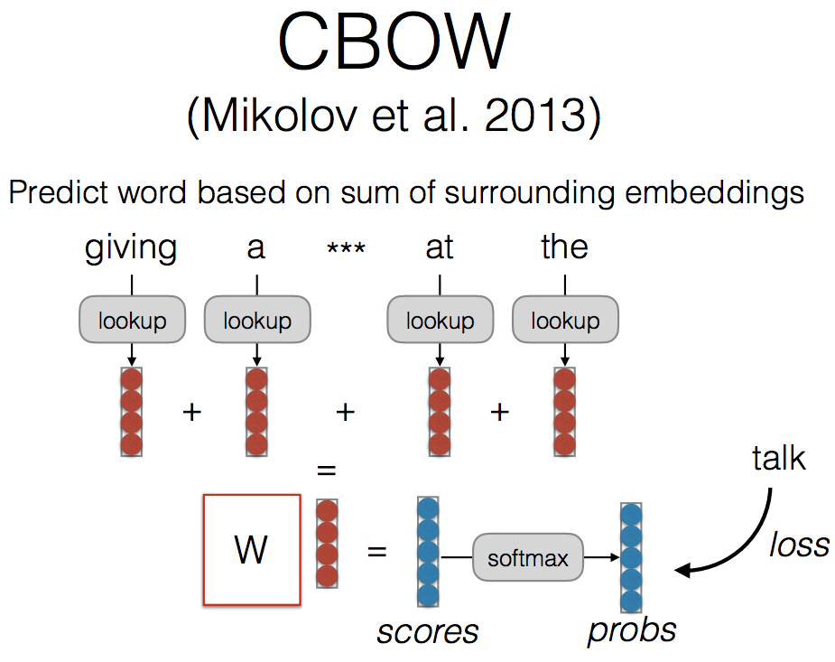
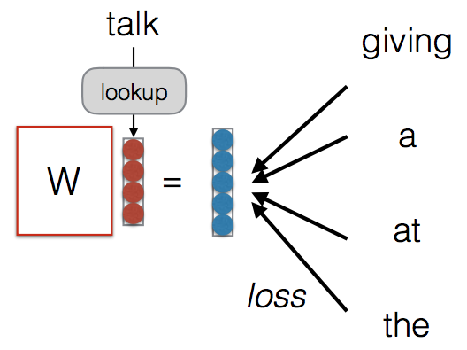

## Distributional Semantics and Word Vectors
* word embedding!
	* how?
		* Initialize randomly 해서 분류문제처럼 해서 backpropagation 으로 자동으로 찾아지게
		* supervised 에서 pretrain : 예) pos tagging 등으로 train 해서 testing 으로 parsing
		* unsupervised 에서 pretrain : 예) word2vec
	* distributional vs. distributed representation
		* distributional
			* 단어는 context 안에서 표현됨
			* count-based method
				* word-context count matrix
					* co-occurrence 세기 (rows as word, columns as contexts)
					* weight - pointwise mutual듯information / reduce dimensions with svd
			* prediction-based method
				* 부차적인 결과물로서 word embedding 을 기대하는 것
				* language model 등의 결과물로...
				
			* Context Window Methods
				* Window size 만큼의 앞 뒤의 context 를 참조해

* CBOW
	
	* Predict word based on sum of surrounding embeddings
	* Look up 이 embedding matrix 결과들을 하나하나 다 더해
	* Center 단어가 뭘까요를 예측하는 방식인 것
	* Supervised 처럼 보이지만 정답지를 만들 필요가 없어진다
	* Matrix 가 되게 shallow 해서 빨라 --> 그냥 cpu 에서만 돌려도 됑

* Skip-gram
	
	* Predict each word in the context given the word
	* 가운데 단어로 주변 단어를 예측함
	* 주변 단어들을 기반으로 한번씩 계산
	* 단어간에 어떤 부분의 weight 가 더올라가게 될지 물론 경쟁이 있겠지만 데이터가 짱 많으면 괜찮을거얌
	* 파란색이 word size

* 알고보니 count-based, prediction based 가 같은거더라!)
	* Strong connection between count-based methods and prediction-based methods (Levy and Goldberg 2014)
	* Log(k) --> negative sampling (뒷부분이 무거워서 쓰는 다른 방법)

* GloVe
	
	* A matrix factorization approach motivated by ratios of P(word | context) probabilities
	* 단점 : word * context matrix 를 반드시 만들어야 진행이 가능해서 scalability 에 문제가 있어
	* 단어의 특성이라는 것은 p(k|ice), p(k|steam)의 ratio 를 보는 것이라 가정
	* (관련이 없는건 1에 가깝게 나오겠지)
	* 학습 된 걸 공개해둬서 많이 쓰인당

* Evaluating embeddings
	* 차원 줄여서 visualize 해(t-sne --> 응집력을 보여주게 돼 / 멀리 있는거, 가까이 있는거를 표현할 수 있게 해주지)
	* T-sne --> 응집 여부만이 의미가 있어(line 으로 돼 있어도 아무 의미가 없는거야)
	* Perplexity 너무 크게 주면 인력 작용이 너무 적어서 잘 안보여지기도해)
	* Intrinsic
		* Relatedness / analogy/ categorization / selectional preference
		* 비슷해 보이는 단어가 얼마나 가깝게 나오는지 확인
	* Extrinsic
		* Initialize w/ the embeddings
		* Concatenate pre-trained embeddings with learned embeddings

* pretrained embedding 은 언제 유용한가
	* Very useful: tagging, parsing, text classification
	* Less useful: machine translation
	* Basically not useful: language modeling

* limitations of embedding
	* Sensitive to superficial differences (dog/dogs)
	* Insensitive to context (financial bank, bank of a river)
	* Not necessarily coordinated with knowledge or across languages
	* Not interpretable
	* Can encode bias (encode stereotypical gender roles, racial biases)
* --> solution
	* Sub-word Embeddings
	* Multi-prototype Embeddings
	* Multilingual Coordination of Embeddings
		* 영어, 한국어 따로 학습해서 맞춰보니 어느정도 일치하더라
	* Unsupervised Coordination of Embeddings
	* Retrofitting of Embeddings to Existing Lexicons
	* Sparse Embeddings
		* 차원 해석이 불가능하다는 점의 해결 --> regularization 해서 sparse vector 로 변환하여
	* De-biasing Word Embeddings