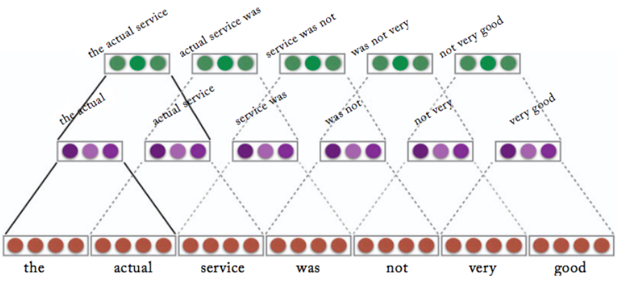
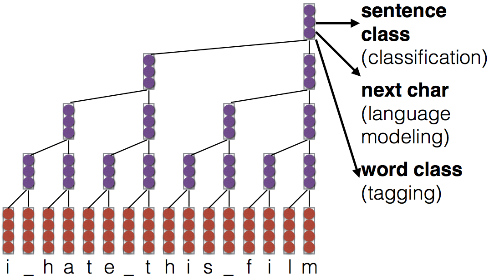
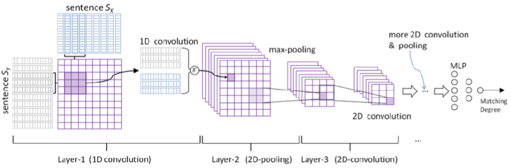
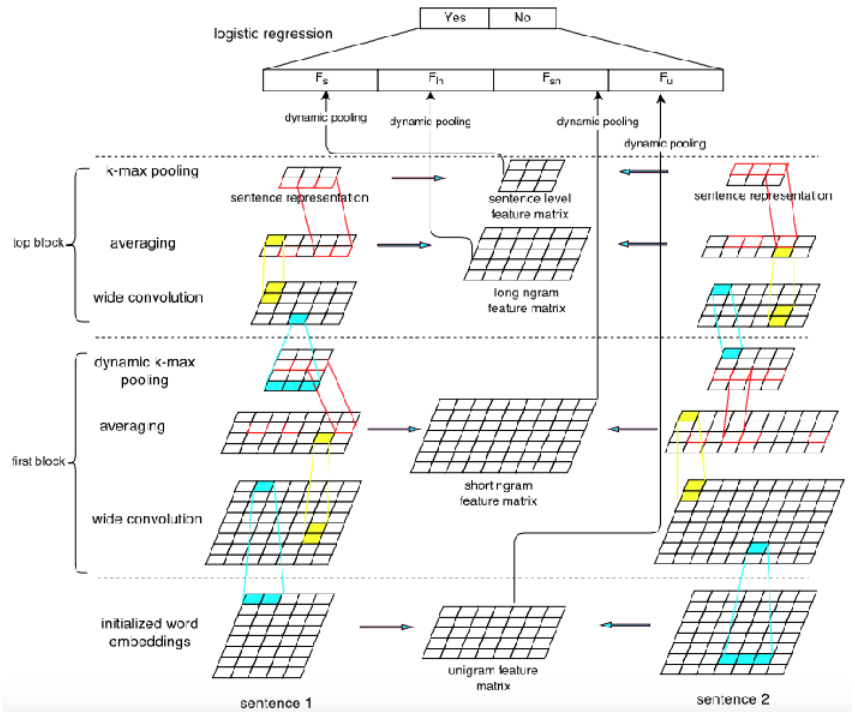

## Convolution Neural Nets for Text
* bag of n-gram 만으로도 충분히 괜찮은 구현 --> 80% 정도는 나와
* 근데 한계가 있음
	* parameter explosion
	* 유사한 단어나 n-gram 에 대해서 share 하는 바가 전혀 없음
--> 이걸 cnn으로 해보자
* 89년에 했던 time delay model의 발전형태...(좌우의 단어들을 concat 해서)
* Cnn(1997)
	* 강점
		* Target 이 그림의 어떤 부분에 있더라도 인식이 가능해지지

### Cnn for text
* Context window modeling
	* 윈도우 만큼만
* Sentence modeling
	* 문장 전체로 

* Standard conv2d function
	* Input
		* Batch * word sequence * emb
		* ppt 내용에서... (feature --> embedding 이라고 보면 됨(잘못적은듯)) 그림에서의 channel 이 여기서의 embedding 과 대응될 수 있음 / 여기서의 columns 는 아닌걸로…
* Padding/ striding
	* padding
		After convolution, the rows and columns of the output tensor are either
	* striding
		It is also common to skip rows or columns

* Pooling
	* Max pooling / Average pooling / k-Max pooling / Dynamic pooling("Did you see this feature in the
beginning? In the middle? In the end?" --> feature 발견 장소까지)
	* *** Classification 에서는 max pooling concept 이 맞아 --> 가장 강한 signal 을 가져온다는 의미에서

### Stacked convolution

* dilated convolution
	
	* timestep 마다 stride 를 점차 늘려나감(no reduction in length)
	* 장점
		* *** stacked network 에서는 non-linear function 의 선택이 매우 중요함 --> relu 나 softplus 가 gradient 보존에는 다른것보다 적합
		* Wave net
		* Tree 형태라서 logn으로가 가능 --> rnn 은 O(N) / 이건 O(nlogn)
		* 병렬화가 되는 디자인
	* 단점
		* 한 문장의 길이가 매번 동일하지 않단걸 생각하면 자연스럽지 못하징
		* cpu 에서는 느리단 말이있엉

### Structured convolution
* Language structure 에 맞게 convolution 을 하자(영어에서 noun-verb 는 가장 많은 정보를 담고 있을것!
	근데 아까까지의 디자인에서는 이런 정보가 추가되지 못하지!)
	--> Parsing tree 를 먼저 만들어서 convolution
* graph convolution
	* Dependancy parsing 을 통해 나오는 graph 등 여러 변형
		* Self loop connection / Dependency connections / Reverse connections
	* 아직 practical 하지는 않대 (parse tree 조차 완벽하지 않거든)

### Convolutional Models for Sentence Pairs
* Sentence pair 를 convolution
	* 문장끼리의 유사성을 알아내기 위해서
* Siames network(1993)
	동일한 network 에 서로 다른 문장을 통과시켜서 값이 나오면 문장의 feature 가 나온 것일 것
	이 두 feature 들을 비교하여 문장 유사도를 구하는 방식
* Convolutional matching model
	
	* Sentence 를 각각 x, y 에 넣어서 두 문장에 결합에 대한 답을 학습한다고 보면 됨
	* Ngram 쌍이 보존되면서 pair 로서의 정보들이 칸칸마다 들어갈 것
	* 최종 output 이 sigmod이런거 통해서 나올 수 있겠지
	* 앞에꺼(샴 네트웍)보다는 성능이 좋더라...
* Convolutional features + matrix-based pooling
	
	* Wide padding 을 쓴다는 padding 을 많이 줘서 첫번째 gram 만 들어가도록
	* Sentece A , A^TWB를 통한 sentence 유사도 계산, sentence B 이런걸 쭉쭉 뽑아서 dynamic pooling --> 그리고 나서 이걸 logistic regression 으로 유사성을 yes or no 로 리턴해

### Understanding CNN result
* 왜 이런 예측결과가 나왔는지 보자앙(Activation 값을 봐서 어떤 feature 가 중요한 역할을 했는지 알 수 있지)
* PCA/t-SNE Embedding of Feature Vector --> feature vector 에 dimension reduction 해서 그래프에 찍어보면 좋겠지잉

Pruning
--> weight 가 낮은 것들을 아예 잘라내서 쓸데 없는 정보가 들어가는것을 방지(+regularization 효과까지 노려서 overfitting 방지 ==> fully connected 보다 더 좋은 효과를 보일 수도 있을거다 뭐 이런 연구
Pruning 한 다음에 다시 나머지 connection 들을 다시 학습해보니 성능이 좋아지더라

