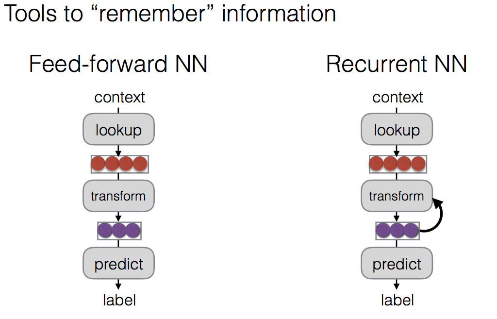
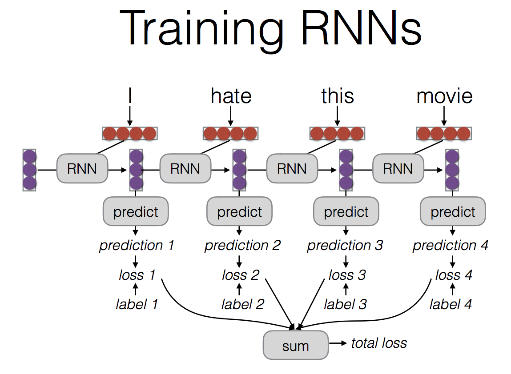
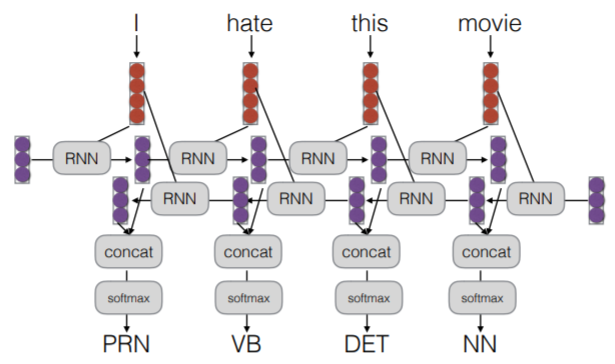
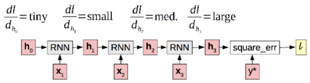
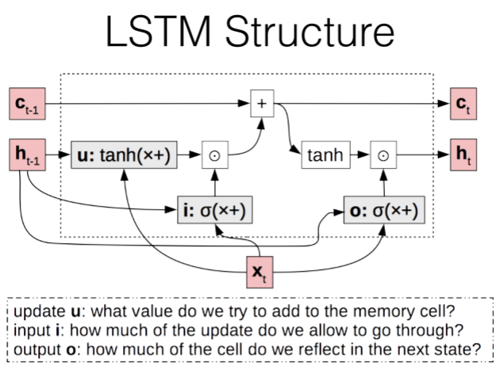

## RNN 이용한 nlp
* nlp --> word, character, sentence 관점에서 sequence data 로 볼 수 있음

* rnn training - unrolled graph is a well-formed (DAG) computation graph
* rnn 으로 하면 --
	* 문장 전체를 읽고 prediction 하는게 가능해짐
	* 문장 내 context표현 가능
	* 활용 - tagging / language model(각 태그가 next word 인 tagging job 으로 볼 수 있음) / calculating representations for parsing
* 이때의 응용 --> 보통 bi-rnn
	
	* 정방향과 역방향을 동시에 학습한다
	* 앞에 있는 input 들은 희석될 수 있으므로, 정방향과 역 방향을 다 쓰게 되는 구조
	* Out1 과 out 5(prediction)을 concat 하는 방식
	* 그냥 하는거에 비하면 언제나 성능 향상이 있어

### RNN으로 할때의 문제점과 그 해결
1. vanishing gradient
	
	* 다시 미분 또 미분 또미분 하는 과정을 거치면서 앞서 들어온 input 에 대한 gradient 값은 점차 소멸될 수 밖에 없음
1.2 solutions
	* LSTM(Long Short-term Memory)
	(Hochreiter and Schmidhuber 1997)
		* time step 간 additive 한 connection 을 만들어가
		* 곱셈아닌 덧셈 이용해서 gradient 가 사라지는걸 방지
		
			* C_t : 냉장고라 표현 / 전달되는 것들을 c로 따로 빼놔
			* I --> gate (sigmoid) -~100% 사이에서 냉장고에 몇퍼센트나 넣어 놓을 것인가
			* O --> output 에 얼마나 많이 넣을 것인가
