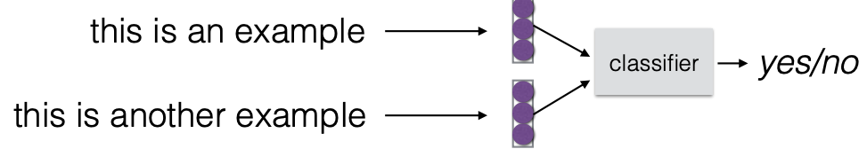
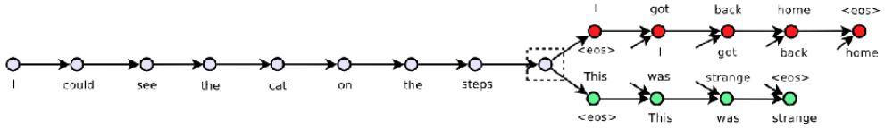
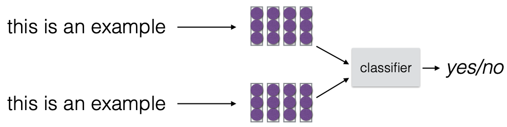
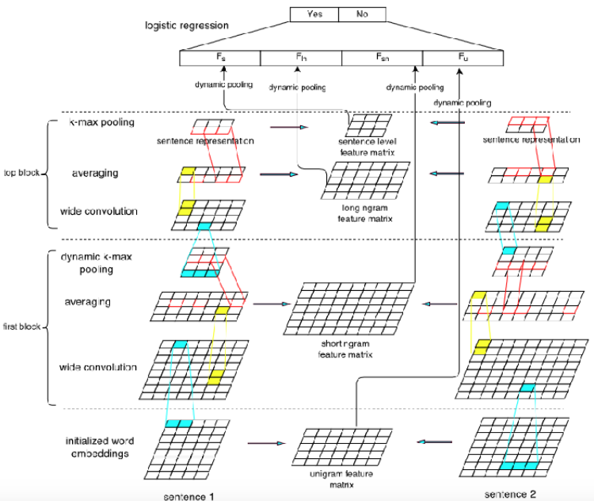

## sentence representation
* vector 로 나타낼 수 있음
* 활용
	* sentence classification / paraphrase identification / semantic similarity / entailment / retrieval

### Sentence Classification
* tolic, sentiment, subjectivity/objectivity 등등 여러가지로 분류해둬

#### Paraphrase Identification(동일한 문장 알아채기)
* 데이터 예시
	* Microsoft Research Paraphrase Corpus (Dolan and Brockett 2005) --> 5800 sentences (질은 좋은데 양이 적엉)
* 모델1 - sentence 를 vector 로 나타내고 이 둘사이의 similarity 를 계산하는 classifier로 돌려
	
	1. Skip-thought Vectors (Kiros et al. 2015)
		* general method
		* unsupervised training : large scale data로 주변 문장들 학습 (Using encoder-decoder)
		  --> 주변에 나왔으면 비슷한 문장일것이다 라는 가정으로
		
* 모델2 - multiple-vector representation 을 계산해서 1번과 비슷한 결정을 함
	
	1.  Convolutional Features + Matrix-based Pooling (Yin and Schutze 2015)
		
	2. Paraphrase Detection w/ Discriminative Embeddings (Ji and Eisenstein 2013)
		* word/context vector 에 대해 matrix factorization
			* word/context vector 에 대한 구분력으로 weight 를 매겨
		(다시 찾아보자...)	
