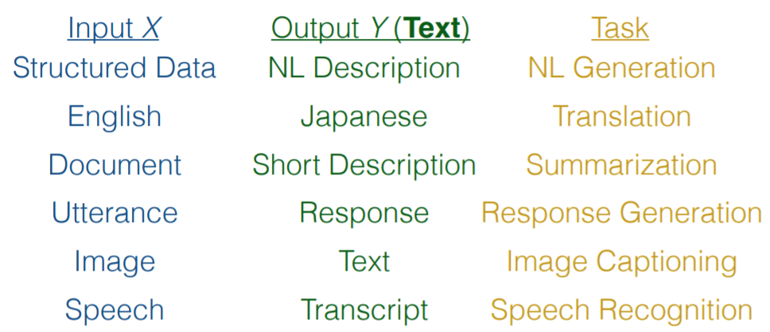
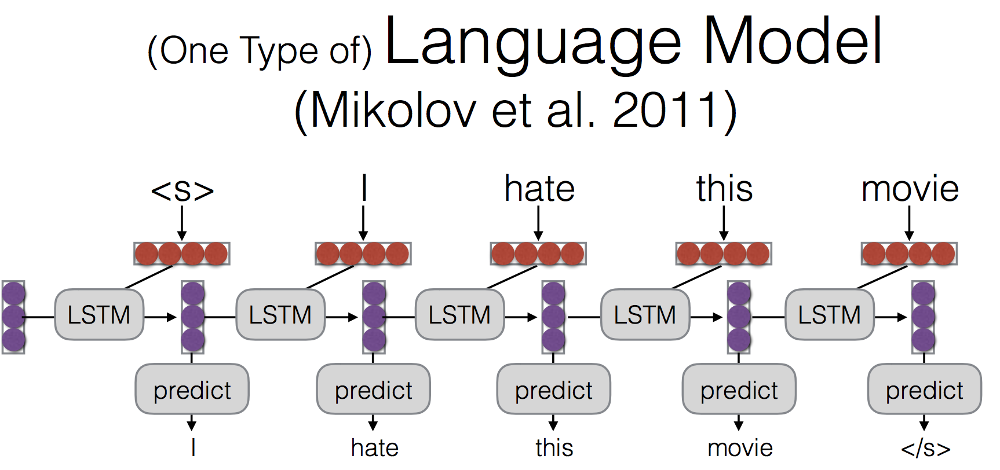
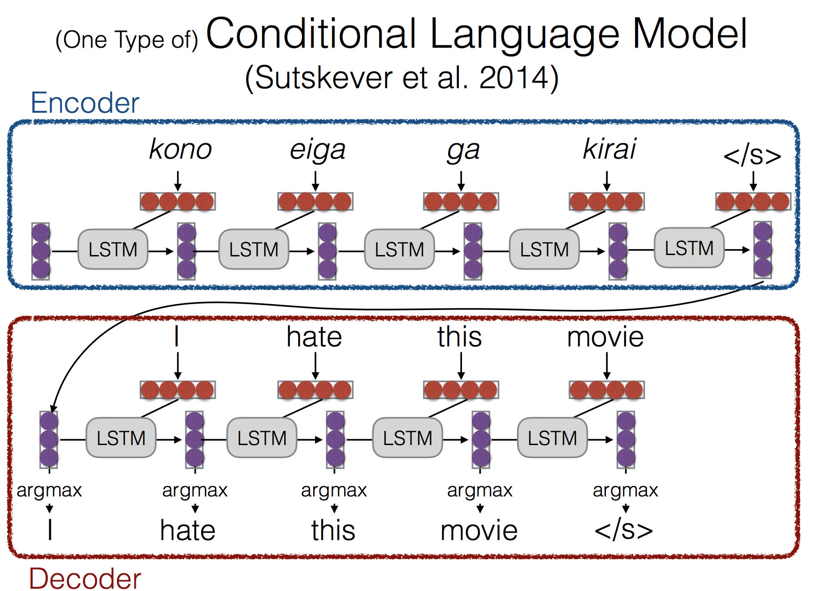
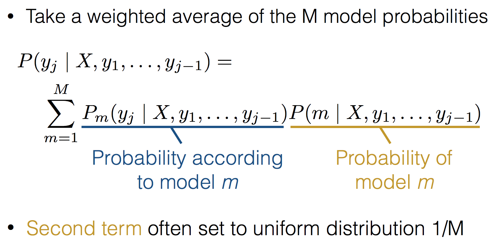
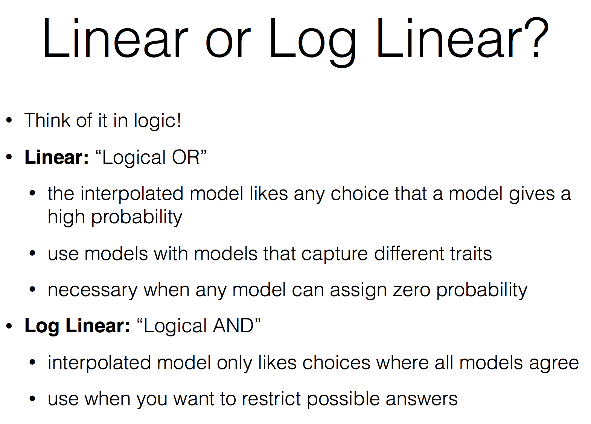

## Conditioned language model
* Language model 이 text 에 대한 generative model 이라면 Conditioned language model 은 특정 조건혹은 context에 대한 generative model 이라고 볼 수 있음

* 동일한 input 이지만 원하는 결과가 translate 일수도, 다음 문장의 예측일 수도 있으니깐(?)

### Formulation and modeling
* Sentence 에 대한 probability 를 계산하는게 기존의 language model 이라면 여기에 Context term 을 추가한 것

	* (선행 문장 뿐 아니라 context 를 따로 또 삽입)
* 차이
	* 보통의 language model 은 lstm 을 씀
	
	* Conditioned language model 에서는 context 를 decoder 의 첫번째 값으로 넘긴다
	
* hidden state 를 어떻게 전달할 것인가
	* decoder 를 encoder 로 시작하도록 하거나
	* encoder 에서 나온걸 transform 해서 전달하거나(dimension 이 다른 경우)
	* 모든 time step 에서의 input 으로 전달하거나
	

### Generation 방법
* P(Y|X) 의 모델에서 sentence 를 어떻게 추출할 것인가
	1. Sampling
		확률 분포에 따라서 random 하게 문장 생성
	2. Argmax
		가장 높은 확률을 가지는 문장 생성
* Ancestral Sampling
	
	* 단어를 하나하나 random 하게 생성
		* Random 하게 뽑아서 그 중에 가장 높은걸로 취해나가
		* 다 할 수 있다면 무조건 이게 나을 수 밖에 없지
		(원하는 바를 정확히 구하는 공식일 것)
	* 단점 : Random 하게 다 할 수 있다면 이게 무조건 좋겠지 근데 한 없이 많은 양을 sampling 할 수 없지
* Greedy search
	
	* 가장 확률이 높은걸로 찍어내
	* 단점
		* 일반적인 말만 나오겠지
		(easy word first)
	 	* Global optimum 을 구할 수가 없음
* Beam search
	
	* 가장 큰걸 뽑는게 아니고, 몇개의 path 에 대해서는 남겨둔다
	(Top k 를 보겠다!)
	* 매 step 마다 상위 k 개를 남기고 parsing 한다

### Model Ensemble
* 여러개의 prediction model 합치기

* 왜
	* Multiple models make somewhat uncorrelated errors
	* Models tend to be more uncertain when they are about to make errors
	* Smooths over idiosyncrasies of the model
* Linear interpolation
	* Uniform 하게 하는 경우가 종종있음
	
* Log-linear interpolation
	* 어디에 집중할 것인가 \*(곱하기) 실제 model 의 probability
	
* 두 모델의 비교
	

