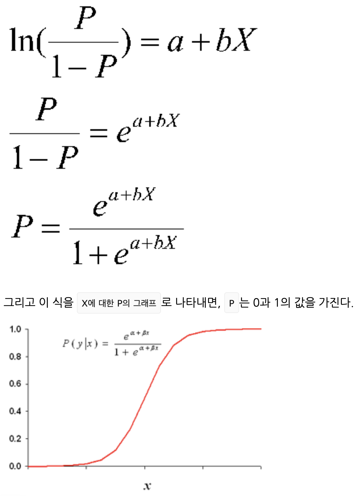

## 1. Exploratory data analysis

- deviation / variance / standard deviation
- mean absolute deviation (= variance)
- range
- order statistics / percentile / interquentile range
- box plot / frequency table / histogram / density plot
- mode / expected value / bar chart / pie chart
- correlation coefficient(sigma((x-x^)(y-y^))/(N-1)s_x s_y) / correlation matrix / scatter plot
- contingency table / hexagonal binning / contour plot / violin plot

## 2. Data and sample distribution

- sample / population / random sampling / stratified sampling / simple random sample / sample bias
- with replacement / without replacement / representativeness / sample bias / nonrandom
- bias(non random sample / systematic error) ≠ errors on random sampling
- selection bias : 데이터를 의식적이든 무의식적이든 선택적으로 고르는 관행, 결국 오해의 소지가 있거나 단편적인 결론을 얻게 된다)
- data snooping / vast search effect
- regression to mean
- sample statistics / data distribution / sample distribution / sample variability / central limit theorem(표본 크기가 클수록 표본분포가 정규분포)
- standard error
    - 여러 표본들로부터 얻은 표본통계량의 변량
    - s/sqrt(n)= (표본 값들의 표준편차 / sqrt(표본 크기)
    - 근데 이거 구하자고 새 샘플을 수집하는 건 일반적으로 불가능 → bootstrap으로 추정하는게 일반적
- bootstrap sample / resampling
- bootstrap
    - 방법
        1. 현재 있는 표본에서 추가적으로 표본을 복원추출
        2. 각 표본에 대한 통계량과 모델을 다시 계산
        3. 위 과정을 R 번 반복
        4. R 개의 결과를 사용하여
            1. 그것들의 표준편차(통계량의 표준 오차) 계산
            2. histogram or box plot
            3. confidence interval 가져옴
    - boostrap 반복횟수는 임의로 설정 (반복 횟수가 많을수록 표준오차나 신뢰구간에 대한 추정이 더 정확해짐)
    - decision tree - bagging
    - 모집단에서 추가적으로 표본을 뽑을 때 그 표본이 얼마나 원래 표본과 비슷한지를 알려주는 것
    - 크기 n에 따라 sample distributiondl 어떻게 달라지는지 알아보기 위한 실험을 통해, sample size를 결정하는데에도 bootstrap 사용 가능
- confidence interval / confidence level / interval endpoint
    - confidence interval witn 90 %
        - sample statistics 의 bootstrap sample distribution의 90%를 포함하는 구간
- normal distribution / error / standardize ((x-x^)/s) / z-score (개별 pt를 standardize한 결과) / standard normal distribution / QQ-plot
- long tail distribution (QQ-plot에서 낮은 값의 점들은 대각선보다 훨씬 낮고 높은 값은 선보다 훨씬 위에 위치) → 더 많은 극단값을 관찰할 가능성이 있음을 의미함
- binomial distribution(bernuli distribution) - m = np, s=np(1-p) / trial
- lambda / poisson distribution / exponential distribution

## 3. Statistical test and Significance test

- treatment / treatment group / control group / randomization(처리 적용대상을 임의로 결정) / subject(처리 적용 대상) / test statistics (검정 통계량)
- null hypothesis / alternative hypothesis / one-way test / two-way test - 보통은 one-way (p값을 한쪽으로)

### 3.3 Resampling

- permutation test
    1. 여러 그룹의 결과를 단일 데이터 집합으로 결합
    2. 그룹 A, 그룹 B에서 각 그룹과 동일한 크기의 표본 각각 무작위로 (비복원)추출 → R번 반복
    3. permutation set에서의 차이에 A, B 그룹 간 차이가 포함되는지 확인

        → 포함되지 않으면 statistically significant

- term
    - proxy variable
    - (random) permutation test = randomization test
        - 변형 → exhaustive permutation test / bootstrap permutation test
- exhaustive permutation test
    - 데이터를 무작위로 섞고 나누는 대신 실제로 나눌 수 있는 모든 가능한 조합을 찾는다 (샘플 크기가 작을때에만 실용적) - shuffling 을 많이할수록 randomization test의 결과도 이와 유사해짐
- boostrap permutation test
    - resampling with replacement

### 3.4 Statistically significancy and p-value

- 전환의 차이가 우연에 의한 것 인지 검정 (이 과정을 p-value로 대체)
    - 모든 표본정보를 하나로 합침
    - 각 그룹 크기의 표본을 섞어서 뽑고 각 그룹에서의 1의 비율 차이를 기록 → 반복
    - 이 비율 차이가 얼마나 자주 원래의 비율 차이를 넘는지 그래프로 확인
- p-value : The probability that the result from null hypothesis are as extreme as observed
- significancy test : It is used to determine if the observed effect is within the range of random variation for the null hypothesis model.

### 3.8 ANOVA test

- ANOVA (ANalysis Of VAriance)
    1. gather all data in one box
    2. resample four groups with the same size and record the average value of each group / record the variance between mean of four groups → repeat
    - The probability of the resampled variance exceeds the observed :  P-value (alpha 이하라면 유의미)
- F-statistics
    - Measure the degree to which the difference between group means deviates from what is expected in the random model.
    - based on (variance caused by residual error) and (group mean - treatment effect) : The higher this ratio, the more statistically significant it is.
- pairwise test / omnibus test / decomposition of variance / f-statistics / ss

### 3.9 Chi-square test

- chi-square statistic : sum of square of Pearson residual (관측-기대)/sqrt(기대)
    1. gather all data in one box
    2. resample four groups with the same size and record the click count
    3. calcupate the pearson residual(residual between the click count on resampled result and expected result
    - How often does this value exceed the observed value?

### 3.10 Multi-armed bandit

- epsilon-greedy algorithm
    1. Generate the random number between 0 and 1
    2. If the number exists between 0 and epsilon, flip a coin
        - If coin face : A / If coin back: B
        - If the number is larger than epsilon just select the best suggestion
- Thompson sampling

### 3.11 Test power and sample size

- Power : Probability to find a specific effect size under a specific sample condition
- term : effect size / significance level
- sample size / effect size / significance level / power
    1. 2할 타자를 위해 20개의 1과 80개의 0이 들어있는 상자 가정
    2. 원하는 효과 크기를 더해서 두번째 표본을 만든다
    3. 각 상자에서 크기 n인 bootstrap sample 추출
    4. 두 bootstrap sample 에 대해서 permutation test → repeat
    - 얼마나 자주 유의미한 차이가 나는지 발견

## 4. Regression and prediction

### 4.1 Simple linear regression

- term
    - response variable(=dependent variable) / independent variable(=feature, property)
    - interception / regression coefficient  / fitted value / residual
    - RSS(Residual Sum of Square) / mininum sum of square regression / ordinary least squares regression

### 4.2 Multiple linear regression

- term
    - RMSE(Root Mean Square Error) / RSE(Residual standard error) / R-squared (=coefficient of decision) / t-statistics
    - cross validation / k-fold cross validation / Occam's Razor / AIC(Akaike's information criteria) / all subset regression / stepwise regression
- stepwise regression
    - 예측 변수를 연속적으로 추가/삭제해서 AIC를 낮춘다
    - 종류
        - forward selection
            - R-square 에 가장 큰 기여도를 갖는 예측 변수를 하나씩 추가하고 기여도가 통계적으로 더이상 유의미하지 않을 때 중지함
        - backward selection(=backward elimination)
            - 전체 변수에서 모델이 통계적으로 유의미할 때까지 하나씩 제거해 감
        - penalized regression
            - 위에서처럼 예측변수를 완전히 제거하는 대신 계수의 크기를 감소시키거나 거의 0으로 만들어버림
            - e.g.) Ridge regression, Lasso regression
    - 모델을 평가하고 조정하는 표본 내 방법 (과적합 가능 / 새 데이터에 잘 맞지 않을 수도 있음) 즉 k-fold cross validation과정이 매우 중요함
- weighted regression
    - Used to weight each record when fitting the equation.

### 4.3 Prediction using regression

- extrapolation : Extending the model beyond the data range used for modeling
- Confidence interval for each coefficient - 회귀 계수 주변의 불확실성을 정량화
- Prediction interval for prediction value - 개별 예측값의 불확실성을 정량화

### 4.4 Factor variable in regression

- term
    - dummy variable / one-hot encoding / deviation coding
    - ordered factor variable(=ordered categorical variable)
- In case of factor variable with multiple levels, the level should be consolidated to be a variable with fewer levels.

### 4.5 Interpretation of regression equation

- correlation between predictive variable
    - It can make it difficult to interpret the meaning of the sign and value of the regression coefficient
- multicolinearity
    - when the correlation of variables is extream
        - e.g.
            - 오류로 인해 한 변수가 여러 번 포함
            - 요인 변수로부터 p-1개가 아닌 p개의 가변수가 만들어진 경우
            - 두 변수가 서로 거의 완벽하게 상관성이 있는 경우
    - 보통 소프트웨어 패키지가 걸러냄
- confound variable
    - The variable missed on the equation, even though it is important
- interaction between variables
    - group it!
    - 찾아내기 어려울 수 있음
    - random forest, gradient boosting tree 사용하면 바로 알겠지.

### 4.6 Assumption testing : regression diagnosis

- term
    - standardized residual / outlier / influential value / leverage(=hat value)
- Outlier : 구분해내는 통계적 방법은 없음(경험칙이 존재할 뿐)
    - 회귀에서는 standardized residual로 검출
    - standardized residual : 회귀선으로부터 떨어진 정도를 표준오차 개수로 표현한 값 (잔차를 표준오차로 나눈 값)
- influential value
    - influential observation : The value that causes significant changes from model when excluded from regression (= high leverage: The degree to which one record affected the regression expression)
    - leverage 측정 지표 : hat-value / cook's distance (leverage + residual)
    - 이건 데이터가 작을때에만 유용함
- partial residual plot : The plot visualizes how well the predictive model describes the relationship between predictor and outcome.
    - partial residual : residual+b_i\*X_i
    - 이게 선형 성을 띠면 원래대로 선형 모델을 만드는 것이 유의미 할것 → 그러나 그렇지 않다면 비선형 항을 고려해 보아야 함
    - 각 회귀 항의 적합성을 정량적으로 평가. 즉 대체 모델에 대한 아이디어를 얻을 수 있음

### 4.7 Polynomial regression and spline regression

- spline : 고정된 점들 사이를 부드럽게 보간 (일련의 조각별 연속 다항식)
- GAM(Generalized Additive Model) : 스플라인 회귀를 자동으로 찾음 (knot 를 자동으로 결정함)

### 5. Classification

### 5.1 Naive bayes

- term
    - conditional probability / posterior probability / prior probability / likelihood
- not naive : 모든 predictive 가 같은 레코드를 찾고, 해당 레코드들이 가장 많이 속한 클래스를 정함
- naive : 모든 predictive 가 독립이라는 가정 (P(x_1, x_2, ..., x_p|y=i) 대신 P(x_j|y=i) 이용)
- P(Y|X)=(likelihood * prior) / evidence = P(x_1, x_2, ..., x_p|y=i) * P(Y) / P(x_1, x_2, ..., x_p)
- shortage
    - 빈번한 0 (분자에 bias*prior 더하는 걸로 해결)
    - 종속성 있으면 안됨
- Both predictor and outcome variables should be categorical.
- Answering : 'Which category of predictor is most likely within each output category'

### 5.2 Discriminant analysis

- term
    - covariance / discriminant function / discriminant weight
- LDA(Linear Discriminant Analysis)
    - SS_내부 (그룹 안의 변동 측정) SS_사이(그룹 사이의 편차 측정)
    - SS_사이 / SS_내부 를 최대화 하는 선형 결합(w_x * x +w_z * z)찾기
    - linear discriminant function 로 클래스에 속할 가중치 혹은 점수를 구한다

### 5.3 Logistic regression

- Generalized linear model
    - f(x) = b0+b1X1+b2X2+...+bpXp
    - f(x) : 링크 함수 / f(x) 자리에 특별한 함수들이 들어가서 구체적인 회귀분석을 만든다!
        - linear regression : Y= b0+b1X1+b2X2+...+bpXp / logistic regression ln(p/(1-p))=b0+b1X1+b2X2+...+bpXp
    

- 해석 : 계수 bj= Xj에 대한 오즈비의 로그 값 → 계수가 1만큼 증가하면 오즈비가 exp(1) 만큼 증가!
- Similarities with Linear regression : Both assumes linear relationship between predictor and response variable
- Differences with Linear regression
    - Model fitting method(not RMSE) - MLE
    - Characteristics and analysis of residuals in the model
    - 출력이 이진변수다

### 5.4 Classification model evaluation

- confusion matrix

|     | y^=1 | y^=0 |
|-----|------|------|
| y=1 | TP   | FN   |
| y=0 | FP   | TN   |

- precision : Accuracy of positive results
    - 참양성 / 양성판정 = TP/(TP+FP)
- recall(=sensitivity) : Evaluates the model's ability to predict positive results
    - 참양성 / 전체 양성 = TP/(TP+FN)
- specificity : Evaluates the model's ability to predict negative results
    - 참음성 / 전체 음성 = TN/(TN+FP)
- ROC curve
    - Expresses the trade-off relationship between recall and specificity
    - specificity for x axis / recall for y axis
    - 효과적인 분류기라면 곡선이 왼쪽 상단으로 그려져야함
    - 비슷하게는 pr curve
- AUC(Area Under Curve)
    - 1 : 0을 1로 잘못 예측하는 경우가 없는 것
    - 최악의 경우는 0.5인 경우
- Lift
    - Measure how efficiently the model classifies 1 (가장 1로 분류될 가능성이 높은 것 부터 매 십분위마다 계산함)
    - 레코드를 무작위로 선택했다면 0.1% 정확도인데, 상위 10%에서 0.3%의 결과를 얻었다 = 3의 리프트(gain)
    - 랜덤 선택을 의미하는 대각선에 대한 누적 이득의 비율
    - Cumulative gains chart / lift curve / decile gain chart

### 5.5 Dealing with unbalanced data

- term
    - under sample(=down sampling) / over sample(=up sampling / using bootstrap)
    - up weight / down weight
    - data generation(SMOTE-synthetic minority oversampling technique : Find records similar to the upsampled record, and create a new composite record with a random weighted average of the original and neighbor records.)
- If there is an imbalance in the data, it is usually given a higher score for correctly classifying either side, and this value ratio should be reflected in the evaluation index.

## 6. Statistical machine learning

### 6.1 KNN(K-nearest neighbors)

- 방법
    1. Find k records with the most similar features
    2. classification : Find out what class the majority belongs to among these similar records, and then assigns the class to the new record.
    3. prediction(regression) : Find the average of similar records and use them as predictions for new records
- distance metric
    - euclidean distance, manhattan distance
- standardization
    - 필수!
    - z-score=(x-mean)/s
- Choosing K
    - K low → overfitting / k high → over smoothing
    - 노이즈 적으면 k low / 많으면 k high (SNR) 보통 1~20
- knn 결과를 해당 record의 feature 로 사용하기도 함(Because information is narrow, it does not cause problems such as multicollinearity.)

### 6.2 Tree Model

- [https://github.com/stella-y/TIL/blob/master/MachineLearningBasic/SupervisedLearning/5_decision_tree_and_random_forest.md](https://github.com/stella-y/TIL/blob/master/MachineLearningBasic/SupervisedLearning/5_decision_tree_and_random_forest.md)
- recursive partitioning
- class purity - gini impurity(I(A)=p(1-p)) or entropy(I(A)=-plog2(p)-(1-p)log2(1-p))
- pruning
    1. minbucket / minsplit 
    2. If the impurity is not reduced to a significant degree, it doesn't divide (cp - complexity parameter)
- regression
    - Measure the impurity using the squared deviation from the mean in the sub-partition
    - evaluation - RMSE
- pros
    - 시각화가 가능함
    - Can contain nonlinear relationships between predictors
    - 일종의 규칙들의 집합

### 6.3 Bagging and Random forest

- Bagging(Bootstrap aggregating)
    - 만들 모델 갯수 M, 사용할 레코드 n →n개 boostrap sampling → 모델 학습 → M개를 평균한 게 최종 모델
- Random forest
    - boostrap sampling → p개 변수만 random sampling → tree 학습 → M 개를 평균한 게 최종 모델
    - cons : black box 모델이 돼버림
- 변수 중요도
    - type1 - 변수 값을 랜덤하게 섞었다면 모델의 정확도가 감소하는 정도를 측정
    - type2 - Measure the average decrease in the impurity score at all nodes where segmentation occurs based on a specific variable.(요게 더 일반적)
- hyperparameter
    - nodesize, maxnodes - get it from k-fold validation

### 6.4 Boosting

- A common technique for generating a series of models by weighting records with large residuals in each successive round.
- AdaBoost - with residual / Gradient Boosting - cost function minimize / stochastic gradient boosting - resample row and columns on each round
- xgboost - open source
    - parameter - subsample(샘플링할 입력데이터의 비율), eta(alpha에 적용되는 축소 비율)
- regularization
    - To prevent overfitting...
    - Lasso (L1), Ridge (L2)

## 7. Unsupervised learning

### 7.1 PCA(Principal Component Analysis)

- term
    - principal component / loading / screeplot
- method
    - feature 의 covariance matrix → eigen value 가 최대일때의 eigen vector 가져옴 → 이 vector 전부 plot 시킴

### 7.2 K-means clustering

- Elbow method
    - set K
    - x axis - # of clusters / y axis - Variance explained (SS- (Sum((x_i-x^)^2+(y_i-y^)^2)) 클러스터 내부 제곱합)
- method
    1. initial cluster - random K points
    2. Each record is assigned to the cluster with the closest mean.
    3. Compute the new cluster average with the newly allocated records.

### 7.3 Hierarchical clustering

- term
    - dendrogram / dissimilarity
- Agglomerative algorithm
    - 유사한 클러스터들을 반복적으로 병합
    - method
        1. Create an initial cluster set of clusters consisting of only a single record for every record of data.
        2. Calculate the dissimilarity between all pairs of clusters.
        3. Merge two clusters with smallest dissimilarity
        4. Repeat merging until one cluster remains.
- dissimilarity
    - complete linkage - 가장 먼 두점 사이의 거리
    - single linkage - 최단 거리중 가장 가까운 두개 cluster 병합
    - average linkage - cluster 내 모든 점끼리의 거리 구해서 average 한걸 measure 로 활용
    - ward's method - cluster 간 병합을 가정하고 centeroid 를 그림, 그 center 로부터의 거리를 구함