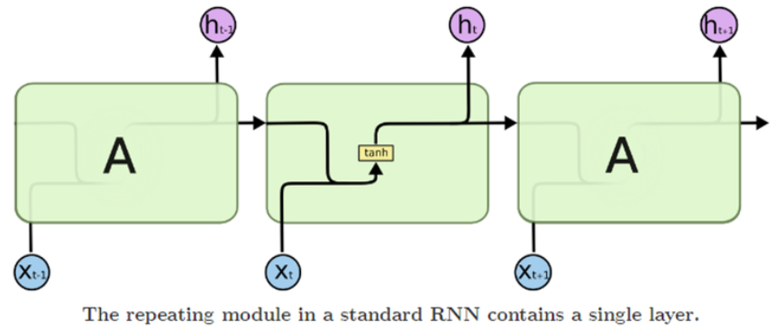
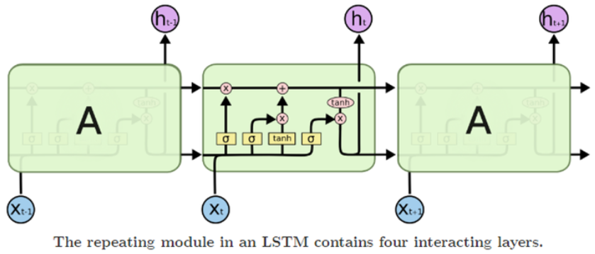
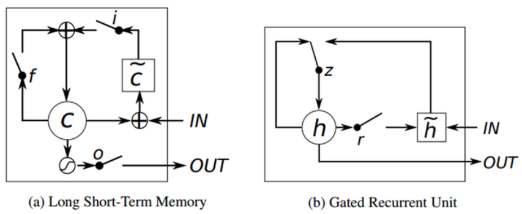

## RNN

* 셀에 저장된 이전 state + 입력에 의해 결과가 결정됨
* Back-propagation through time
* 파라미터를 공유함
	* 시간 domain 에서 펼쳐졌을 뿐이고 원래 망에서는 순환구조이기 때문에 동일한 파라미터를 사용함
* 장시간 데이터 의존도 있는 문제는 vanishing/exploding gradient 문제로 학습이 어려워짐

## LSTM

* 장기간 메모리 역할을 수행하는 cell state(이전 state에서 온 정보), 연결 강도를 조절하는 3개 gate(forget, input, output)로 구성
	* gate 조절로 이전 state 정보가, 현재 state 로 끼치는 영향 조절 가능 / 여기에 현재 입력과 연관된 정보 추가 가능 / 출력에 끼치는 영향의 수준을 정할 수 있게 됨

## GRU(Gated Recurrent Unit)
* update, reset 의 2개 gate 존재

* 과거의 activation 과 후보 activation 의 interpolation 을 통해 결정이 됨
* interpolation 비율은 update gate z 를 통해 결정되는 것

* 결과적으로 gru 에서는 lstm 의 forget 과 input gate 결합해서 1개 update gate 만들었고, 별도의 cell state 와 hidden state 를 hidden state 하나로 묶은 것
* 간단하지만 성능 자체는 뒤지지 않아서 많이 쓰임
