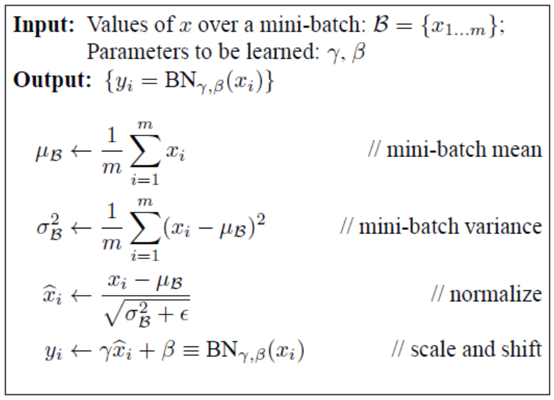
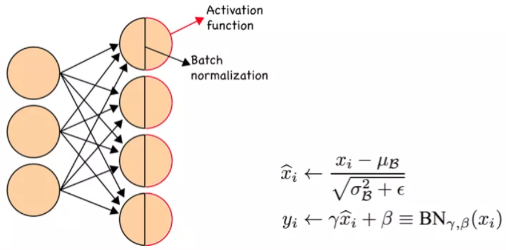
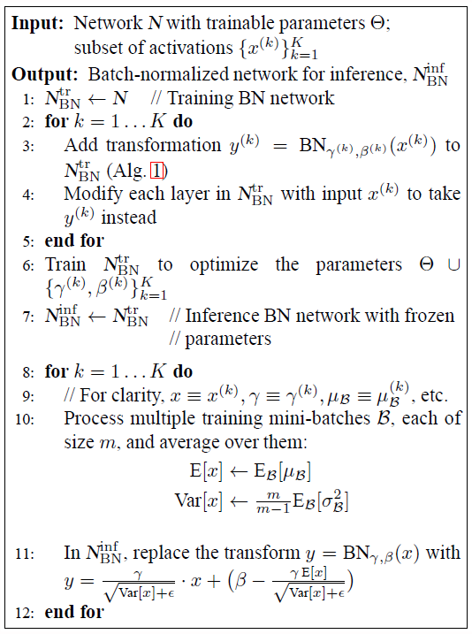

# Batch Normalization
## Motivation
* Gradient vanishing / gradient exploding 일어나지 않게
	* 이전까지는 activation 함수 변화(relu), careful initialization, small learning rate로 해왔음
	* Training 하는 과정 자체를 전체적으로 안정화 하여 학습속도 가속화
	* 불안정화의 원인을 internal covariance shift라고 봄
		* Internal covariance shift
			* Network 의 각 층이나 activation 마다 input 의 distribution 이 달라지는 현상
		* 이를 막기 위해 각 층의 input 의 distribution 을 평균 0, 표준편차 1인 input 으로 normalize
		* Whitening
			* 들어오는 input 의 feature 들을 uncorrelated 하게 만들어주고 각각의 variance 를 1로 만들어 줌
			* 단점
				* Covariance matrix 계산, inverse 계산 필요해서 계산량이 많아
				* Whitening 을 하면 일부 parameter 들의 영향이 무시됨
					* Input u 를 받아 x=u+b 의 output 내고, 적절한 bias b를 학습하는 네트워크에서 x 에 E[x]를 빼준다
					* E[x]를 빼는 과정에서 b의 값이 같이 빠지고, 결국 output 에서 b 의 영향이 없어짐
					* 표준편차로 나눠주는 scaling 과정까지 들어가면 이 경향은 더 악화된다

## 해결
* Feature 들이 이미 uncorrelated 돼 있다고 가정하고, feature 각각에 대해서만 scala 형태로 mean 과 variance 를 구하고 각각을 normalize 함
* Normalize 된 값들에 scale factor(gamma)랑 shift factor(beta)를 더하고 이 변수들을 back-prop 과정에서 같이 train 시켜줌
	* 단순히 mean, variance 를 0,1로 고정하면 오히려 activation function 의 nonlinearity 를 없앨 수 있음 (sigmoid activation 의 입력이 평균 0, 분산 1이면 출력 부분은 곡선보다 직선에 가까워질 것 / 또한 feature 가 uncorrelated 돼있다는 가정에서 network 가 표현할 수 있는게 제한될 수 있음)
* Training data 전체에 대해 mean 과 variance 를 구하는게 아니라, mini-batch 단위로 접근해서 계산한다
* 현재 택한 mini-batch 안에서만 mean, variance 를 구해서, 이 값을 이용해 normalize 한다

## Algorithm
* 	• 각 feature 별로 평균, 표준편차 구한 다음 normalize
	• Scale factor 와 shift factor 이용해 새 값 만들어줌
	
	• 실제 적용시킬때는 hidden layer 에 들어가기 전에 batch normalization layer 를 더해주어 input 을 modify 해준 뒤 새 값을 activation function 으로 넣는다

* Test 할 때
	* Mini-batch 의 값 이용하는 대신 training 할 때 봤던 input 들의 moving average / unbiased variance estimate 의 moving average 이걸 계산해서 저장해놓고 이 값으로 normalize
	* 마지막에 gamma, beta 이용해서 scale/shift 해주는 건 동일함
		* Training 할 때는 mini-batch 의 평균, 분산으로 normalize
		* Scale factor, shift factor 이용해서 새 값 만듦
		* Scale, factor, shift factor 는 다른 layer 에서 weight 를 학습하듯이 back-propagation

	* CNN 이면 좀 달라짐
		* convolution의 성질을 유지시키고 싶기 때문에, 각 channel을 기준으로  각각의 Batch Normalization 변수들을 만든다. 예를 들어 m의 mini-batch-size, n의 channel size 를 가진 Convolution Layer에서 Batch Normalization을 적용시킨다고 해보자. convolution을 적용한 후의 feature map의 사이즈가 p x q 일 경우, 각 채널에 대해 m x p x q 개의 각각의 스칼라 값에 대해 mean과 variance를 구하는 것이다. 최종적으로 gamma와 beta는 각 채널에 대해 한개씩 해서 총 n개의 독립적인 Batch Normalization 변수들이 생기게 된다.

## 이점
* Gradient explode/vanish & local min 문제 --> parameter scale 에 영향을 받지 않게 된다(learning rate 를 크게 잡아도 됨)
* 자체적인 regularization 효과가 있음
	* Weight regularization term 등을 제외할 수 있으며 dropout 을 제외할 수 있음(dropout 효과랑 BN의 효과가 같음)

[참고](https://shuuki4.wordpress.com/2016/01/13/batch-normalization-%EC%84%A4%EB%AA%85-%EB%B0%8F-%EA%B5%AC%ED%98%84/)
