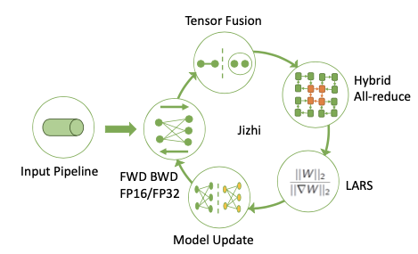
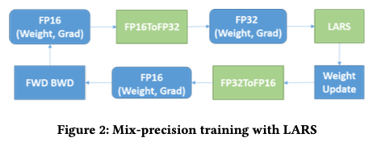
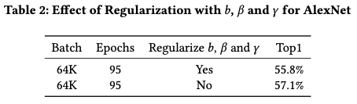
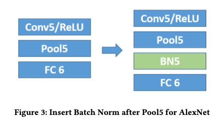

# [Paper review] Highly scalable Deep Learning Training System with Mixed-Precision: Training ImageNet in Four Minutes

# **요약**

아래의 세가지 방법으로 Highly scalable 한 deep learning training system 구현.

1. Mixed-precision training method : LARS 전후로 precision 을 변경 - single machine 에서의 throughput 향상

2. Optimized approach with large mini-batch size (without losing accuracy)

3. Highly optimized all-reduce algorithm (Hybrid all-reduce algorithm)

# **Introduction**

## Two challenges when using large batch accross large clusters

1. larger minibatch size lead to lower test accuracy
    - large mini batch : reduce the variance of gradients by taking the average of the gradients in mini-batch
    - 근데 이렇게 할 수록 accuracy 가 떨어지는 경향이 있음Large batch size
        - 하드웨어의 성능을 최대한 활용하게 되는 방향으로 가는게 중요한데, (full use of hardware) 이를 위해선 각 머신으로 가는 mini-batch size가 적절히 세팅되어야하며, 몇몇 논문에선 클 수록 좋다고 함([https://arxiv.org/abs/1706.02677](https://arxiv.org/abs/1706.02677))
        - (전체적인 throughput을 좋게하고, 모델의 update를 적게 하게 해줌)
2. large cluster -> communication cost 때문에 머신 갯수가 많아질 수록 near-linear scalability를 달성하기는 어려워진다
    - communication step이 bottle neck 이 되는 경우가 많기 때문에

## Main Contribution

T (overall throughput)=S*N*e (S: single machine 에서의 throughput / N: # of gpu / e: scaling efficiency)

- 아래 전략으로 위의 challenge를 극복함
1. Large mini batch size without losing test accuracy
    - mixed-precision training with LARS
    - eliminated weight decay on bias and parameters for batch norm and adding proper batch norm layer
2. Large cluster 에서의 communication cost 절감
    - Improved S(single machine 에서의 throughput) by half-precision training
    - Improved e(scaling efficiency) by optimizing adative all-reduce collective with ring-based all-reduce in NCCL

# **2. Related work**

1. Large-batch training

2. Low-precision training

3. Distributed training on heterogeneous clusters

# **3. System overview**

1. Input pipeline module
    - delivers data for the next step before the current step has finished
2. Training module
    - forward/backward computation with mixed-precision and model update with LARS
3. Communication module
    - tensor fusion
    - hybrid all-reduce
    - (optimize the scaling efficiency according to tensor size and cluster size)

# **4. System implementation and optimization**

## 4.1 Mixed-precision training with LARS

- half-precision 을 naive 하게 적용하면 gradient vanish 나 training process가 stall 될 수 있음
- mixed 된 형태로 half-precision 적용
- 
- forward and backward propagation (fp 16)-> cast to single precision(fp 32)-> LARS (fp 32)-> weight update (fp 32)-> 32 to 16-> forward and backward

## 4.2 Improvements on model architecture

두가지 측면에서 향상시킴

1. eliminated weight decay on the bias and batch norm
    - 이때 affine transform 에 관여하지 않는 b, beta gamma 는 unregularize 상태로 두는게 top1 accuracy 가 더 나았음
    - 
2. adding proper batch norm layer for AlexNet
    - alexnet의 pooling layer 5번 이후에 feature map distribution의 variance 등이 커지는 걸 보고 이 이후에 batch norm layer를 추가함
    - 

## 4.3 Improvements on Communication Strategies

- k개 gpu면 k개 chunk 로 나누고, k-1개의 reduce iteration 이 필요해짐
- k가 커지면 node 간 message passing 이 늘어나서 성능에 악영향을 줄 것
- Hybrid all-reduce 이용해서 극복함
    1. Tensor Fusion
        1. core idea : all-reduce 하기 전에 작은 사이즈의 여러 tensor들을 pack 하는 것(network bandwidth 감소)
        2. 이유 : convolution layer의 gradient tensor size 가 fully-connected layer보다는 훨씬 작을텐데, 너무 작은 tensor를 network 로 주고받는건, latency 만 늘릴 것
        3. buffer 를 둬서, 사이즈가 parameter theta 보다 커질때만 fused tensor 를 all-reduce 하는 것
        4. 단 latency 는 증가할 것
            1. 여러개 tensor를 묶는게, 마지막 몇개 레이어 혹은 backward propagation 에서 earlier layer 몇개에서는 gradient aggregation 의 병렬화를 막게 될 것이므로
    2. Hierarchical all-reduce
        1. k 개 gpu 를 하나의 group 으로 나눔
            1. 같은 그룹 내에서 reduce 수행 (각 그룹내의 master에 partial result 저장)
            2. group 간 ring all-reduce
            3. final result 를 broadcast
        2. convolution layer처럼 weight수가 적은 경우 performance gain 이 있으나 fully connected layer 같은 경우는 hierarchical all-reduce 보다는 ring all-reduce 가 더 유용함
    3. Hybrid all-reduce
        1. Hierarchical all-reduce 와 ring all-reduce 를 혼합하여 사용
        2. aggregate 할 size of tensor를 나타낼 parameter 를 하나 더 둬서, 이 parameter 에 따라서, traditional ring-based all-reduce 와 customized all-reduce 를 switching.

# **참고 자료**

1. All-reduce : [https://brunch.co.kr/@chris-song/96](https://brunch.co.kr/@chris-song/96)
2. LARS(torchLARS) : [https://www.kakaobrain.com/blog/113](https://www.kakaobrain.com/blog/113)
3. Quantization :
    1. [https://towardsdatascience.com/speeding-up-deep-learning-with-quantization-3fe3538cbb9](https://towardsdatascience.com/speeding-up-deep-learning-with-quantization-3fe3538cbb9)
    2. [https://post.naver.com/viewer/postView.nhn?volumeNo=19437431&memberNo=20717909](https://post.naver.com/viewer/postView.nhn?volumeNo=19437431&memberNo=20717909)
    3. on tensorflow [http://itteckmania.blogspot.com/2018/03/quantize.html](http://itteckmania.blogspot.com/2018/03/quantize.html)
4. gpipe(torchgpipe) :[https://www.kakaobrain.com/blog/66](https://www.kakaobrain.com/blog/66)
