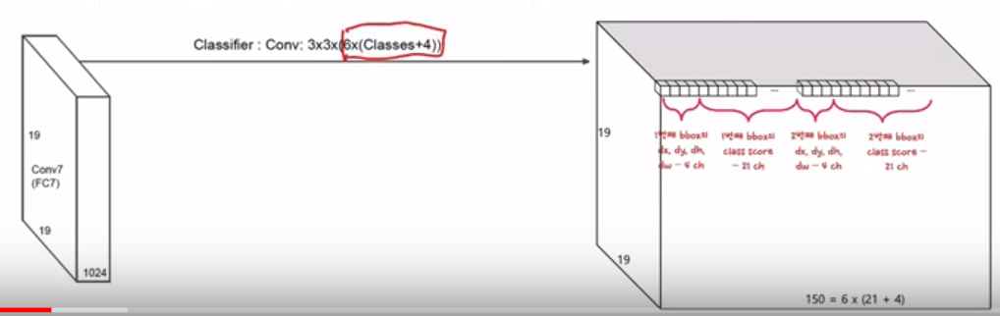
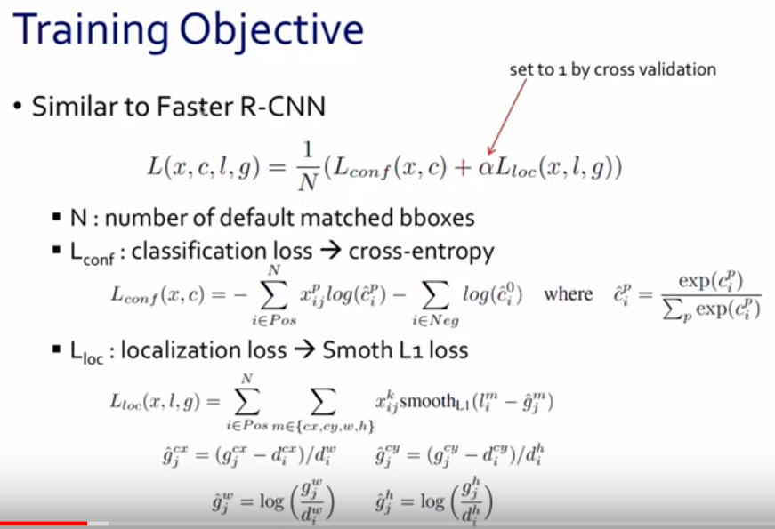
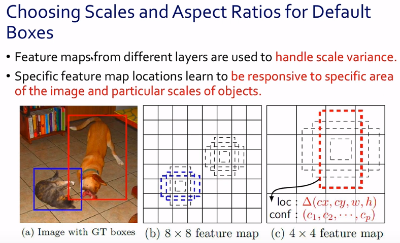
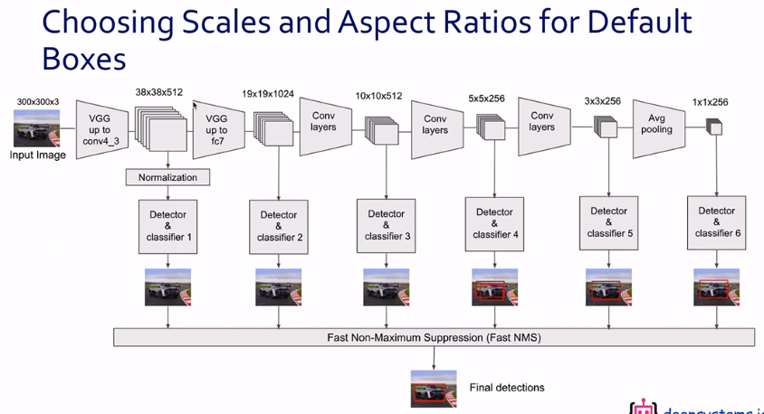
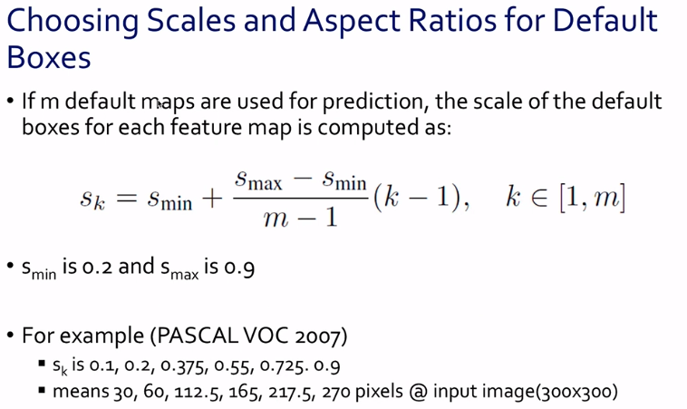
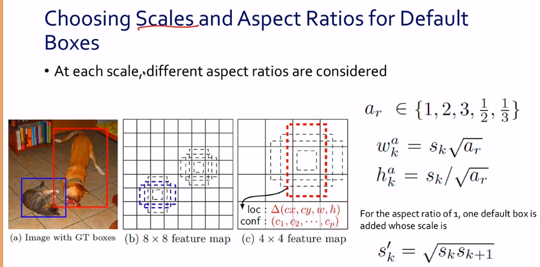

## SSD: Single Shot MultiBox Detector
https://arxiv.org/pdf/1512.02325.pdf
* fast R-cnn(당시 sota) 에 비해 속도에서 장점

### object detection
* 두개 task
	1. 어떤 object 인지 예측(classification (by softmax 등))
	2. box coordinate 예측(좌표 값에 대한 regression 필요)
* 각 모델에 대한 loss 를 더해서 전체 loss 를 줄이는 형태 등으로 학습

* 보통의 object detection 알고리즘은 두종류로 나눌 수있다.
	1. 2-stage detector
		1. region candidate 추출(region proposal)
			- 대상을 축약
		2. classification
	2. 1-stage detector
		1. classification 만 통으로 진행

### Related work
* faster R-cnn
	* 2-stage detector
	* RPN (region proposal network - bounding box regression) 결과를 object classification 의 input 으로 활용
* Yolo
	* 1-stage detector
	* image 전체를 convolution layer 통과시킨 후, classification & bounding box 를 한번에 예측
	* image 전체에 대한 information 을 (conv 를 통해 나온 결과)를 classification 의 인풋으로 넣음 - (큰 물체 찾는데에 더 유리할 것)

### Introduction
* 논문 발표 당시 sota 는 Fast R-cnn --> computation 을 많이 요구하는 형태였음
* yolo 는 frame 수는 많이 높아졌지만, 성능에 대한 희생이 컸음
* frame 이 어느정도 나오면서도, 성능이 어느정도 나오는 모델을 만들겠다는게 제안사항

### Architecture
* vgg16 사용
* base network 는 vgg16과 같고, fc6, fc7 대신 convolution layer 으로 넣었고, detection 위해서 convolution layer 를 더 쌓음
* 근데 **이 각각 convolution stage 결과에 detection layer 를 바로 연결함**
* 앞의 layer 에서 온 input 에 의해선 더 작은 obj를, 뒤의 layer 에서는 더 큰 obj 를 detect 하게 되는 효과를 얻을 수 있을 것
* 단 마지막 detect layer 에 들어가는 결과가 매우 크게 되겠지만 각 결과에 대해 softmax 계산만 하게 되기때문에 속도가 많이 느려지지는 않음
* 이 때에 각 conv layer 에 적용하는 classifier
	* classes + 4(width, height, x, y)
	* 위에서의 식에서 - 대상 bounding box 의 candidate 를 4개(또는 6개)씩 뽑아서, 비교하는 방식을 쓰기로!
	* 결국 3\*3\*6(classes+4) (3\*3는 conv)
	
* 위 그림에서 dx, dy, dw, dh 가 들어가는 이유는 이미 정해놓은 default box에서의 변화를 학습하게 되기 때문

### Training
* bounding box loss 계산 - IoU metric 사용 (overlap/union)
* training object
	
	* L(x,c,l,g)=1/n * (L_conf(x,c)+ alpha())
	* L_conf
	* L_ioc
		* smooth l1 loss - l1과 l2 loss 를 1을 기점으로 섞어 쓰는 형태

### choosing scales and aspect ratios of default boxes
1. scale 확정

	1. candidate box 생성
		* domain 에 따라서, 일반적인 obj 가 이런 비율, 사이즈 일거다 라는 인사이트를 바탕으로 사용자가 넣어줘야.
	
	2. default box 를 위한 scale 확정
		* pixel 크기에 따라
		
2. aspect ratio 확정
	* 가로세로 폭 정하는 것
	
	* 위 그림에서 s prime 은 폭을 좀 더 크게 했을 때에 효과가 좋았다는 finding 이 있었어서 넣어본 것

### hard negative mining
* highest confidence loss 이용해서, top n 에 대해서는 더 많이 학습함(더 못맞추는 부분에 대해서 집중 학습한다고 보면 될 듯)

### experiment
* base network 로 위의 architecture 를 쓰기는 하는데 convolution 부분에 대해서 atrous algorithm 으로 구성
* 

### conclusion
* Single shot object detector for multiple categories
* One key feature is multiple convolutional maps to deal with different scale
* More default bounding boxes, the better result obtained
* Comparable accuracy to state-of-the-art object detectors(fast-rcnn & YOLO) but much faster

* 코드 분석
https://www.notion.so/Object-Detection-9c3d52a77913435d979af1dfaac98c0d
