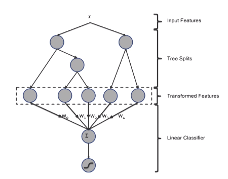
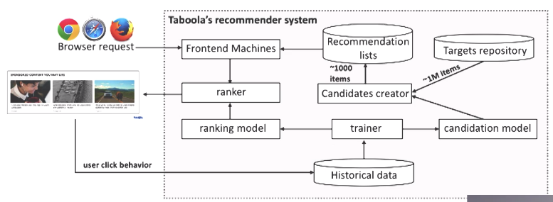
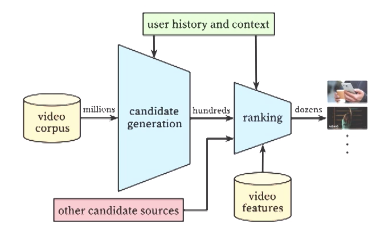
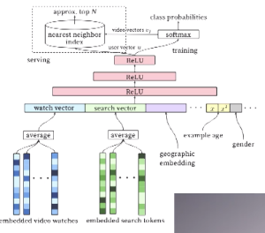
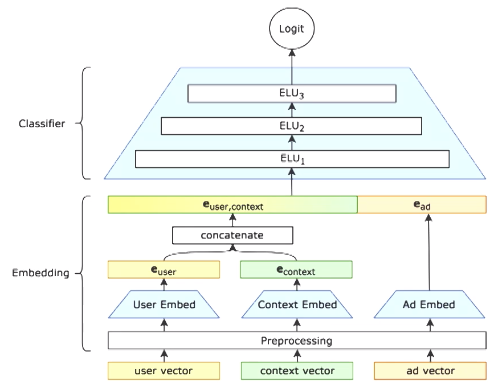
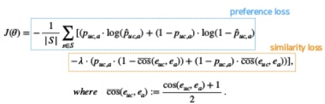
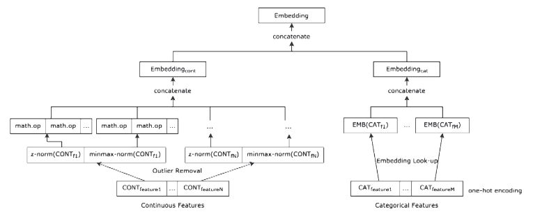
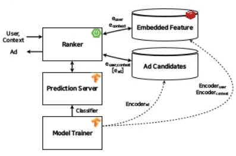
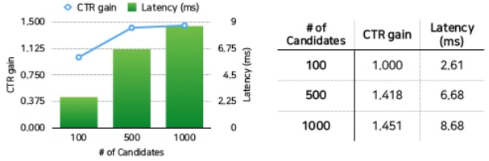

## Deview 2018 - 네이버 광고추천 시스템
Deview2018 에서의 네이버 광고 추천 시스템 세션 내용을 정리함.
https://www.slideshare.net/deview/226naveraddeepclickprediction
https://tv.naver.com/v/4584668

## 1. 온라인 광고 시스템의 주요 문제들 
* 클릭 예측 문제 
    * key mission - 주어진 user context 가 가장 매력적으로 느낄만한 광고를 추천
    * (user, context) -> ad
    * binary classification problem 로 해석 가능
* 온라인 서빙과 차원의 저주
    * CTR 이 높지 않아서 class 간 불균형이 심하다
    * 익명의 유저군, 너무 다양한 유저 context
    * utility function 이 다차원적이다(주체에 따라서 원하는 바가 다르다)
        * advertiser's utility(광고주) vs. ad network's utility(네이버) vs. user's utility(유저)

## 2. Naive approach, Others approaches
### Naive approach
* (user, context) -> classifier(p(click|user, context, ad)) -> best ad
    - scalability
    - cold start problem

### Others approaches
#### case1. Facebook ad
* Practical Lessons from Predicting Clicks on Ads at Facebook
* Feature transform + linear classifier
* input feature 를 tree boosted layer 를 태워서 feature 를 변형하고, linear classification

#### case2. Taboola
* Targets repository 라는걸 따로 둬서 대상이 될 광고의 규모를 어느정도로 줄여둠

#### case3. YouTube
* candidate generation 한 다음에 거기서 ranking
* embedding 후 classification

#### case4. Google play
* Wide & Deep Learning for Recommender Systems
* 전체에서 retrieval 을 먼저 (candidate 가져오기)
* embedding 후 classification
* 여기서 wide& deep network 하게 학습

## 3. 모델 구조 
### key Idea
* 네이버에서는 serving robustness 에 더 포커스함
* embedding + classification
    * Candidate model
        * 이걸로 ad scalability 를 더 높임
        * preference and similarity 이용해서 간단하게 모델링
    * Embedding
        * feature space 가 sparse 한걸 극복
        * serving part 에서 큰 이득을 봄

### Embedding
* embedding 자체를 classifier 뿐 아니라 candidate model 에서도 활용
* candidate model → nearest neighbor 로 가져옴

#### loss function

* Preference와 similarity를 함께 학습하게 설계
* Preference loss : cross entropy
* \+ similarity loss : 유저가 광고를 클릭한 경우에는 유저벡터와 광고 벡터가 점점 가까워 지는 형태로 학습되게 함 (cosine similarity 활용)
* **아래에서 언급하겠지만 이렇게 섞어쓰는 경우 성능에 많은 손해를 볼 수밖에 없다...**

#### Candidate model
* nearest neighbor select

#### Feature processing

* continous feature
    * z-norm, minmax-norm 적용 후 몇가지 math operation
* categorical feature
    * embedding dictionary 만들어서, 각각의 categorical feature 가 embedding 으로 mapping 되서 들어가도록 함

## 4. 서빙 구조

* model trainer 에서 ad embedding, user\*context embedding 미리 말아두고, prediction model 도 미리 학습해둠(약 4\~6시간)
* serving system 으로 clipper 도 고려했으나, memory usage, cpu usage 가 너무 높아지는 문제가 있어서 tensorflow serving 으로 갈아탔다고 함
* ad candidate 뽑는 nearest neighbor search에는 ANNOY 사용함

## 5. 결과 및 discussion
* user, context, ad 에 대한 embedding
    - embedding 이 잘 된건지 시각화시켜서 확인함
* 학습할때 loss function 에서 similarity loss 부분을 뺀 것과 비교해봤더니 사실 이걸 뺐을때에 ctr 이 1.5배 이상 높았음
    * similarity loss 부분을 포함해서 학습하면, 두루두루 모든 사용자들에게 인기있는 광고들에 대해서는 잘 안뽑히더라

* offline test 했을때와 실제의 결과는 많이 다르더라...
